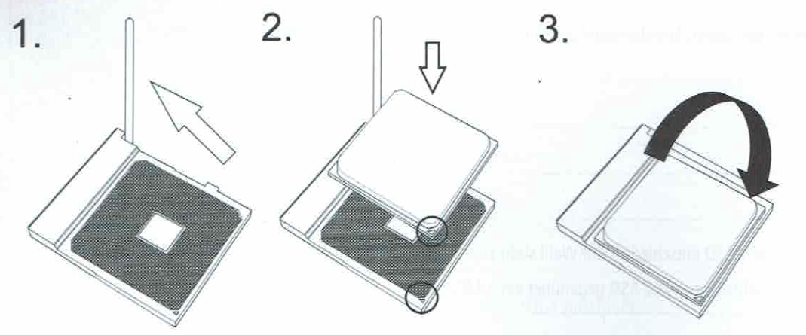
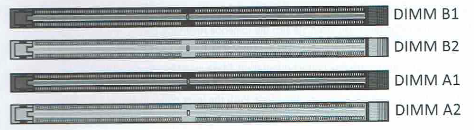
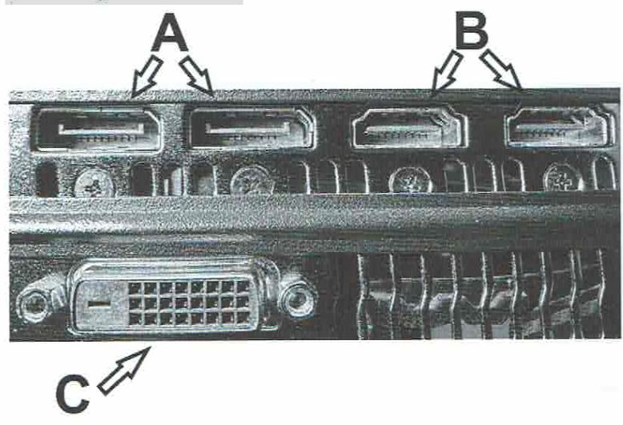
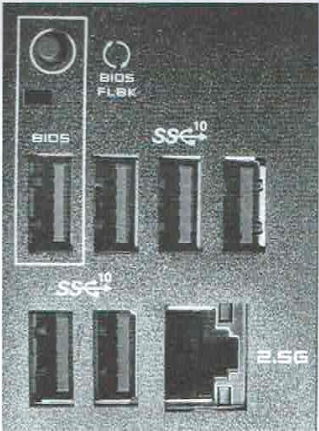
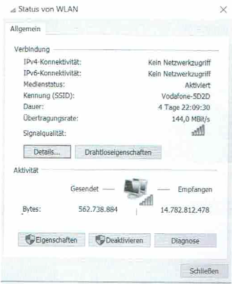
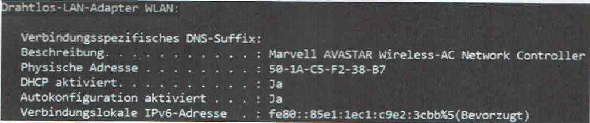
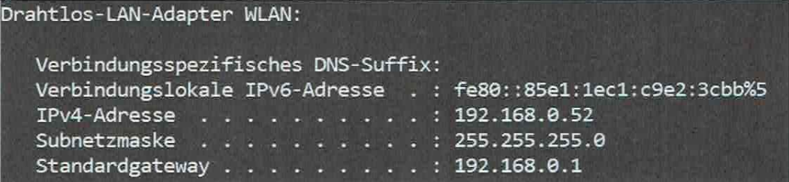
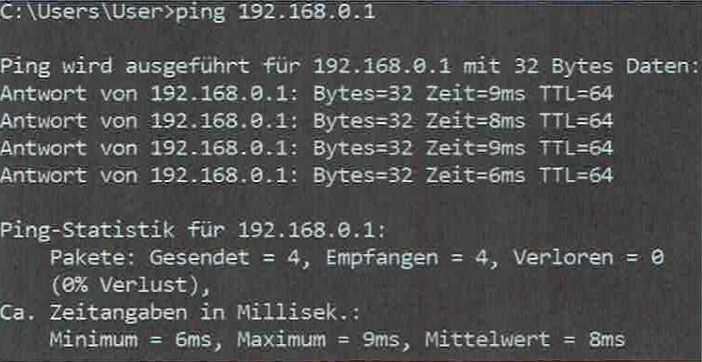
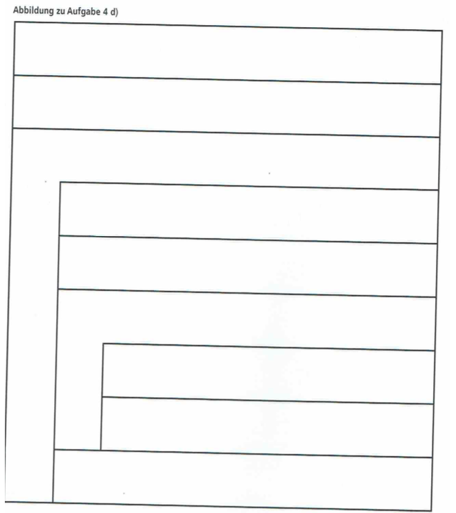

# Abschlussprüfung Frühjahr 2022

Termin: Mittwoch, 30. März 2022

## Inhalt

### 1. 01-02 Machbarkeit und Wirtschaftlichkeit von Projekten  

- Angebotsdaten, Projektauftrag, formale Informationen, Kosten/Nutzen  
  - [Aufgabe 1ca](#1ca-lastenheft-ist-analyse-zeitrahmen) (Lastenheft, Ist-Analyse, Zeitrahmen)
  - [Aufgabe 1cb](#1cb-angebotsdaten-projektauftrag-formale-informationen) (formale Informationen)
  - Aufgabe 4c (Lizenzkosten vs. Eigenentwicklung)

### 2. 01-03 Arbeitsaufgaben im Rahmen von Geschäftsprozessen  

- Kundenkommunikation, Präsentation beim Erstgespräch, Außendienst  
  - [ ] [Aufgabe 1a](#1a-präsentation-erstgespräch) (Präsentation, Erstgespräch)  
  - [ ] Aufgabe 1c (Informationsbedarf für Projekt)

### 3. 02-03 Zielgerichtete Methoden zur Kundenberatung  

- Nutzenorientierte Leistungsbeschreibung, Vorteile für den Kunden  
  - [ ] Aufgabe 1b (Leistungsangebote überzeugend formulieren)

### 4. 02-04 Informationen aufbereiten und präsentieren

- Erstellung einer Präsentationsfolie, zielgruppengerechte Darstellung  
  - [ ] Aufgabe 1a (Folie zur Unternehmensdarstellung)

### 5. 03-01 Marktgängige IT-Systeme (Hardwarekomponenten und Anschlüsse)

- CPU, RAM, SSD, GPU-Schnittstellen (DVI, HDMI, DisplayPort usw.)  
- **Aufgaben:**  
- Aufgabe 2a, 2b, 2c, 2d, 2e, 2f, 2g (Mainboard-CPU, RAM, SSD, Grafikkarte, USB-Anschlüsse, Taktfrequenz etc.)

### 6. 03-02 Typische IT-Systeme und deren Einsatzbereiche  

- Nutzung von WLAN, OSI-Modell, Netzwerkprotokolle  
- **Aufgaben:**  
  - [ ] Aufgabe 3 (WLAN-Einrichtung, WPA-PSK/Enterprise, OSI-Schichten)

### 7. 03-03 Leistungsfähigkeit und Energieeffizienz von IT-Systemen

- Taktfrequenz, CPU-Kerne, Cache, logische Prozessoren  
- **Aufgaben:**  
  - [ ] Aufgabe 2g (CPU-Werte, Caches)

#### 8. 04-01 IT-Systeme konzipieren, konfigurieren, testen, dokumentieren  

- Workspace-Management-Software (cloudbasiert / on-premises)  
- **Aufgaben:**  
  - [ ] Aufgabe 4a, 4b (Software-Funktionen, Cloud vs. on-premises)

### 9. 04-05 Aktivitäten bei Installationen und Konfigurationen

- Softwarepaketierung, Patch-Management, RADIUS/EAP-Konfiguration  
- **Aufgaben:**  
  - [ ] Aufgabe 3b (WPA-Enterprise RADIUS)  
  - [ ]Aufgabe 4a (Patchmanagement, Inventarisierung)

### 10. 04-07 Programmierwerkzeuge, Pseudocode

- Struktogramm, Schleifen (for, while), Datenbankabfragen  
- **Aufgaben:**  
  - [ ] Aufgabe 4d (Struktogramm für die automatische Konfiguration)

### 11. 03-04 Wirtschaftlichkeit von IT-Systemen bestimmen

- Lizenzkosten vs. Eigenentwicklung (Kalkulation)  
-**Aufgaben:**  
  - [ ] Aufgabe 4c (interne vs. externe Lizenzkosten)

## 12. 06-04 Umsetzung eines arbeitsplatzbezogenen Sicherheitskonzeptes

- WLAN-Sicherheit (WPA, RADIUS), Datenübertragung in die Cloud  
- **Aufgaben:**  
  - [ ] Aufgabe 3b (WPA-Enterprise)  
  - [ ] Aufgabe 4e (Daten-Upload in die Cloud)

---

## Situation

>Sie absolvieren eine Ausbildung bei der AllRound AG, einem im Jahr 1985 gegründeten IT-Systemhaus mit 720 Mitarbeiterinnen und Mitarbeitern in weltweiten Niederlassungen. Nach einer Krisensituation, einem Wechsel in der Geschäftsführung und einer Neuausrichtung hat die AllRound AG sich zum Anbieter größerer und internationaler IT-Projekte entwickelt.  
Ein Außendienstmitarbeiter hat erfahren, dass bei der Rulix GmbH eine Aktualisierung der IT-Gesamtkonzeption ansteht. Die
Rullix GmbH produziert und vertreibt Bauteile im Bereich der E-Mobilität und besitzt weltweit mehrere Standorte. Da sie nicht über ausreichende Personalkapazitäten für die eigene Durchführung verfügt, soll dieses Projekt extern vergeben werden. Der Außendienstmitarbeiter hat bereits die Möglichkeit eines Erstkontaktes hergestellt mit dem Ziel, die Rullix GmbH als Kunden zu gewinnen.

---

## 1. Aufgabe

Machbarkeit und Wirtschaftlichkeit von Projekten (25 Punkte)

## 1.a Präsentation, Erstgespräch

Als Vorbereitung auf das Erstgespräch mit der Rullix GmbH soll zunächst die AllRound AG allgemein und dann das Leistungsangebot vorgestellt werden, um die Eignung der AllRound AG für diesen Auftrag herauszustellen.

Sie sollen eine Präsentationsfolie für die allgemeine Unternehmensdarstellung der AllRound AG erstellen, um für den ge-
wünschten Auftrag einen möglichst guten Eindruck zu hinterlassen. Aus der eingangs beschriebenen Situation sind dazu drei
geeignete betriebliche Informationen herauszustellen, um diese auf der Folie als möglichst präsentationsgeeignete Stichpunkte anzuführen. Dabei soll jeder einzelne Stichpunkt eine Botschaft vermitteln. Die inhaltliche Vorlage für die gestalterische Umsetzung sol in Form von Aufzählungspunkten erfolgen, wie in dem Beispiel bereits angedeutet ist.

---

### 1.aa

Vermerken Sie im Notizbereich drei inhaltliche Botschaften, welche Sie aus der obigen Situationsbeschreibung in Ihrer
Präsentationsfolie zum Ausdruck bringen wollen. (6 Punkte)

---

### 1.ab Folie zur Unternehmensdarstellung

Ergänzen Sie den Folienbereich um die drei zur Botschaft passenden Aufzählungspunkte. (3 Punkte)

---

| (Folienbereich) |
| :--- |
| - Seit 1985 am Markt |
| - ... |
| - ... |
| - ... |
| --- |
| (Notizbereich) **Botschaften:** |
| - z. B.: Beständigkeit durch über 35 Jahre Marktpräsenz und jahrzehntelange Erfahrung garantiert langfristige Partnerschaften auch in der Zukunft. |
| - ... |
| - ... |
| - ... |

---

## 1.b Leistungsangebote überzeugend formulieren

**Aus dem Unternehmensportfolio der AllRound AG sind Ihnen folgende Begriffe im Gedächtnis:**

- Industrie 4.0
- Support in den Bereichen Prozess- und IT-Management
- Migrationsunterstützung
- Big Data
- Cloud-Hosting in allen Varianten
- Beratung im Hinblick auf DSGVO und BDSG
- Webhosting
- Remarketing von IT-Geraten

Die Leistungsangebote der AllRound AG solen dem Kunden nicht nur erklärt, sondern auch sprachlich überzeugend formuliert
werden.

Wählen Sie aus den obenstehenden Begrifen drei aus und beschreiben Sie diese dem zukünftigen Kunden so, dass die einzel-
nen Leistungsangebote möglichst auftrags- und nutzenbezogen erläutert werden. (9 Punkte)

---

| **Leistungsangebot** | **Erläuternder Text, in ganzen Sätzen** |
| :--- | :--- |
| Industrie 4.0 |Beispiel: Wir optimieren Ihren Produktionsprozess durch Nutzung intelligenter Informations- und Kommunikationstechnik. Angestrebt wird die Schaffung einer möglichst hohen Flexibilität durch eine weitgehend selbstorganisierte Produktion. |
| ... | ... |
| ... | ... |
| ... | ... |

---

## 1.c Informationsbedarf für Projekt

Die AlRound AG sol ein Angebot für das Projekt zur kompleten Neuorganisation der Verwaltung und der IT-Gesamtkonzeption
der Rullix GmbH erstellen.

### 1.ca Lastenheft, Ist-Analyse, Zeitrahmen

Schildern Sie analog des Beispiels, warum folgende Informationen für die Erstellung des Angebots benötigt werden:
(6 Punkte)

| **Informationen** | **Erläuterung** |
| :--- | :--- |
| Beispiel: Räumliche Gegebenheiten | Bestimmung der Entfernungen, um den logistischen Aufwand abschätzen zu können |
| Lastenheft | ... |
| Geplanter Zeitramen | ... |
| Ergebnisse der Ist-Analyse | ... |

---

### 1.cb Angebotsdaten, Projektauftrag, formale Informationen

Zur Erstellung eines Angebots werden auch formale Informationen benötigt, z. B. die Adresse.
Welche formale Information könnte darüber hinaus auch noch erforderlich sein? (1 Punkt)

...

---

## 2. Aufgabe

Das Angebot wurde angenommen. Nach der Beschaffung einzelner Hardwarekomponenten besteht Ihre Aufgabe nun darin, die
Standardarbeitsplätze zu konfigurieren. Sie solen einzelne Komponenten einbauen und die Schnittstellen der Computer identifizieren. (24 Punkte)

---

### 2. a Mainboard-CPU

Sie möchten die CPU in den CPU-Sockel des Mainboards einbauen. Dazu lesen Sie sich die folgende Anleitung durch.

**CPU installation:** To fit the processor in the socket, first lift the lever. The CPU fits in only one correct orientation. Make sure the arrow on top of the processor is aligned with the arrow on the processor socket. Do not force the CPU into the socket to prevent bending the connectors on the socket and damaging the CPU. Gently push the processor into place. Push the lever down to secure the processor.

---

#### 2. aa

Nennen Sie die drei Schritte für den Einbau der CPU. (3 Punkte)

1. ...
2. ...
3. ...

---

#### 2. ab

Beschreiben Sie, welche beiden Punkte beim Schritt 2 besonders zu beachten sind. (2 Punkte)

1. ...
2. ...

---

### 2. b

Nach dem Einsetzen der CPU auf das Mainboard wolen Sie den CPU-Kühler montieren. Dem CPU-Kühler liegt eine kleine Tube Wärmeleitpaste bei.

Erläutern Sie, welche Aufgabe die Wärmeleitpaste hat. (2 Punkte)

...

---

### 2. c RAM

Sie möchten nun den DDR 4 Arbeitsspeicher in die Slots des Motherboards einsetzen. Sie haben zwei DDR 4 RAM Riegel und möchten den RAM im Dual Channel Modus betreiben. Auf dem Motherboard sehen Sie die folgenden Slots:

Erläutern Sie, was Sie beim Einsetzen der beiden Speicherriegel beachten müssen, damit der RAM im Dual Channel Modus
arbeitet. (3 Punkte)

...

---

### 2. d SSD

Als Datenspeicher haben Sie sich für eine SSD entschieden. Zur Wahl steht eine SATA SSD und eine M.2 SSD.
Nennen Sie einen Vorteil und einen Nachteil einer M.2 SSD gegenüber einer SATA SSD. (2 Punkte)

Vorteil: ...
Nachteil: ...

---

### 2. e Grafikkarte

Nachdem der PC fertig zusammengebaut ist, möchten Sie den Monitor an die Grafikkarte anschließen. Sie sehen an der Grafik-
karte die folgenden Anschlüsse:

Um welche Anschlüsse handelt es sich bei den mit A, B und C markierten Schnittstellen?
Nennen Sie die korrekten Bezeichnungen/Abkürzungen. (3 Punkte)

A: ...  
B: ...  
C: ...  

---

### 2. f besonderer USB-Anschluss (BIOS-Flashback)

An der Rückseite des PC sehen Sie die folgenden Anschlüsse:

#### 2. fa

Beschreiben Sie, welche Besonderheit der umrahmte USB-Anschlus hat. (2 Punkte)

...

---

#### 2. fb

Nennen Sie zwei Vorteile des USB-C Anschlusses gegenüber dem USB-3 Anschlus. (2 Punkte)

1. ...
2. ...

---

### 2. g Taktfrequenz, Cache, logische Prozessoren

Sie testen den PC. Der Taskmanager zeigt die folgenden Daten:

| | |
| :--- | :--- |
| Basisgeschwindigkeit | 3,40 GHz |
| Sockets | 1 |
| Kerne | 16 |
| Logische Prozessoren | 32 |
| Virtualisierung | Aktiviert |
| L1-Cache | 1 MB |
| L2-Cache | 8 MB |
| L3-Cache | 64 MB |

---

#### 2. ga Logische Prozessoren

Erläutern Sie den Begriff „Logische Prozessoren". (2 Punkte)

...

---

#### 2. gb Cache-Speicher

Beschreiben Sie allgemein die Aufgabe eines „Cache"-Speichers. (2 Punkte)

...

---

#### 2. gc Taktfrequenz

Geben Sie die Taktfrequenz von 3,4 GHz in Hertz an. (1 Punkt)

...

---

## 3. Aufgabe

### 3. a WLAN-Einrichtung

Ihre Aufgabe besteht darin, für ein Notebook einen Netzwerkzugriff ins Firmen-WLAN einzurichten. Hierbei handelt es sich um ein WLAN mit WPA-PSK oder auch WPA Personal.

Nennen Sie zwei wesentliche Informationen, die Sie vom Administrator erfragen müssen, um das Notebook im WLAN anmelden
zu können. (2 Punkte)

1. ...
2. ...

---

### 3. b WPA-Enterprise RADIUS

Zur Authentifizierung von Nutzern im WLAN gibt es neben dem WPA-PSK-Verfahren auch das EAP-Verfahren, welches auch als
WPA-Enterprise-RADIUS bezeichnet wird.

Nennen Sie je einen Vor- bzw. Nachteil und geben Sie eine Empfehlung, in welcher Unternehmensgröße es vorwiegend einge-
setzt werden sollte. (3 Punkte)

| Verfahren | Vorteil | Nachteil | Unternehmensgröße |
| :--- | :--- | :--- | :--- |
| WPA-PSK | Einfach umzusetzen | Unsicher, da PW mit steigender Anzahl von Nutzern schnell bekannt werden kann | Kleine Unternehmen mit wenigen Mitarbeitern |
| EAP/WPA-Enterprise-RADIUS | ... | ... | ... |

---

### 3. c OSI-Schichten

Sie versuchen, die Verbindung über das WLAN herzustellen, was leider zunächst nicht gelingt. Ihre Idee ist nun, eine Fehlerana-
lyse basierend auf den verschiedenen Schichten des OSI-Modells durchzuführen.

Ergänzen Sie zur Vorbereitung die leeren Felder in der folgenden Tabelle.
Hinweis: Geben Sie pro Feld jeweils nur ein passendes Beispiel an. 6 (Punkte)

| OSI-Schicht Nr. | OSI-Schicht Name | Verwendete Protokolle | Verwendete Adressen | Mögliche Fehler |
| :--- | :--- | :--- | :--- | :--- |
| 7 | Physikalische Schicht | ... | - | ... |
| 4 | Transportschicht | TCP/UDP | Ports | Verlust eines Segments |
| 3 | ... | ... | ... | ... |
| 2 | ... | ... | ... | ... |
| 1 | ... | - | - | Medium getrennt |

---

### 3. d WLAN-Standard

Entsprechend Ihres Plans starten Sie Ihre Fehlersuche im OSI-Modell von unten nach oben (Bottom-up), beginnend mit Schicht 1.
Im obenstehenden Bild suchen Sie dazu Informationen über den Zustand der Verbindung.

Benennen Sie einen Wert, welcher der OSI-Schicht 1 zuzuordnen ist und interpretieren Sie diesen bezüglich seiner Funktionali-
tät. (4 Punkte)

...

---

### 3. e WLAN-Standard OSI-Schichten 2 und 3

Sie starten nun das Konsolenfenster zur Analyse der OSI-Schichten 2 und 3 und erhalten nach der Eingabe eines Befehls zur Anzeige der Netzwerkkonfiguration die folgende Ausgabe:

Trotz des fehlenden Netzwerkzugriffs werden zwei Adresen angezeigt.

---

#### 3. ea MAC-Adresse

Beschreiben Sie die Herkunft der Adresse 50-1A-C5-F2-38-B7. (2 Punkte)

...

---

#### 3. eb IPv6-Adresse

Beschreiben Sie die Herkunft der Adresse fe80::85e1:1ec1:c9e2:3cbb. (2 Punkte)

...

---

### 3. f WLAN-Standard

Bei Ihrer Fehleranalyse legen Sie nun Ihren Fokus auf die Analyse der höheren OSI-Schichten.
Nach Eingabe des Befehls zur Erneuerung der IP-Adresse wird nun die folgende Information angezeigt:

#### 3. fa Serverbezeichnung

Sie setzen Ihre Fehleranalyse nun fort

Nennen Sie die Bezeichnung des Servers, der hier durch den Befehl zur Erneuerung der IP-Adresse kontaktiert wurde. (1 Punkt)

...

---

#### 3. fb Hostadresse

Geben Sie die nachfolgenden Adressen des hier angegebenen Hosts an. (3 Punkte)

Netzadresse: ...  
Hostadresse: ...  
Broadcastadresse: ...  

---

#### 3. fc

Um die nun veränderte Situation zu prüfen, geben Sie den Befehl „ping 192.168.0.1" ein und erhalten die folgende
Ausgabe:

Sie analysieren die Ergebnisse Ihrer gesamten Fehlersuche.

Benennen Sie den von Ihnen ermittelten Fehler. (2 Punkte)

...

...

---

## 4. Aufgabe

Die AlRound AG plant, für die automatisierte Konfiguration der Standardarbeitsplätze eine Workspace-Management-Software
einzusetzen. (26 Punkte)

### 4. a Software-Funktionen

Über die Workspace-Management-Software informieren Sie sich mit dem folgenden Text:

Workspace management systems prepare the PC by installation and configuration, so that the user can immediately work with
the programs. Prerequisite for the automatic installation are customized setups (packages), which do not require user input. The
packages are installed and configured by a software distribution agent, which must be located on each PC. The patch manage-
ment controls the administration and automatic installation of patches and updates. The integrated license management com-
bines the data of available and actually used licenses and can thus not only prevent the procurement of neither to few nor
too many software licenses. The data collection during the inventory is done remotely. It can also make use of proven network
management tools such as SNMP. It is therefore not necessary for the responsible personnel to obtain physical access to the
individual devices, as it is the case with an inventory. The data stock can be continuously updated by the automatic collection
and not only once a year.

Nennen Sie vier Leistungsmerkmale einer Workspace-Management-Software anhand des oben zitierten Textes. (4 Punkte)

1. ...
2. ...
3. ...
4. ...

---

### 4. b Cloud vs. on-premises

Die Workspace-Management-Software wird cloudbasiert oder on-premises angeboten.
Nennen Sie zwei Vor- und Nachteile einer cloudbasierten Software gegenüber der on-premises. (4 Punkte)

| Software | Vorteil | Nachteil |
| :--- | :--- | :--- |
| Cloud | ... | ... |
| Cloud | ... | ... |
| On-premises | ... | ... |
| On-premises | ... | ... |

---

### 4. c interne vs. externe Lizenzkosten

Für die Workspace-Management-Software können die Lizenzen von einem externen Anbieter für 25,00 EUR je Lizenz und Jahr bezogen werden.

Für die Eigenentwicklung wird ein Personalaufwand von 12.000 Stunden veranschlagt. Die jährliche Wartung wird mit 140 Stunden pro Jahr über einen Zeitraum von zehn Jahren veranschlagt. Eine Mitarbeiterstunde wird mit dem internen Kostensatz
von 75 EUR berechnet.

Ab welcher Lizenzanzahl ist die Eigenentwicklung über einen Zeitraum von zehn Jahren günstiger als der Fremdbezug? (Lohnsteigerungen und Erhöhung der Lizenzpreise sollen nicht berücksichtigt werden.) (5 Punkt)

...

---

### 4. d Struktogramm für die automatische Konfiguration

Sie planen, eine eigene Lösung für eine automatisierte Konfiguration der Standardarbeitsplätze zu programmieren. Aus einer Datenbank werden alle zu konfigurierenden PCs ausgelesen. Danach wird für jeden PC aus der Datenbank die zu installierende, Software abgefragt und auf dem PC installiert.

**Es gibt die folgenden Variablen:**

- PCNr Ganzzahl - Laufvariable
- SoftwareNr Ganzzahl - Laufvariable

**Es gibt die folgenden Felder (Array):**

- PCListe [ ] Stringliste mit den Namen der PC
- Softwarelistell Stringliste mit den Namen der Software

**Es stehen Ihnen die folgenden Funktionen zur Verfügung:**

- getPC () - liefert eine Liste von PC-Namen aus der Datenbank
- getSoftware (String) - liefert zu dem angefragten PC eine Liste der zu installierenden Software
- instaliSoftware (String, String) Installiert die im ersten String angegebene Software auf dem im zweiten String übergebenen PC

Tragen Sie die Anweisungen folgerichtig in das nebenstehende Struktogramm ein. 9 Punkte

1. install Software (SoftwareListe [SoftwareNr], PCListe[PCNr])
2. Solange SoftwareNr < Anzahl der Elemente in SoftwareListe i l
3. PCListe[] = getPC ()
4. PCNr = PCNr + 1
5. PCNr = O
6. Softwareliste [ ] = getSoftware (PCListe [PCNr])
7. SoftwareNr = 0
8. SoftwareNr = SoftwareNr + 1
9. Solange PCNr < Anzahl der Elemente in PCListe()

---

---

### 4. e Daten-Upload in die Cloud

Die Datenbank soll in der Cloud gesichert werden.

Berechnen Sie die Zeit in Minuten, die für die Übertragung der 100 MiByte großen Datei bei einer VDSL-Leitung mit 100 Mbit/s
download und 40Mbit/s upload benötigt wird.

Das Ergebnis ist auf volle Sekunden aufzurunden.
Der Rechenweg ist anzugeben. (4 Punkte)
