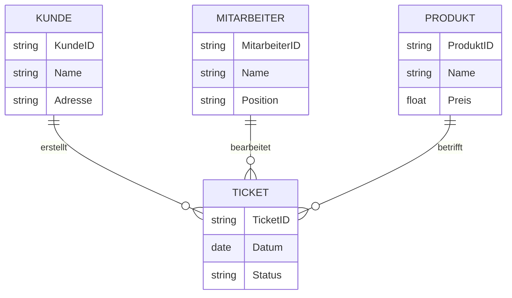

# Abschlussprüfung Herbst 2024

Termin: Mittwoch, 28. Februar 2024

__Einrichten eines IT-gestützten Arbeitsplatzes.__

__Teil 1 der Abschlussprüfung:__

- 4 Aufgaben
- 90 Minuten Prüfungszeit
- 100 Punkte

---

## Themen / Lernfelder

1. ?
2. ?
3. ?
4. ?

## Die Aufgaben 1 bis 4 beziehen sich auf folgende Ausgangssituation

>Sie sind Auszubildender in der IT-Abteilung der KustFlex GmbH. Diese fertigt Kunststoffteile aller Art und Größen auch nach individuellen Wünschen.

---

## 1. Aufgabe (26 Punkte)

Im Unternehmen Kustoflex GmbH werden fünf CAD-Arbeitsplätze eingerichtet.
Sie sind in dem Projektteam, das geeignete Systeme auswählt.

### a. (? Punkte)

Nach der Auswertung von vier Firmenangeboten ergibt sich die folgende Tabelle. Unternehmen 3 bietet ausschließlich eine __Software as a Service (SAAS) Lösung__ an.

|Nr.|Komponente|Gewichtung|Unternehmen 1||Unternehmen 2||Unternehmen 3||Unternehmen 4||
|:---|:---|:---|:---|:---|:---|:---|:---|:---|:---|:---|
||||Punkte|__gP__|Punkte|__gP__|Punkte|__gP__|Punkte|__gP__|
|1|Grafikkarte|20 %|3|60|2|40|4|80||60|
|2|Arbeitsspeicher (RAM)|25 %||100|3|75|4|100|3|75|
|3|Monitor|40 %|2|80||40|4|160|4||
|4|Preis||3|45|4|60|1|15|1|15|
||Auswertung|100|12|285|10||13|355|11|310|

---

#### aa. (4 Punkte)

Ermiteln Sie die fehlenden Werte und eine Reihenfolge der vier Unternehmen beginnend mit der höchsten Punktzahl.

1. ...
2. ...
3. ...
4. ...

---

#### ba. (4 Punkte)

Beschreiben Sei zwei Kritikpunkte an diesem Ablauf.

1. ...
2. ...

---

#### bb. (2 Punkte)

Nenen Sei zwei geeignete Maßnahmen, um die Servicequalität zu verbesern.

1. ...
2. ...

---

### 1 c. (3 Punkte)

Sei sind sich unsicher, ob die vorgeschlagenen Maßnahmen ausreichend sind. Nennen Sie drei Methoden für enie Bedarfsanalyse, um die Kundenbedürfnisse zu identifizieren.

1. ...
2. ...
3. ...

---

### 1 d. (? Punkte)

Der zukünftig bessere Service wird ohne höhere Kosten nicht zu erreichen sein.

Beantworten Sie die nachfolgenden Fragen auf Deutsch anhand des englischsprachigen Artikels.

>it is important to pay atention to the prices you set for your services, because they can determine the succes of your business. if you price your services to high, you may be rejected by customers and fail to find sales, no mater how god they are. On the other hand, if you set your prices too low, you wil not cover your costs. There is no set method for pricing services. Here are four points they should consider for service pricing.

- Calculate your costs.
- Know your customers.
- Look at the market.
- Choose a pricing model.

---

#### da. (1 Punkt)

Benennen Sei eine Gefahr, die bei zu hohen Service-Preisen besteht.

...

---

#### db. (1 Punkt)

Benennen Sei eine Gefahr, die bei zu niedrigen Service-Preisen besteht.

...

---

#### dc. (4 Punkte)

Nennen Sei die vier im Text genanten Aspekte zur Service-Preis-Bestimmung.

1. ...
2. ...
3. ...
4. ...

---

### 1 e. (4 Punkte)

Nach der vorgenommenen Preiserhöhung ruft ein Kunde an und sagt zu ihnen: „Die Service-Preise sind ihr Geld nicht wert".
Beurteilen Sei diese Ausage nach dem 4-Ohren-Model.

1. Sachaspekt ...
2. Selbstaussage ...
3. Beziehungsaspekt ...
4. Appell ...

---

## 2. Aufgabe (25 Punkte)

Zur Realisierung des 24/7-Services gilt es im Vorfeld u. a. die Rahmenbedingungen zur Telearbeit zu klären. Sei wirken hierbei mit

### 2 a. (4 Punkte)

Der Teamleiter möchte zur Telearbeit PCs verwenden.

Was ist darüber hinaus noch nötig, um am Telearbeitsplatz die anfallenden betrieblichen Aufgaben erledigen zu können?
Nennen und begründen Sei zwei weitere Anschafungen oder Maßnahmen.

1. ...
2. ...

---

### 2 b. (4 Punkte)

Ein Kollege unterbreitet den Vorschlag, Tablets zum Einsatz im Homeoffice anzuschafen.
Erläutern Sei anhand von zwei Aspekten, warum die Anforderungen an einen Bildschirmarbeitsplatz durch ein Tablet nicht erfült werden.

1. ...
2. ...

---

### 2 c. (4 Punkte)

Als Kompromiss hat man sich auf den Einsatz von Noteboks geeinigt.
Beschreiben Sie zwei Möglichkeiten bzw. Ergänzungen, die Arbeit mit den Noteboks ergonomischer zu gestalten.

1. ...
2. ...

---

### 2 d. (4 Punkte)

Als Vorbereitung für das anstehende Gespräch mit dem Betriebsrat sollen Sie Vor- und Nachteile von Homeoffice für die Beschäftigten zusammentragen.
Tragen Sei in die nachfolgende Tabelle jeweils zwei mögliche Vorteile und zwei Nachteile ein.

| Vorteile von HomeOffice für die Beschäftigten| Nachteile von HomeOffice für die Beschäftigten |
|----------------------------------------------|-----------------------------------------------|
| ...                                          | ...                                           |
| ...                                          | ...                                           |

---

### 2 e. (5 Punkte)

Im Rahmen des 24/7-Services will die OptiSoft-XXL GmbH ihre Hotline zur angebotenen Software um die Zeit zwischen 20:00 Uhr und 06:00 Uhr erweitern. Für diese Zeit ist für den First-, Second- und Third-Level-Support die häusliche Ereichbarkeit als Bereitschaftszeit jeweils eines Mitarbeiters erforderlich.

Jeder Anruf wird zunächst vom First-Level-Support entgegengenommen und dann gegebenenfalls weitergeleitet. Auch wenn dies der Fall ist, solö dieser zusätzliche Service den Kunden als einheitlicher Minutenpreis angeboten werden. Weitere mögliche Kosten und Nachbereitungszeiten zu den Anrufen sollen nicht berücksichtigt werden.

Berechnen Sie, zu welchem einheitlichen Minutensatz kalkuliert werden mus, um die Kosten der Tabellenangaben exakt zu decken. Der Rechenweg muss nachvollziehbar sein. Runden Sie gegebenenfalls auf den nächsten Cent auf.

|| First-Level-Support | Second-Level-Support | Third-Level-Support |
|----------------------|----------------------|----------------------|---------------------|
| Stundensatz für die Bereitschaftszeit in EUR| 12,00 | 15,00 | 20,00 |
| Minutensatz bei Anruf in EUR | 0,50 | 1,00 | 1,50 |
| Durchschnittliche Anrufzeit in Minuten pro Nachtschicht | 150 | 100 | 50 |

---

### 2 f. (4 Punkte)

Die Kostenpflichtigkeit der Hotline zu dieser Software muss den Kunden kommuniziert werden.
Formulieren Sie in ganzen Sätzen zwei überzeugende Argumente, die als Text für einie E-Mail verwendet werden können.

1. ...
2. ...

---

## 3. Aufgabe (22 Punkte)

Bei der Nutzung Ihres firmeneigenen Laptops als heimbasierten Telearbeitsplatz ist es u. a. wichtig, den Schutz der Kundendaten zu gewährleisten.

### 3 a. (2 Punkte)

Nennen Sie dazu zwei in Deutschland für den Datenschutz relevante gesetzliche Grundlagen.

1. ...
2. ...

---

### 3 b. (4 Punkte)

Das Bundesamt für Sicherheit in der Informationstechnik (BSI) gibt Anforderungen zum Schutz von Informationen für die Telearbeit vor und stellt dazu Umsetzungshinweise zur Verfügung.

Nennen Sie jeweils ein Beispiel für eine sinnvole technisch-organisatorische Maßnahme (TOM) aus den folgenden Bereichen.

| Bereich | Beispiel für eine TOM                                        |
|:---------|:--------------------------------------------------------------|
| Zugriffschutz auf mobile Datenträger | Verschlüsselung der lokalen SSD |
| Zutrittsschutz Telearbeitsplatz | ... |
| Sichere Anmeldung am Laptop | ... |
| Sichere Datenkommunikation | ... |
| Transport von Datenträgern | ... |

---

### 3 c. (4 Punkte)

Zur Umsetzung des Zugriffsschutzes auf mobile Datenträger gibt Ihnen Ihr Arbeitgeber vor, Ihre lokale SSD zu verschlüsseln.
Dazu sollen Sie das ni Ihrem Laptop vorhandene Trusted Platform Module (TPM) und eine Verschlüsselungssoftware verwenden. Das TPM dient hier als Schlüsselspeicher. Beim Start des PCs soll das Laufwerk jeweils durch ein Passwort entsperrt werden.
Für den Fall, das Sie Ihren PC nicht entsperen können, wir ein Wiederherstelungsschlüssel getrennt aufbewahrt.

#### ca. (2 Punkte)

Nennen Sie zwei Kriterien für ein sicheres Passwort.

1. ...
2. ...

---

#### cb. (3 Punkte)

Bei der Einrichtung der Verschlüsselungssoftware müssen Sie auswählen, wie der Wiederherstelungsschlüssel gesichert werden soll.
Beurteilen Sei die vorgeschlagenen Verfahren, indem Sie stichwortartig jeweils einen charakteristischen Vorteil und einen Nachteil nennen.

| Verfahren | Vorteil | Nachteil |
|:----------------------|:----------------------|:----------------------|
| Auf PC in Textdatei speichern | kein zusätzlicher Speicher erforderlich | Kann im Wiederherstelungsfal ggf, nicht mehr erreicht werden |
| In Cloud-Speicher hochladen | ... | ... |
| Auf USB-Stick speichern | ... | ... |
| Wiederherstellungsschlüssel ausdrucken | ... | ... |

---

#### cc. (4 Punkte)

Der Algorithmus der Verschlüsselungssoftware unterstützt die beiden Sicherheitsziele Vertraulichkeit und Integrität. Beschreiben Sie, was dies in Bezug auf die Daten auf der SD bedeutet.

1. ...
2. ...
3. ...
4. ...

---

#### cd. (2 Punkte)

Beurteilen Sie, inwiefern das beschriebne Verschlüsselungssystem die Daten auf der SSD im Fall eines Diebstahls des gesamten Laptops sichert.

1. ...
2. ...

---

### d. (5 Punkte)

Zum Aufbau einer sicheren Verbindung von Ihrem Telearbeitsplatz auf einen Server im Firmennetz sollen Sie ein VPN verwenden. Zusätzlich erhalten Sie von Ihrem Arbeitgeber ein für Sie persönlich ausgestelltes digitales Zertifikat.

#### da. Beschreiben Sie den sicherheitstechnischen Vorteil eines Virtual Private Network (VPN) - (2 Punkte)

...

---

#### db. Beschreiben Sie die von Ihrem Arbeitgeber mithilfe des digitalen Zertifikats geplante Identifizierung. (3 Punkte)

...

---

## 4. Aufgabe (28 Punkte)

Zur Verwaltung der Serviceanfragen soll ein neues Ticketsystem eingeführt werden.

### a. (4 Punkte)

Ihre Aufgabe in der Planungsabteilung ist es, den Ablauf des Projektes zu überwachen.

#### 4 aa. (4 Punkte)

Nennen Sei jeweils zwei wesentliche Merkmale von Gantt-Diagramm und Netzplan.

1. Gantt-Diagramm ...
2. Gantt-Diagramm ...
3. Netzplan ...
4. Netzplan ...

---

#### ab. (3 Punkte)

Bringen Sie die folgenden Vorgänge einer Planungsliste in die richtige Reihenfolge:

- 1- Test und Validation
- 2- Entwurf der Verteilungmi Netz
- 3- Logischer Entwurf
- 4- Konzeptioneller Entwurf
- 5- Anwendung und Wartung
- 6- Physischer Entwurf/Implementierung

Tragen Sei hierzu die Ziffern in der richtigen Reihenfolge ein.

|| 1. | 2. | 3. | 4. | 5. | 6. |
|:---|:---|:---|:---|:---|:---|:---|
| Anforderungsanalyse | ... | ... | ... | ... | ... | ... |

---

### b. (6 Punkte)

Für eine Projektplanung erhalten Sie die folgenden Informationen in einem Gant-Diagramm vorgelegt:

Eni Projekt beginnt mit dem Vorgang A. Nachdem dieser Vorgang nach drei Tagen abgeschlossen ist, folgen drei parallele Vorgänge: B hat sechs Tage, D dauert acht Tage, E hat fünf Tage Dauer. B hat den Nachfolger C mit vier Tagen, an den sich der Vorgang F mit drei Tagen anschließt. C und D haben zusammen mit E den gemeinsamen Nachfolger F mti drei Tagen. Auf F folgt noch der Vorgang G mit zwei Tagen.

Danach ist das Projekt beendet.

#### ba. Erstellen sie mithilfe der Vorgänge ein Gantt-Diagramm und zeichnen Sie die Abhängigkeiten ein. (6 Punkte)

|| 1 | 2 | 3 | 4 | 5 | 6 | 7 | 8 | 9 | 10 | 11 | 12 | 13 | 14 | 15 | 16 | 17 | 18 | 19 | 20 |
|---|---|---|---|---|---|---|---|---|---|---|---|---|---|---|---|---|---|---|---|---|
| Vorgang A | x | x | x |   |   |   |   |   |   |   |   |   |   |   |   |   |   |   |   |   |
| Vorgang B |   |   |   |   |   |   |   |   |   |   |   |   |   |   |   |   |   |   |   |   |
| Vorgang C |   |   |   |   |   |   |   |   |   |   |   |   |   |   |   |   |   |   |   |   |
| Vorgang D |   |   |   |   |   |   |   |   |   |   |   |   |   |   |   |   |   |   |   |   |
| Vorgang E |   |   |   |   |   |   |   |   |   |   |   |   |   |   |   |   |   |   |   |   |
| Vorgang F |   |   |   |   |   |   |   |   |   |   |   |   |   |   |   |   |   |   |   |   |
| Vorgang G |   |   |   |   |   |   |   |   |   |   |   |   |   |   |   |   |   |   |   |   |

---

##### bb. (1 Punkte)

Ermiteln Sie, nach wei vielen Tagen das Projekt frühestens beendet werden kann.

...

---

#### bc. (1 Punkt)

Ermiteln Sie, welcher Vorgang den größten Pufer in Tagen hat.

...

---

### c. (? Punkte)

Die zugehörige Datenbank soll nun erstellt werden. Teil des Datenbankentwurfs wurden bereits in eienem Entity-Relationship-Diagramm (ERD) umgesetzt.

Die Bearbeitung eines Tickets erfolgt in der Regel in einer oder mehreren zum Ticket gehörenden Tätigkeiten, welche durch Mitarbeiter der Serviceabteilung durchgeführt werden. Dieser Umstand soll nun noch zusätzlich in dem Ticketsystem abgebildet werden.

Zu jeder Tätigkeit soll eine ausführliche Beschreibung der durchgeführten Arbeiten und ein Ergebnis der Aktion gespeichert werden. Start und Ende der Tätigkeiten solen festgehalten werden.

#### ca. Ergänzen Sei das ERD um die fehlenden Elemente zur Abbildung der Tätigkeiten in der Datenbank (5 Punkte)

Hinweise zum bestehenden Teil des ERD:

>Zu einem Ticket wird erfast, zu welchem Kunden das Ticket gehört, welcher Mitarbeiter der IT-Abteilung es angelegt hat, wann es erfasst wurde sowie eine Beschreibung des Problems. Jedes Ticket bekommt außerdem eine Priorität und einen aktuellen Zustand der Bearbeitung zugeordnet.

---


---



__ERM muss noch ergänzt werden!!!__

---

#### cb. (2 Punkte)

Sie erhalten von der Geschäftsleitung den Auftrag, aus statistischen Gründen die Anzahl der Tickets per Priorität zu ermittln. Dei Ausgabe sol die Priorität und die dazugehörige Anzahl enthalten.

Erstellen sie dazu eine geeignete SQL-Abfrage.

...

---

#### cc. (3 Punkte)

Dem Unternehmen ist bekannt, wie viele Kunden es insgesamt hat. Nun möchte die Geschäftsleitung den Prozentsatz der Kunden ausrechnen, die bereits ein Ticket eröffnet haben. Dazu muss die Anzahl der Kunden mit einem Ticket in der Ticketdatenbank bestimmt werden.

Erstellen Sie dazu eine geeignete SQL-Abfrage.

...

---

#### cd. (3 Punkte)

Sie erhalten von der Geschäftsleitung den Auftrag zu ermiteln, welche offenen Tickets (Zustand=offen) einen Erfasungsmonat haben, der mehr als zwei Monate zurückliegt.

Analysieren sie die vorliegende Abfrage und beschreiben Sie das zu erwartende Ergebnis.

```sql
SELECT Problembeschreibung, Prioritaet, Zustand, ErfassungDatum 
FROM Ticket WHERE Month (NOW () ) -Month (ErfassungDatum) > 2 AND Zustand="offen" ORDER BY ErfassungDatum ASC;
```

...

---

## Ende der Prüfung
