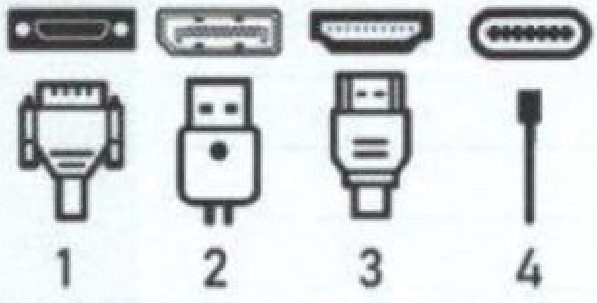
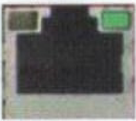
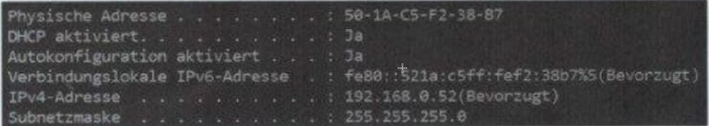

# Abschlussprüfung Frühjahr 2024 Teil 1 der Abschlussprüfung

Termin: Mittwoch, 28. Februar 2024

**Einrichten eines IT-gestützten Arbeitsplatzes.**

**Teil 1 der Abschlussprüfung:**

- 4 Aufgaben
- 90 Minuten Prüfungszeit
- 100 Punkte

---

## Themen / Lernfelder

**Nutzwertanalyse, laufende Kosten, Leasing vs. Kauf, Kaufvertrag**  

- [ ] Siehe insbesondere Aufgabe 1a (Nutzwertanalyse, SaaS vs. on-premise, Bewertung von Angeboten), 1b (laufende Kosten pro Monat, Wartung, Abschreibung), 1c (Anschlüsse, Monitortypen), 1d–1f (Kaufvertrag, Willenserklärung,Laufvertragsstörungen)  

**ITT-Net*werke, OSI-Schichten, IP-Konfiguration, LED-Status**  

- [ ] Siehe insbesondere Aufgabe 2a, 2b (Netzwerkeinstellungen, LED-Status, IP-Konfiguration, OSI-Schichten)

**Dateiformate, Byte-/Bit-Umrechnung, Farbräume, Stromkosten**

- [ ] (Gemäß Aufgabenstellung für die Frühjahr 2024-Prüfung, nicht im hier gezeigten Auszug)  

**Schutzbedarf, IT-Sicherheitsmaßnahmen, Datenübertragungsraten**  

- [ ] (Gemäß Aufgabenstellung für die Frühjahr 2024-Prüfung, nicht im hier gezeigten Auszug)

**Hinweis:**  

- Die Aufgaben 3 und 4 sind in diesem Ausschnitt nicht vollständig abgebildet.  
- In der Gesamtprüfung umfassen sie weitere Themen wie Dateiformate, RGB-Farbraum,  
- Energieverbrauch, Schutzbedarf und Berechnung von Datenübertragungsraten.

## Die Aufgaben 1 bis 4 beziehen sich auf folgende Ausgangssituation

>Sie sind Auszubildender in der IT-Abteilung der KustFlex GmbH. Diese fertigt Kunststoffteile aller Art und Größen auch nach individuellen Wünschen.

---

## 1. Aufgabe (26 Punkte)

Im Unternehmen Kustoflex GmbH werden fünf CAD-Arbeitsplätze eingerichtet.
Sie sind in dem Projektteam, das geeignete Systeme auswählt.

### a. (? Punkte)

Nach der Auswertung von vier Firmenangeboten ergibt sich die folgende Tabelle. Unternehmen 3 bietet ausschließlich eine **Software as a Service (SAAS) Lösung** an.

|Nr.|Komponente|Gewichtung|Unternehmen 1||Unternehmen 2||Unternehmen 3||Unternehmen 4||
|:---|:---|:---|:---|:---|:---|:---|:---|:---|:---|:---|
||||Punkte|**gP**|Punkte|**gP**|Punkte|**gP**|Punkte|**gP**|
|1|Grafikkarte|20 %|3|60|2|40|4|80||60|
|2|Arbeitsspeicher (RAM)|25 %||100|3|75|4|100|3|75|
|3|Monitor|40 %|2|80||40|4|160|4||
|4|Preis||3|45|4|60|1|15|1|15|
||Auswertung|100|12|285|10||13|355|11|310|

---

#### aa. (4 Punkte)

Ermitteln Sie die fehlenden Werte und eine Reihenfolge der vier Unternehmen beginnend mit der höchsten Punktzahl.

1. ...
2. ...
3. ...
4. ...

---

#### ab. (2 Punkte)

In einem Meeting wurde neu festgelegt dass nur eine on-premise Lösung in Frage kommt. Wählen Sie unter Berücksichtigung des Meetings das Unternehmen aus das den Aufttrag bekommen sollte.

...

---

### b. (7 Punkte)

Das ausgewählte Unternehmen legt folgendes Angebot vor:

||Preis|Kondition|
|:---|:---|:---|
|Monitor|450,00 €||
|PC|720,00 €||
|Softwareleasing|50,00 €|pro Monat **und** Arbeitsplatz|
|Wartungspauschale|1200,00 €|pro Jahr für **alle** Geräte|
|||Rabatt **5 %** auf **PC** und **Monitor**|

Berechnen Sie die !aufenden Kosten **pro Monat** für dæ gesamte CAD-Arbeitsplätze unter der Voraussetzung, dass die Nutzungsdauer der **Monitore 4 Jahre** und der  **PCs drei Jahre**  Geben Sie den Rechenweg an.

...

---

### c. (4 Punkte)

Nach der Beschaffung und der Lieferung sollen die Büros vor Ort eingerichtet werden.
Die gelieferten Monitore besitzen eventuell die nachstehenden Anschlüsse.
Ordnen sie die Anschlüsse den Abbildungen zu:

**Anschlüsse:**

|Anschluss|Zuordnung|
|:---|:---|
|HDMI|...|
|USB-C|...|
|DVI|...|
|DisplayPort (DP)|...|

**Abbildungen:**

---

### d. (2 Punkte)

Die Monitore wurden am 1, Septembet 2023 bestellt, Es gibt keine Auftragbestätigung und sie wurden am 7. Oktober 2023 geliefert. Die Rechnung haben Sie am 9. Oktober 2023 erhalten. Erläutern Sie zu welchem Zettpunkt der Kaufvertrag zustande gekommen ist und begründen Sie ihre Entscheidung.

...

---

### e. (3 Punkte)

Nennen Sie drei mögliche Inhalte die durch einen Kaufvertrag geregelt sind (Abgrenzung von den juristischen Bestandteilen eines Kaufvertrags, z. B Willenserklärungen).

1. ...
2. ...
3. ...

---

### f. (4 Punkte)

Die ordnungsgemäße Abgwicklung des Kaufvertrages ist dem Kunden sehr wichtig.

#### fa. (2 Punkte)

Nennen sie zwei Kaufvertragstörungen.

1. ...
2. ...

---

#### fb. (2 Punkte)

Geben Sie bei ihren genannten Kaufvertragsstörungen je eine Maßnahme an, die der Kunde ergreifen kann. um diese Störungen zu vermeiden.

1. ...
2. ...

---

## 2. Aufgabe (24 Punkte)

Nach der Konfiguration des CAD-Arbeitsplatzes prüfen Sie nun die Netzwerkeinstellungen. Dazu führen Sie verschieden Tests durch und interpretieren die Ergebnisse.

### a. (4 Punkte)

Bei einem Blick auf die Netzwerkbuchse Ihres PCs erkeenen Sie rechts oben eine grüne Leuchtdiode (LED, vergleich Bild l).
Interpretern Sie die hier zur Verfügung gestellten Informationen bzüglich der Netzwerkfunktionalität Ihres PCs.

LED leuchtet durchgehend.

1. ...
2. ...

---

LED blinkt unregelmäßig.

1. ...
2. ...

---

### b. (4 Punkte)

Nach der Eingabe des Befehls **"ipconfig /all"** auf der Kommanduzeile Ihres PCs erhalten sie u. a. die fo!genden weiteren Informationen (Abb. 1)

Benenen Sie in der folgnden Tabelle aufgeführten OSI-Schichten und ordnen Sie zur Strukturierung die vorliegenden Begriffe den richtigen Schichten zu:

- Physische Adresse
- DHCP
- Verbindungslokale IPv6-Adresse
- Buchse mit LED

|OSI-Schicht|Name der Schicht (deutsche oder englische Bezeichnung)|Begriff|
|:---|:---|:---|
|7|...|...|
|4|Transport|TCP|
|3|...|...|
|2|...|...|
|1|...|...|

---
