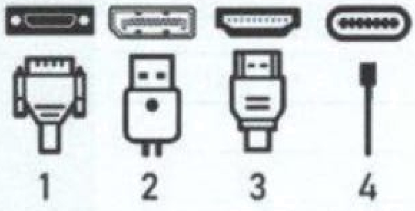

## Teil 1 der Abschlussprüfung Fachinformatiker:in Anwendungsentwicklung

**Einrichten eines IT-gestützten Arbeitsplatzes.**

[Aufgaben & Lösungen](2024_spring_ap1_compressed.pdf)

## Situation

| |
|:--- |
| Sie sind Auszubildender in der IT-Abteilung der KustoFlex GmbH. Diese fertigt Kunststoffteile aller Art und Größen auch nach individuellen Wünschen. |

---

## 1. Aufgabe

>26 Punkte

Im Unternehmen Kustoflex GmbH werden fünf CAD-Arbeitsplätze eingerichtet.
Sie sind in dem Projektteam, das geeignete Systeme auswählt.

### 1a SAAS (Software as a Service) vs. on-premise

>6 Punkte

Nach der Auswertung von vier Firmenangeboten ergibt sich die folgende Tabelle. Unternehmen 3 bietet ausschließlich eine **Software as a Service (SAAS) Lösung** an.

|Nr.|Komponente|Gewichtung|Unternehmen 1||Unternehmen 2||Unternehmen 3||Unternehmen 4||
|:---|:---|:---|:---|:---|:---|:---|:---|:---|:---|:---|
||||Punkte|**gP**|Punkte|**gP**|Punkte|**gP**|Punkte|**gP**|
|1|Grafikkarte|20 %|3|60|2|40|4|80||60|
|2|Arbeitsspeicher (RAM)|25 %||100|3|75|4|100|3|75|
|3|Monitor|40 %|2|80||40|4|160|4||
|4|Preis||3|45|4|60|1|15|1|15|
||Auswertung|100|12|285|10||13|355|11|310|

---

#### 1aa Nutzwertanalyse

>4 Punkte

Ermitteln Sie die fehlenden Werte und eine Reihenfolge der vier Unternehmen beginnend mit der höchsten Punktzahl.

1. ...
2. ...
3. ...
4. ...

---

#### 1ab Entscheidung

>2 Punkte

In einem Meeting wurde neu festgelegt dass nur eine on-premise Lösung in Frage kommt. Wählen Sie unter Berücksichtigung des Meetings das Unternehmen aus das den Aufttrag bekommen sollte.

...

---

### 1b Kostenvergleich

>7 Punkte

Das ausgewählte Unternehmen legt folgendes Angebot vor:

||Preis|Kondition|
|:---|:---|:---|
|Monitor|450,00 €||
|PC|720,00 €||
|Softwareleasing|50,00 €|pro Monat **und** Arbeitsplatz|
|Wartungspauschale|1200,00 €|pro Jahr für **alle** Geräte|
|||Rabatt **5 %** auf **PC** und **Monitor**|

Berechnen Sie die !aufenden Kosten **pro Monat** für dæ gesamte CAD-Arbeitsplätze unter der Voraussetzung, dass die Nutzungsdauer der **Monitore 4 Jahre** und der  **PCs drei Jahre**  Geben Sie den Rechenweg an.

...

---

### 1c

>4 Punkte

Nach der Beschaffung und der Lieferung sollen die Büros vor Ort eingerichtet werden.
Die gelieferten Monitore besitzen eventuell die nachstehenden Anschlüsse.
Ordnen sie die Anschlüsse den Abbildungen zu:

**Anschlüsse:**

|Anschluss|Zuordnung|
|:---|:---|
|HDMI|...|
|USB-C|...|
|DVI|...|
|DisplayPort (DP)|...|

**Abbildungen:**


---

### 1d Kaufvertrag

>2 Punkte

Die Monitore wurden am 1, Septembet 2023 bestellt, Es gibt keine Auftragbestätigung und sie wurden am 7. Oktober 2023 geliefert. Die Rechnung haben Sie am 9. Oktober 2023 erhalten. Erläutern Sie zu welchem Zettpunkt der Kaufvertrag zustande gekommen ist und begründen Sie ihre Entscheidung.

...

---

### 1e juristische Bestandteile eines Kaufvertrags

>3 Punkte

Nennen Sie drei mögliche Inhalte die durch einen Kaufvertrag geregelt sind (Abgrenzung von den juristischen Bestandteilen eines Kaufvertrags, z. B Willenserklärungen).

1. ...
2. ...
3. ...

---

### 1f Kundenzufriedenheit, Maßnahmen zur Vermeidung von Kaufvertragstörungen

>4 Punkte

Die ordnungsgemäße Abwwicklung des Kaufvertrages ist dem Kunden sehr wichtig.

#### 1fa Kaufvertragstörungen

>2 Punkte

Nennen sie zwei Kaufvertragstörungen.

1. ...
2. ...

---

#### 1fb Maßnahmen zur Vermeidung von Kaufvertragstörungen

>2 Punkte

Geben Sie bei ihren genannten Kaufvertragsstörungen je eine Maßnahme an, die der Kunde ergreifen kann. um diese Störungen zu vermeiden.

1. ...
2. ...

---

## 2. Aufgabe (24 Punkte)

Nach der Konfiguration des CAD-Arbeitsplatzes prüfen Sie nun die Netzwerkeinstellungen. Dazu führen Sie verschieden Tests durch und interpretieren die Ergebnisse.

### a. (4 Punkte)

Bei einem Blick auf die Netzwerkbuchse Ihres PCs erkeenen Sie rechts oben eine grüne Leuchtdiode (LED, vergleich Bild l).
Interpretern Sie die hier zur Verfügung gestellten Informationen bzüglich der Netzwerkfunktionalität Ihres PCs.


LED leuchtet durchgehend.

1. ...
2. ...

---

LED blinkt unregelmäßig.

1. ...
2. ...

---

### b. (4 Punkte)

Nach der Eingabe des Befehls **"ipconfig /all"** auf der Kommanduzeile Ihres PCs erhalten sie u. a. die fo!genden weiteren Informationen (Abb. 1)


Benenen Sie in der folgnden Tabelle aufgeführten OSI-Schichten und ordnen Sie zur Strukturierung die vorliegenden Begriffe den richtigen Schichten zu:

- Physische Adresse
- DHCP
- Verbindungslokale IPv6-Adresse
- Buchse mit LED

|OSI-Schicht|Name der Schicht (deutsche oder englische Bezeichnung)|Begriff|
|:---|:---|:---|
|7|...|...|
|4|Transport|TCP|
|3|...|...|
|2|...|...|
|1|...|...|

---

### c. IPv6 (5 Punkte)

Sie analysieren nun die in Abb. 1 angezeigte IPv6 Adresse "fe80:521a:c5ff.fef2:38b7"

Nennen Sie die folgenden zugehörigen Werte:

- Länge der IPv6-Adresse in Bits:

  ...

- Ungekürzte Darstellung der IPv6-Adresse in Hexadezimalschreibweise:

  ...

- Präfxlänge:

  ...

- Interface-Identifier:

  ...

---

### d. DHCP (2 Punkte)


Nennen Sie unter Bezugnahme auf Abb, 1 die Informationen, die der DHCP-Server Ihrem Client zur Verfügung stellt.

1. ...
2. ...

---

### e. ARP (3 Punkte)

Zur weiteren Analyse Ihrer Netzwerkkonfiguration geben Sie den Befehl „arp -a" ein und erhalten die folgende Ausgabe (Abb. 2):

```plaintext
PS C:XWINDOWS\system32>arp - a

- Schnittstelle : 192.168.0.52 --- 0x5
- Internetadresse: 192.168.0.1
- Physische Adresse: d4-3f-cb-8c-37-8b
- Typ: dynamisch
```

Erläutern Sie anhand des Beispiels in Abb. 2 die grundlegende Aufgabe des Address Resolution Protocol (ARP) bei der Netzwerk-
kommunikation in einem LAN.

...

---

### f. Ping (2 Punkte)

Geben Sie einen geeigneten Befehl an, um von Ihrem PC aus die Erreichbarkeit der Internetadresse (siehe Abb. 2) zur prüfen.

...

---

### g. IPv4 und MAC (4 Punkte)

In den Abbildungen 1 und 2 haben Sie Informationen zu dem Datenverkehr der ARP-Kommunikation zwischen Ihrem PC und
dem weiteren PC in Ihrem Netzwerk erhalten.

Ordnen Sie in der folgenden Skizze die IP-Adressen und die Physischen Adressen richtig zu.

| | | |
|:---|:---|:---|
|  | 🖥️ | 🖥️ |
|  | Eigener PC | Weiterer PC in Netzwerk |
| IP-Adresse | ... | ... |
| Physische Adresse | ... | ... |

---

## 3. Aufgabe (24 Punkte)

Ein Kunde sendet seine Daten für ein Bauteil im PLY-Format. Da Ihnen das Format nicht bekannt ist, suchen Sie nach Informationen über das Dateiformat und seinen Aufbau.

### 3a unbekanntes Dateiformat (PLY) (6 Punkte)

1. ...
2. ...
3. ...

---

### 3b Dateikonvertierung (2 Punkte)

Sie haben erfahren, dass es sich bei dem Polygon File Format (PLY) um ein Dateiformat zur Speicherung dreidimensionaler
Daten handelt. Ihr betriebseigenes CAD-System benötigt aber die Daten im OBJ oder STL-Format.

Nennen Sie eine Möglichkeit, wie Sie die Kundendaten in Ihrem CAD-System dennoch verwenden können.

...

---

### 3c ASCII vs. Binärformat (4 Punkte)

Sie haben Informationen über den Aufbau einer PLY-Datei erhalten. Eine PLY-Datei kann im ASCII-Format oder als Binärdatei
gespeichert sein.

Erläutern Sie den Unterschied zwischen einer Datei im ASCII Format und einer Datei im Binär Format.

1. ...
2. ...

---

### 3d Speicher- und Farbberechnung (8 Punkte)

In einer PLY-Datei sind 3840 Punkte gespeichert. Jeder Punkt wird durch x, y und z Koordinaten bestimmt, Jede Koordinate
wird durch einen 32-Bit-Float-Wert codiert.

#### da. Speicherbedarf (3 Punkte)

Berechnen Sie, wie viele Kibibyte Sie benötigen, um die 3.840 Punkte zu speichern. Der Speicherbedarf des Datei-Headers
und Farbcodierungen sollen nicht berücksichtigt werden.

...

---

#### db. Farben (2 Punkte)

Jeder Punkt soll jetzt im RGB-Farbraum mit je 8 Bit pro Farbkanal codiert werden.
Berechnen Sie, wie viele verschiedene Farben sich damit darstellen lassen.

...

---

##### dc. Farbwerte (3 Punkte)

Berechnen Sie, wie viel Prozent Speicher Sie pro Bildpunkt zusätzlich benötigen, um die Farbwerte zu speichern.

...

---

### 3e Netzteil-Leistung (8 Punkte)

Sie werden beauftragt, das Netzteil für einen CAD-Rechner auszuwählen. Es stehen Netzteile von 400 W in 50-w-Schritten bis
1200 W zur Verfügung. Die folgenden Komponenten wurden bereits ausgewählt.

Zu der ermittelten Leistungsaufnahme ist ein Puffer von 10 % hinzuzurechnen.

| **Komponente**| **Maximale Leistungsaufnahme in Watt je Stück** | **Anzahl** |
|:---|:---|:---|
| Mainboard | 20 | 1 |
| Prozessor | 172 | 1 |
| Prozesssor-Lüfter | 12 | 1 |
| Arbeitsspeicher | 5 | 4 |
| Grafikkarte | 310 | 1 |
| M.2 SSD | 5 | 2 |
| Gehäuselüfter | 8 | 2 |

Berechnen Sie die ermittelte Leistungsaufnahme mit Puffer und benennen Sie das ausgewählte Netzteil.

...

---

### 3f Stromkosten (3 Punkte)

Der PC wird an 200 Arbeitstagen je 9 Stunden laufen. Das Netzteil hat einen Wirkungsgrad von 90 % und wird im Schnit zu
50 % ausgelastet sein.

Berechnen Sie die Stromkosten bei einem Preis von 0,40 EUR pro kWh.

Hinweis: Konnten Sie in e) kein Netzteil ermiteln, rechnen Sie mit 750 Watt weiter.

...

---

## 4. Aufgabe (26 Punkte)

Mit Herm Müller wurde ein neuer Mitarbeiter eingestellt, der mit dem hausinternen CAD-Programm die Realisierungsmöglichkeiten der Aufträge überprüfen soll, um eine für alle Seiten optimale Lösung zu finden.

In einigen Fällen wird von ihm erwartet, dass er für wenige Tage beim Kunden vor Ort tätig wird. Zu diesen Terminen wird ihm ein leistungsfähiger Laptop zur Verfügung gestellt.

Die Erstellung und das Bearbeiten einer Konstruktionszeichnung erfordert eine große Rechnerleistung und einen hohen Speicher-bedarf, sodass bei Außenterminen dies auf der lokalen Festplatte des Laptops erfolgen muss.

### 4a Maßnahmen zum Schutz der Vertraulichkeit (6 Punkte)

Herr Müller möchte seine berufsbedingten Fahrten mit Bus und Bahn und die Aufenthalte auf öffentlichen Plätzen zur Erle-digung betrieblicher Arbeiten nutzen. Allerdings sind dabei zur Gewährleistung der Geheimhaltung besondere Vorsichtsmaß-nahmen erforderlich.

Nennen Sie Herrn Müller drei geeignete Maßnahmen Sie dabei auf eine mögliche Folge einer Nichtbeachtung hin.
Ergänzen Sie dazu die nachfolgende Tabelle.

| Maßnahmen oder Verhaltensweisen | Folge bei Nichtbeachtung |
|:---|:---|
| *Beispiel: Nutzung einer Blickschutzfolie* | *Beispiel: Bildschirminhalt kann von Unberechtigten gelesen werden* |
| ... | ... |
| ... | ... |
| ... | ... |

---

### 4b VPN (2 Punkte)

Herr Müller sichert seine Daten möglichst auf dem Server der KustoFlex GmbH über VPN.

Erklären Sie die Funktionalität des Begriffs VPN.

...

---

### 4c Internetverbindung und Datensicherheit (3 Punkte)

Herr Müller kritisiert, dass im Außendienst nicht immer eine stabile Internetverbindung zur Verfügung steht.

Nach den Sicherheitsrichtlinien der Kustoflex GmbH sind für lokal gespeicherte Daten Tagesvollsicherungen auf mehreren
(nummerierten) externen Festplatten vorgesehen.

Nennen Sie Herrn Müller drei Punkte, die zu beachten sind, wenn die lokal gespeicherten Daten mithilfe von externen Festplat-
ten möglichst zuverlässig gesichert werden sollen. Benücksichtigen Sie dabei die Datensicherheitsaspekte.

1. ...
2. ...
3. ...

---

### 4d Malware (6 Punkte)

Sie informieren Herm Müler über „Malware" als Oberbegriff für Schadsoftware.

#### da. Arten von Malware (3 Punkte)

Nennen Sie drei Arten von Malware.

1. ...
2. ...
3. ...

---

#### db. Spezifische Merkmale von Malware (3 Punkte)

Weisen Sie den in Aufgabe da) genannten Arten jeweils ein spezifisches Merkmal zu.

1. ...
2. ...
3. ...

---

### 4e Schutzmaßnahmen (3 Punkte)

Eine Antivirensoftware ist bereits auf dem Laptop installiert.

Erläutern Sie Herm Müler drei weitere organisatorische oder technische Empfehlungen, wie man sich vor Malware schützen
kann.

1. ...
2. ...
3. ...

---

### 4f Datenübertragung (6 Punkte)

Berechnen Sie zur Verdeutlichung des Zeitaufwands für Herr Müller die Übertragungsdauer, wenn er Daten mit einem Umfang von 1 GiB aufgrund des Ergebnisses des Speedtests abspeichern Möchte. Der Rechenweg ist mit anzugeben.

Ergebnis des Speedtests:

| **Download** | **Upload** |
|:---|:---|
| 75.78 Mbit/s | 50.02 Mbit/s |

Runden Sie das Ergebnis auf volle Sekunden auf und stellen Sie das Ergebnis in Minuten und Sekunden dar.

...

---
