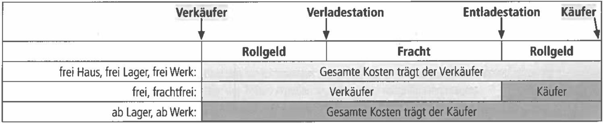
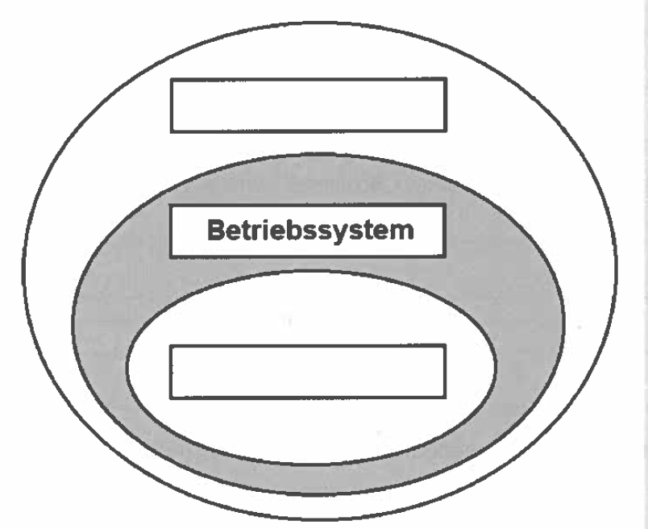
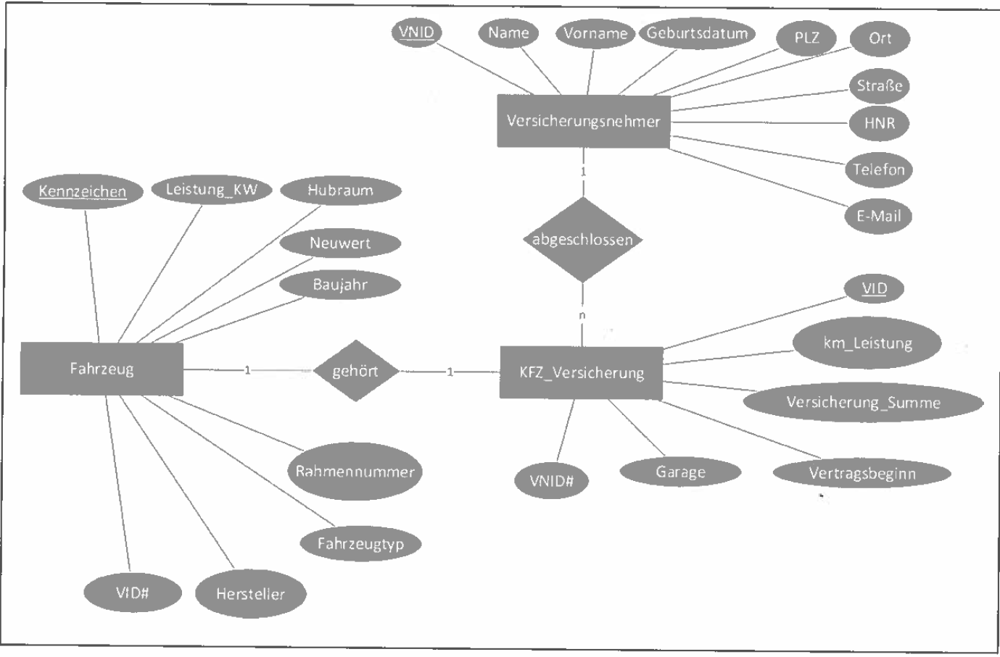

# Abschlussprüfung Frühjahr 2023 Teil 1 der Abschlussprüfung

---

## Situation

>Sie arbeiten in der SecuRita AG, einem Unternehmen des Finanzsektors. Hier steht eine Neustrukturierung der Arbeitsplätze unter Beachtung von Datensicherheit und Datenschutz an. Dabei sollen Sie die folgenden Aufgaben erledigen:

1. [Nutzwertanalyse](#1-b-16-punkte), [Vergleich Endgeräte](#1-a-4-punkte), [Entscheidung](#1-c-4-punkte), [Kriterium](#1-d-2-punkte), [Cloudlösungen / SaaS]
2. [Bezugspreisermittlung](#2-aa-10-punkte) mit Gegenüberstellung von Kauf und Leasing
3. Datenschutz und Datensicherheit bei der [Betriebssystemkonfiguration](#3-a-4-punkte), [BSI](#3-b-24-punkte), [Protokollierung](#3-c-4-punkte)
4. Einsatz von KI bei der Schadensabwicklung, [Lasten- und Pflichtenheft](#4-bb-2-punkte), UML, SELECT

---

### 1. Aufgabe (26 Punkte)

Das Unternehmen plant, seine Arbeitsumgebungen zu modernisieren. Das bisher genutzte Großraumbüro mit festen Arbeitsplätzen soll durch eine flexible Struktur ersetzt werden. Dafür sollen verschiedene Modelle für Arbeitsplatzrechner mithilfe einer **Nutzwertanalyse** verglichen werden. Die zur Auswahl stehenden Modelle finden Sie im Belegsatz.

---

#### 1 a (4 Punkte)

Nennen Sie pro Modell je einen Vor- und einen Nachteil

||Vorteil|Nachteil|
|---|---|---|
|Notebook|||
|All-in-One-PC|||
|Thin Client|||
|Desktop-PC|||

---

#### 1 b (16 Punkte)

Analysieren Sie die zur Verfügung stehen Modelle und ergänzen Sie die Nutzwertanalyse in den Zellen mit den fehlenden Punkten (weiße Felder). Jeder Punktwert kann nur einmal vergeben werden. (1-4 Punkte möglich, 1: am schlechtesten, 4: am besten)  

Berechnen Sie anschließend für jedes Modell die Summe der gewichteten Punkte.

|Nr.|Kriterien|Gewichtung|Notebook||All-in-One-PC||Thin Client||Desktop-PC||
|---|---|---|---|---|---|---|---|---|---|---|
||||Punkte|__gP__|Punkte|__gP__|Punkte|__gP__|Punkte|__gP__|
|1|Platzbedarf|15%|2|0,3|3|0,45|||||
|2|Ergonomie|20%|2|0,4|||4|0,8|||
|3|Performance|10%|3|0,3|||2|0,2|||
|4|Verfügbarkeit|20%|4|0,8|2|0,4|1|0,2|3|0,6|
|5|Koststen für Wartbarkeit und Erweiterbarkeit|15%|2|0,3|||4||||
|6|Preis|20%|||||||||
||Auswertung|100|||||||||

gP = gewichtete Punkte

---

#### 1 c (4 Punkte)

Entscheiden Sei sich für eines der Modelle unter Berücksichtigung der geplanten Modernisierung der Arbeitsumgebung. Begründen Sie Ihre Entscheidung.

---

#### 1 d (2 Punkte)

Geben Sie ein weiteres sinnvoles Kriterium für die Nutzwertanalyse an. Begründen Sie Ihren Vorschlag.

---

### 2. Aufgabe (25 Punkte)

Für die Mitarbeiter solen 3.500 neue Notebooks bezogen werden. Von den Standard-Lieferanten wurden folgende drei Angebote eingeholt:

||Notebooks-günstiger.de|SMART Notebooks|Tech-ware|
|---|---|---|---|
|Listen-EK-Preis/Stk.|886,31 €|901,25 €|1.071,00 €|
|Lieferantenrabatt|0 %|0 %|20 %|
|Lieferantenskonto|0 %|0 %|2 %|
|Lieferbedingungen|frachtfrei|frei Haus|ab Werk|

Für ale Angebote gelten die folgenden Lieferkosten durch die Spedition Lieferschnel GmbH:

- Rollgeld zur Verladestation: 45 EUR pro 10 Stück
- Fracht: 100 EUR pro 10 Stück
- Rollgeld ab Entladestation: 5 EUR pro 10 Stück

#### 2 aa (10 Punkte)

Ermiteln Sie den Bezugspreis der einzelnen Anbieter pro Notebook durch Ergänzung der leeren Felder in der folgenden Tabelle:

||Notebooks-günstiger.de|SMART Notebooks|Tech-ware|
|---|---|---|---|
|Listen-EK-Preis/Stk. Brutto|886,31 €|901,25 €|1.071,00 €|
|Lieferantenrabatt|0,00 €|0,00 €||
|=Zieleinkaufspreis|886,31 €|901,25 €||
|Lieferantenskonto|0,00 €|0,00€||
|=Bareinkaufspreis|886,31 €|901,25 €||
|Bezugskosten||||
|=Bezugspreis||||

---

#### 2 ab (3 Punkte)

Es wurde ein Lieferant mit einem höheren Bezugspreis gewählt. Nennen Sie drei mögliche Gründe.

1. ...
2. ...
3. ...

---

#### 2 b (4 Punkte)

Sie erhalten ein weiteres Angebot. Die Best-IT-Service GmbH bietet die 3.500 Notebooks zu einem Gesamtpreis von 300.000,00 EUR an, alternativ einen Leasingvertrag über fünf Jahre mit einer monatlichen Leasingrate von 6.000,00 EUR mit Kaufoption.

---

##### 2 ba (2 Punkte)

Beschreiben Sei das Grundprinzip von Leasing und erklären Sei dabei die Eigentums- und Besitzverhältnisse

...

---

##### 2 bb (3 Punkte)

Vergleichen Sei den Kaufpreis mti den Gesamtkosten des Leasings. Ermitteln Sie den Differenzbetrag

...

---

#### 2 bc (3 Punkte)

Nennen Sie __drei Vorteile__, die für einen Leasingvertrag sprechen.

1. ...
2. ...
3. ...

---

#### 2 bd (2 Punkte)

Erläutern Sie den Begriff __Kaufoption__.

...

---

### 3. Aufgabe (24 Punkte)

#### 3 a (4 Punkte)

Sie informieren sich darüber, wie Sie bei den PCs in Ihrem Betrieb auf der Ebene der Betriebssysteme die Sicherheit verbessern könnten. Zur Einordnung der Funktionsebenen eines PCs wird häufig ein Schichten- oder ein Schalenmodel verwendet.

Benennen Sie im nebenstehenden Modell eine Schicht oberhalb und eine Schicht unterhalb des Betriebssystems.

Beschreiben Sie mithilfe der folgenden Tabelle jeweils eine Funktion Ihrer oben benannten Schichten.

|Schicht|Funktion|
|---|---|
|||
|||

---

#### 3 b

Bei Ihren Recherchen zur Sicherheit rund um das Betriebssystem treffen Sie auf eine Information des Bundesamts für Sicherheit in der Informationstechnik (BSI). Beim Lesen des Textes ergeben sich die unten aufgeführten Fragen.

>„Ein Großteil der erfolgreichen Angriffe auf IT-Systeme mit Microsoft Windows 10 lässt sich bereits mit den im Betriebssys- tem vorhandenen Bordmitteln erkennen oder verhindern. Um die nötige Konfiguration des Betriebssystems zu erleichtern, hat das Bundesamt für Sicherheit in der Informationstechnik (BSD im Rahmen der „Studie zu Systemaufbau, Protokollie- rung, Härtung und Sicherheitsfunktionen in Windows 10" (SiSyPHuS Win 10) Hand/ungsempfehlungen zurAbsicherung der Windows-Systeme in deutscher und englischer Sprache veröffentlicht. Ein Fokus bei der Erstellung lag auf der einfachen Umsetzung und praktischen Anwendung. Daher stellt das BSI die empfohlenen Konfigurationseinstellungen als direkt in Windows importierbare Gruppenrichtlinienobjekte (GP9) zum Download bereit — ein Service, der schnell und sicher ist. " Quelle: <https://www.bsi.bund.de/DE/Service-Navi/Presse/Pressemitteilungen/Presse2021/210503_SiSyPHuS.html> veröffentlicht am 03. Mai 2021

##### 3 ba Nennen Sie zwei allgemeine Aufgaben des BSI (2 Punkte)

...

---

##### 3 bb Erklären Sie den Begriff der „Härtung" eines Betriebssystems (2 Punkte)

...

---

##### 3 bc Nennen Sie zwei Beispiele für eine Härtung eines Betriebssystems (2 Punkte)

...

---

##### 3 bd  Nennen Sie zwei Svstemwerkzeuae („Bordmittel") eines Betriebssystems, mit denen die IT-Sicherheit erhöht werden kann (2 Punkte)

...

---

##### 3 be Beschreiben Sie, wozu Gruppenrichtlinien auf einem Arbeitsplatzrechner eingesetzt werden können (4 Punkte)

...

---

#### 3 c (4 Punkte)

Das BSI gibt weiterhin auch Empfehlungen zur Konfiguration der Protokollierung von Aktivitäten an den einzelnen Rechnern  

##### 3 ca Beschreiben Sie, inwiefern eine Protokollierung (Logging) zur Erhöhung der IT-Sicherheit beitragen kann (4 Punkte)

...

---

##### 3 cb Beschreiben Sie die besonderen Anforderungen an den Datenschutz, die bei der Protokollierung beachtet werden müssen (4 Punkte)

...

---

### 4. Aufgabe (25 Punkte)

#### 4 a (4 Punkte)

Die SecuRita AG möchte zukünftig die Möglichkeit bieten, Schadensfälle schnell und einfach online zu regulieren. Zum Einsatz soll ein Chatbot kommen, der über künstliche Intelligenz verfügt. Dazu soll in einem ersten Schritt eine Übersicht über die Vorteile und Nachteile eines Chatbot unter wirtschaftlichen und sozia- len Aspekten erstellt werden. Geben Sie in jedem Feld ein zutreffendes Argument an.

||Vorteile|Nachteile|
|---|---|---|
|wirtschaftliche Aspekte|||
|soziale Aspekte|||

---

#### 4 b (4 Punkte)

Die SecuRita AG hat sich für den Einsatz des Chatbots entschieden. Dazu soll in einem ersten Schritt ein Lastenheft erstellt werden.

##### 4 ba Beschreiben Sie zwei Unterschiede zwischen einem Lastenheft und einem Pflichtenheft (4 Punkte)

...

---

##### 4 bb (2 Punkte)

Sie wirken an der Erstellung des Lastenheftes mit. Nennen Sie zwei weitere Inhalte, die neben der Ausgangssituation in ein Lastenheft gehören.

|Inhalt Lastenheft|
|---|
|- Ausgangssituation|
|- ...|
|- ...|

---

#### 4 c (8 Punkte)

Im nächsten Schritt wird ein Entwurf eines UML-Klassendiagramms für die Schadensregulierung erstellt. Für die Versicherungsfälle KFZ und Immobilie sollen eigene Klassen entworfen werden.

Die Klasse KFZ hat die Eigenschaften:

- Hersteller
- Typschlüssel
- Neupreis
- Baujahr
- Laufleistung
- Schadenshöhe

und Methoden:

- restwertBerechnen()
- auszahlen()
  
Die Klasse immobilie hat die Eigenschaften:

- Neupreis
- Baujahr
- Wohnfläche
- Lagebewertung
- Schadenshöhe
  
und Methoden:

- restwertBerechnen()
- getLagebewertung()
- auszahien()

__Aufgabe:__ Erstellen Sle eine sinnvolle Klassenhierarchie mit einer gemeinsamen Oberklasse „VersicherungsobÉkt"
__Hinweis:__ Die Restwertberechnung erfolgt beim KFZ und bei der Immobilie unterschiedlich. Zusätzliche Methoden, Konstruktoren und Zugriffsmodifikatoren sind nicht erforderlich.

---

#### 4 d

Bei der Schadenregulierung im KFZ-Bereich werden die notwendigen Informationen in einer relationalen Datenbank gespeichert. Wichtig dabei ist die Zuordnung der Versicherungsnehmer zu den jeweiligen KFZ-Daten. So werden zum Beispiel unter dem Attribut Fahrzeugtyp, die Fahrzeuge nach SUV, Limousine, Geländewagen oder Cabriolet unterschieden. Das Attribut „Garage" wird mit dem Datentyp BOOLEAN abgespeichert. Ein Teilauszug aus dieser Datenbank sehen Sie in dem untenstehenden Entity-Relationship-Modell.

__PK__ bezeichnet ein Primärschlüsselattribut, Primärschlüsselattribute werden unterstrichen.

__FK__ bezeichnet ein Fremdschlüsselattribut, Fremdschlüsselattribute werden durch ein nachgestelltes Hash-Zeichen (#) kenntlich gemacht.

##### 4 da (3 Punkte)

Sie erhalten von der Versicherungszentrale den Auftrag, die durchschnittliche Versicherungssumme über alle KFZ-Versiche rungsverträge zu ermitteln. Erstellen Sie dazu eine geeignete SQL-Abfrage.

...

---

##### 4 db (4 Punkte)

Sie erhalten von der Versicherungszentrale den Auftrag, die Versicherungsnummern (VID) zu ermitteln, welche im Mai 2022 abgeschlossen wurden und eine maximale Versicherungssumme von über 100.000,00 EUR beinhalten. Alle Fahrzeuge, die in einer Garage abgestellt werden, sollen in dieser Abfrage nicht angezeigt werden. Erstellen Sie dazu eine geeignete SQL-Abfrage.
