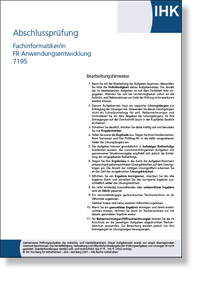
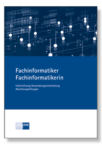

## KI-gestützte Analyse alter Prüfungsaufgaben für Fachinformatiker

### Projektziel

Das Projekt „KI-gestützte Analyse alter Prüfungsaufgaben für Fachinformatiker“ hat zum Ziel, aus alten Prüfungsaufgaben der vergangenen Jahre mittels KI und Verschlagwortung die wahrscheinlichen Aufgabenbereiche für kommende Prüfungen zu ermitteln.

Dies soll den Fachinformatiker-Anwärtern ein **besseres Verständnis der Prüfungsanforderungen** verschaffen und dadurch eine **effizientere Prüfungsvorbereitung** ermöglichen.


---

### Maintainer

[Heiko Fanieng](https://fanieng.com)  
Mail: [heiko@fanieng.com](mailto:heiko@fanieng.com)  
LinkedIn: [hfanieng](https://www.linkedin.com/in/hfanieng)  
Github: [hfanieng](https://github.com/hfanieng)

### Contributors

- [Farzaneh Soghani](https://github.com/Farzaneh0101)
- [Hiba Al Anssari](https://github.com/HibaAlanssari)
- [Katrin Kraus](https://github.com/xTrina)
- [Tanja Kretschmann](https://github.com/Kretta)
- [Abderrahim El Bouanani](https://github.com/Abdel-213)
- [Puya Khandany](https://github.com/PuyaKh)  
- ...
- GitHub: [wearesolutionarchitects](https://github.com/wearesolutionarchitects)  
- LLMs: Chat GPT 4.5, o1, o3-mini | Stable Diffusion: RealVisXL30 | Mistral | Llama | ...

---

## Inhaltsverzeichnis

- [1. Einleitung (ca. 1 Minute)](#1-einleitung-ca-1-minute)
- [2. Vorgehensweise (ca. 5 Minuten)](#2-vorgehensweise-ca-5-minuten)
  - [2.1 Digitalisierung & Datensammlung](#21-digitalisierung--datensammlung)
  - [2.2 Tagging & Verschlagwortung](#22-tagging--verschlagwortung)
  - [2.3 Abgleich mit IHK-Prüfungskatalog](#23-abgleich-mit-ihk-prüfungskatalog)
  - [2.4 KI-gestützte Analyse](#24-ki-gestützte-analyse)
- [3. Einsatz von GitHub (ca. 2 Minuten)](#3-einsatz-von-github-ca-2-minuten)
- [4. Vorteile & Nachteile (ca. 3 Minuten)](#4-vorteile--nachteile-ca-3-minuten)
- [5. Fazit (ca. 2 Minuten)](#5-fazit-ca-2-minuten)
- [6. Fragen & Diskussion (ca. 10 Minuten)](#6-fragen--diskussion-ca-10-minuten)
- [7. Live-Demo (ca. 10 Minuten)](#7-live-demo-ca-10-minuten)
- [8. Fragen & Diskussion zur Live-Demo (ca. 10 Minuten)](#8-fragen--diskussion-zur-live-demo-ca-10-minuten)

---

## 1. Einleitung (ca. 1 Minute)

- Problem: Fachinformatiker-Anwärter müssen sich auf IHK-Prüfungen vorbereiten, ohne genau zu wissen, welche Themen relevant sind.
- Ziel: Aus alten Prüfungsaufgaben der vergangenen Jahre mittels KI und Verschlagwortung die wahrscheinlichen Aufgabenbereiche für kommende Prüfungen ermitteln.
- Warum: Besseres Verständnis der Prüfungsanforderungen, effizientere Prüfungsvorbereitung.

---

## 2. Vorgehensweise (ca. 5 Minuten)

### 2.1 Digitalisierung & Datensammlung



- Alte Aufgaben in digitaler Form (PDF, Scans etc.).
- Extraktion der Inhalte in Textform (z.B. mittels OCR-Tools).
- Vorteil: Einheitliches Format, automatisierte Weiterverarbeitung.

---

### 2.2 Tagging & Verschlagwortung

- Markdown-Dateien: Jede Aufgabe in einer separaten Datei.
- YAML Frontmatter: Enthält Metadaten wie

```yaml
---
title: Herbst 2024
description: "Teil 1 der Abschlussprüfung Fachinformatiker:in Anwendungsentwicklung"
pubDate: 2024-09-17
meta:
  - name: "description"
    content: "Teil 1 der Abschlussprüfung Fachinformatiker:in Anwendungsentwicklung"
  - name: "author"
    content: "Heiko Fanieng"
  - property: "og:title"
    content: "Prüfungen"
  - property: "og:description"
    content: "Teil 1 der Abschlussprüfung Fachinformatiker:in Anwendungsentwicklung"
  - http-equiv: "content-language"
    content: "de"
tags:
- AP1
- Einrichtung
- Herbst
- September
- "2024"
- IT-Grundschutz
- Netzwerkkonfiguration
- UML
- Anwendungsfall-Diagramm
- Array
- Pseudocode
- Gesamtkosten
- Netto- und Bruttopreis
- Ratendarlehen
- RAM-Kompatibilität
- Phishing
- Lasten- und Pflichtenheft
- Datenmodell
- Leasing
- Ökologische Aspekte
---
```

- Zweck: Klare Struktur, schnelle Filterung und Sortierung.

---

### 2.3 Abgleich mit IHK-Prüfungskatalog



- IHK-Katalog analysieren: Welche Themen sind besonders relevant/neu?
- Mapping: Aufgaben-Tags vs. Themenbereiche im Katalog.
- Dynamische Gewichtung: Fokus auf besonders relevante Kategorien.

---

### 2.4 KI-gestützte Analyse

- Ansatz:
  1. KI-Modell (z.B. NLP) analysiert Häufigkeit und Relevanz der Themen.
  2. Identifiziert wiederkehrende oder aufkommende Themen.
  3. Prognose, welche Themen in Zukunft wahrscheinlich sind.
- Ergebnis: „Wahrscheinlichkeitsranking“ möglicher Themen.

---

## 3. Einsatz von GitHub (ca. 2 Minuten)

- Versionierung & Zusammenarbeit:
  - Gemeinsames Repository für alle Markdown-Dateien.
  - Änderungen, neue Aufgaben oder Tags nachvollziehbar.
- Branching-Strategie:
  - Haupt-Branch: Stabiler Stand mit validierten Aufgaben.
  - Feature-Branches: Neue Aufgaben / Tags hinzufügen, KI-Modelle aktualisieren.

---

## 4. Vorteile & Nachteile (ca. 3 Minuten)

### Vorteile

1. Strukturierte Sammlung: Durch Markdown & YAML klar gegliedert.
2. Schnelle Wiederverwendung: Aufgaben lassen sich einfach filtern und neu zusammenstellen.
3. Team-Workflow: GitHub-Integration erlaubt kollaboratives Arbeiten.
4. Datengestützte Prognose: KI liefert systematisch verwertbare Ergebnisse.

---

### Nachteile

1. Initialer Aufwand: Digitalisierung & Tagging kosten Zeit.
2. Datenqualität: Schlechte OCR-Ergebnisse beeinträchtigen die KI-Analyse.
3. Fehlende KI-Erklärbarkeit: Prognosen sind nicht immer ohne Weiteres nachvollziehbar.
4. Abhängigkeit von Aktualität: IHK-Prüfungskatalog muss immer aktuell gehalten werden.

---

## 5. Fazit (ca. 2 Minuten)

- Effiziente Lernhilfe: Das System bietet einen strukturierten Ansatz, um Prognosen über wahrscheinliche Prüfungsinhalte zu treffen.
- Guter Startpunkt: Die KI-Analyse liefert eine datenbasierte Indikation, ersetzt aber nicht das eigene Verständnis der Themen.
- Zukünftige Erweiterung:
  - Regelmäßige Aktualisierung des IHK-Katalogs und der Aufgaben.
  - Feinere Tagging-Strukturen oder automatisierte Tag-Generierung durch KI.
  - Einsatz weiterer KI-Methoden (z.B. Deep Learning für Trendanalysen).

---

**Danke für Eure Aufmerksamkeit!**

---

## 6. Fragen & Diskussion (ca. 10 Minuten)

- Wie könnte die KI-Analyse durch zusätzliche Datenquellen verbessert werden?
- Welche weiteren Anwendungsfälle außerhalb von Prüfungsvorbereitungen sind denkbar?
- Inwiefern könnte das System auch für andere Berufsbilder oder Studiengänge angepasst werden?

---

## 7. Live-Demo (ca. 10 Minuten)

- Vorstellung des GitHub-Repositories und der Struktur.
- Demonstration der Filtermöglichkeiten und der KI-Analyse.
- Interaktive Erstellung einer „Prüfung“ basierend auf den Ergebnissen.

---

## 8. Fragen & Diskussion zur Live-Demo (ca. 10 Minuten)

- Wie könnte die Benutzeroberfläche für Anwender:innen verbessert werden?
- Welche weiteren Features wären wünschenswert?
- Wie könnte die KI-Analyse in Echtzeit bei der Erstellung von Prüfungen unterstützen?

---
