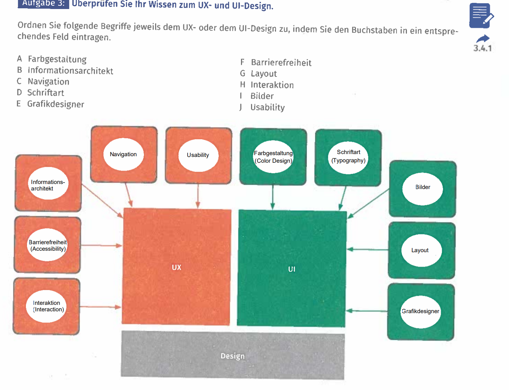

# Benutzerschnittstellen unter softwareergonomischen Gesichtspunkten planen

Arbeitsbuch Seite 126, Aufgabe 1-5

## Aufgabe 1

## Aufgabe 2

Beurteilen Sie Software hinsichtlich des UX Designs. Erarbeiten Sie sich in Gruppenarbeit die Grundlagen des UX Design und finden Sie jeweils ein Beispiel für eine Software, wo diese gut bzw. schlecht umgesetzt wurde. Begründen Sie Ihre Aussagen, indem Sie die jeweils positiven bzw. negativen Aspekte benennen. Präsentieren und diskutieren Sie Ihre Ergebnisse im Klassenverband.

|Software|Begründung|
|---|---|
|Positiv: Visual Studio Code|Barrierefrei: Text und Darstellung kann mit Strg und [+] vergrößert werden.|
|<https://code.visualstudio.com/>||
|Negativ: Microsoft Excel|kein echter Darkmode|
|<http://www.office365.com/>||

## Aufgabe 3

<http://www.fanieng.com/>
<http://la-mediterranea.eu>

## Aufgabe 4

## Aufgabe 5

Bewerten Sie Software hinsichtlich ihrer Barrierefreiheit. : Finden Sie in Partnerarbeit Beispiele für die Umsetzung der Barrierefreiheit in Softwareanwendungen. Wählen Sie dazu selbstständig eine Software aus und beschreiben Sie diese.

|Software|Umsetzung|
|---|---|
|Microsoft Teams|Transkribierung, Gespräche können für Menschen ohne Höhrvermögen in Untertitel umgewandelt werden|
