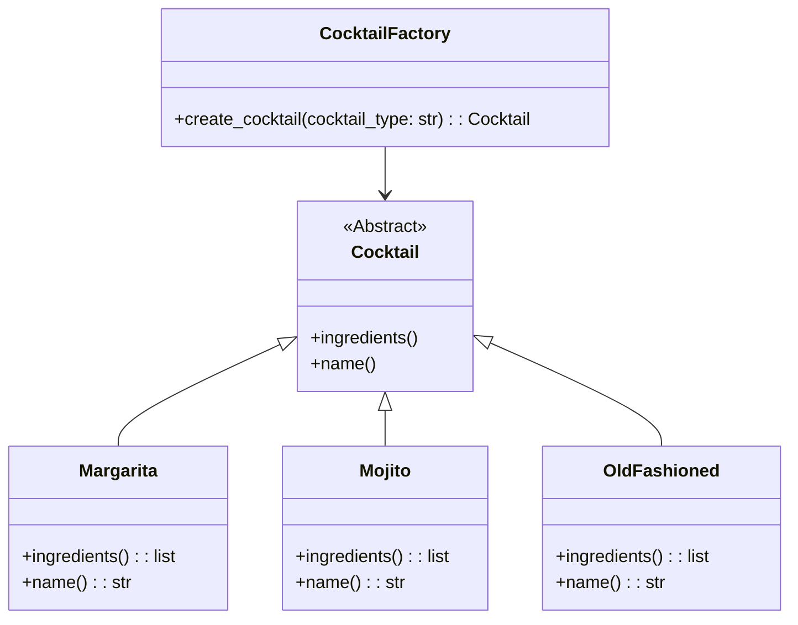

# Factory pattern

```mermaid
classDiagram
    class Cocktail {
        <<Abstract>>
        +ingredients()
        +name()
    }

    class Margarita {
        +ingredients() : list
        +name() : str
    }

    class Mojito {
        +ingredients() : list
        +name() : str
    }

    class OldFashioned {
        +ingredients() : list
        +name() : str
    }

    class CocktailFactory {
        +create_cocktail(cocktail_type: str) : Cocktail
    }

    Cocktail <|-- Margarita
    Cocktail <|-- Mojito
    Cocktail <|-- OldFashioned
    CocktailFactory --> Cocktail
```

---
