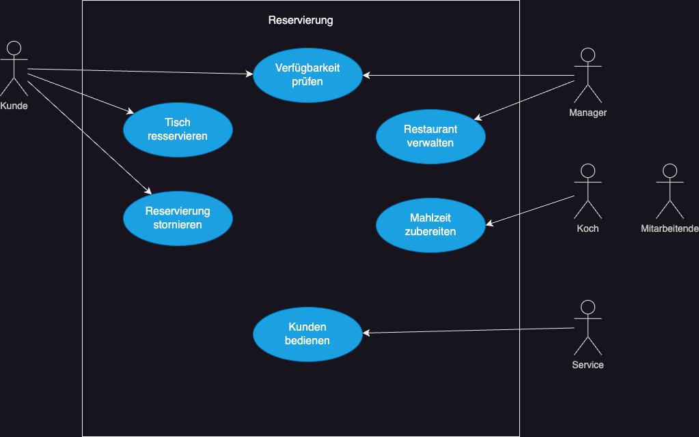
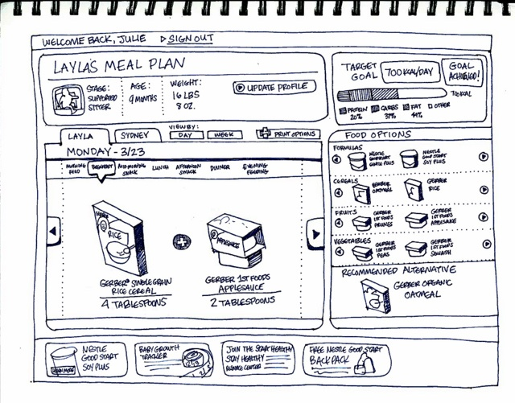
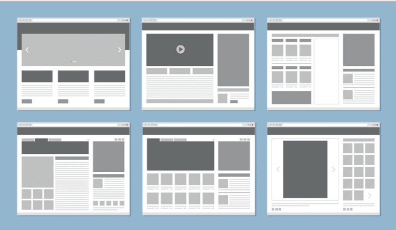
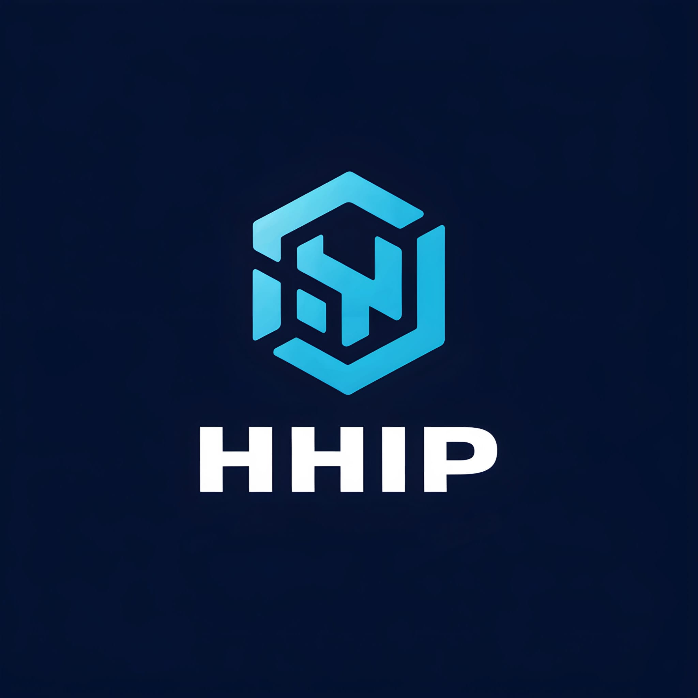
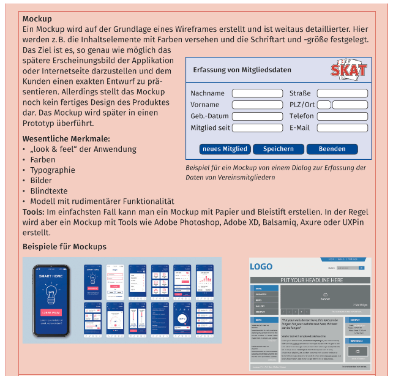

# Eine Oberfläche für eine Benutzerschnittstelle entwerfen

---

## 1. Geben Sie an, welche Aussagen richtig sind

- [x] Erste Entwürfe in Form von Sketches, Wireframes oder Mockups können sehr gut in Kundengesprächen und zur Erstellung des Pflichtenheftes verwendet werden.
- [ ] Ein Sketch enthält einen ersten Entwurf und steht am Anfang des Designprozesses einer Benutzerschnittstelle.
- [x] Wireframes enthalten noch keine Angaben über die farbliche Gestaltung der Oberfläche und keinen Text.
- [ ] Wireframe und Mockup sind zwei Begriffe für die gleiche Sache.
- [x] Mockups können schon Bilder und Blindtexte enthalten.

---

## 2. Überprüfen Sie mit den Aufgaben 6,7 und 8 der Lernsituation 4 im Arbeitsbuch Ihr Wissen zu Sketches, Wireframes und Mockups und planen Sie für Ihr Projekt eine ergonomische Benutzerschnittstelle

## Aufgabe 6: Überprüfen Sie Ihr Wissen über Sketch, Wireframes und Mockups

Erläutern Sie den Unterschied zwischen einem Wireframe, einem Sketch und einem Mockup und bringen Sie
diese in die richtige Erstetlungsreihenfolge.

__Sketch__ -> __Wireframe__ ->  __Mockup__

Erläuterung: Zuerst wird eine Handskizzze (Sketch) erstellt, danach ein Wireframe (funktioneller Entwurf) und zuletzt ein Mockup auf Basis des Wireframes. Das Mockup enthält bereits das look und Feel der Anwendung, Bilder, Farben und Blindtexte.

---

## Aufgabe 7: Überprüfen Sie Ihr Wissen über die ergonomische Gestaltung von Softwareschnittstellen

Kreuzen Sie an, was zutrifft:

__Ergonomische Gestaltung von Softwareschnittstellen.__

### 7.1 Softwareergonomie befasst sich mit

- [ ] der Entwicklung von benutzergerechten Datenmodellen
- [x] mit der Entwicklung von Benutzerschnittstellen
- [ ] mit dem Design von effizienten Programmiersprachen
- [ ] mit der optimalen Anpassung der Hardware an die Software

### 7.2 Konkrete Anforderungen an die Softwareergonomie sind zu finden in der

- [ ] ISO 7201
- [ ] ISO 9141
- [ ] ISO 7241
- [x] ISO 9241
- [ ] ISO 0335
- [ ] ISO 9421

---

### 7.3 Bestandteile des UX Design sind

- [x] Erwartungskonformität
- [x] Erlernbarkeit
- [x] Usability
- [x] Visuelles Design
- [x] Zugänglichkeit

---

### 7.4 Welche Maßnahmen gehören nicht zum Corporate Design von Software?

- [ ] Gestaltung des Logos
- [ ] Auswahl geeigneter Farben
- [x] Einheitliche Kommentierung des Quellcodes
- [x] Clean Code
- [ ] Auswahl geeigneter Bilder

---

### 7.5 Bringen Sie die folgenden Entwürfe in die zeitlich richtige Reihenfolge. Nummerieren Sie dazu die Phasen durch

1. Sketch
2. Mockup
3. Wireframe
4. Prototyp

---

## Aufgabe 8: Planen Sie für Ihr Projekt eine ergonomische Benutzerschnittstelle

__Bearbeiten Sie innerhalb Ihrer Projektgruppe folgende Aufgaben.__

---

### 1 Planen Sie für Ihr Programm auf Grundlage Ihres Anwendungsfall-diagramm eine Oberfläche

Entwickeln Sie dafür zunächst ein Sketch

und ein Wireframe für Oberflächenbestandteile.

 Beachten Sie dabei die Grundprinzipien des UX-Designs.

### 2 Entwickeln Sie für Ihr Programm ein Corporate Design

| Element | Beschreibung |
| --- | --- |
| Logo |  |
| Schriftart | Arial |
| Farben | Dunkelblau, Hellblau und Weiß |
| Bilder (Verweise) | |
| Sonstiges | Browserinterface, Desktop-APP |

---

### 3 Erstellen Sie für Ihre Oberfläche ein Mockup

Berücksichtigen Sie dabei die Entscheidungen, welche Sie zum Corporate Design getroffen haben. Fertigen Sie hier nur einen ersten Handentwurf an und setzen Sie diesen dann am PC mithilfe von Grafikprogrammen um.

---

### 4 Sammeln Sie Ideen, wie Sie Barrierefreiheit in Ihrem Programm umsetzen können

- Alternativt-Texte zu Grafiken
- Unterschiedliche Styles Farbschamat u. a. bei Farbenblindheit und Sehschwäche
- Plattformunabhängigkeit z. B. durch Screenreader und Tastatursteuerung
- Kontrastreiche Farben
- Schriftgröße und Schriftart
- Tooltips und Hilfetexte für Bedienelemente und Funktionen

---
