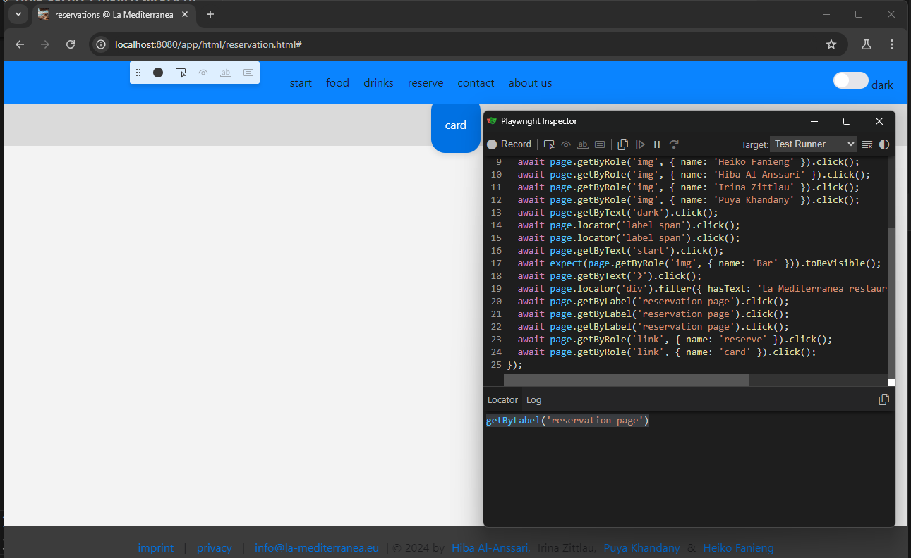

# La Mediterranea Web-App Testplan

---

## Zeitplanung (Rahmen: 29.10.2024 - 07.11.2024)

### Vorbereitung und Setup

#### 1. Installation und Konfiguration von Playwright (Tag 1/29.10.2024)

Dauer: 1 Tag  
Verantwortlich: Puya und Heiko

__Aufgaben:__

-[x] Playwright in Visual Studio Code installieren und konfigurieren.  
-[x] Sicherstellen, dass alle Teammitglieder das Setup erfolgreich abgeschlossen haben.

<https://playwright.dev/docs/intro>

---

#### 2. Projekt- und Teststruktur aufbauen (Tag 1/29.10.2024-30.10.2024)

- Dauer: 2 Tage
- Verantwortlich: Hiba und Irina

__Aufgaben:__

-[x] Repository und Grundstruktur des Testprojekts erstellen.  
-[x] Ordner für jede Seite und Unterseite erstellen.  
-[x] Testskripte anlegen.

__Ergebnis:__ Ordnerstruktur für Haupt- und Unterseiten, Testskripte und Testdaten.

```typescript
import { test, expect } from '@playwright/test';

test('loding page from prdoction server', async ({ page }) => {
  await page.goto('https://la-mediterranea.eu/');
});
```

---

#### 3. Teststrategie und Anforderungsanalyse (Tag 3/31.10.2024)

- Dauer: 1 Tag
- Verantwortlich: Alle Teammitglieder (Meeting)

__Aufgaben:__

-[x] Definition von Testzielen, Testumfang und Testfällen pro Seite und Unterseite.  
-[x] Festlegen, welche Seiten für UI-, Funktionalitäts- und Leistungstests priorisiert werden.

__Ergebnis:__ Startseite, Reservierungsauswahl und Reservierungsformular sind die Hauptseiten, die priorisiert getestet werden.

---

### Testphase 1: Funktionale Tests (Tag 4/01.11.2024-02.11.2024)

#### 1. Erstellen von Testfällen für Hauptseiten

- Dauer: 2 Tage
- Verantwortlich: Puya und Heiko

__Aufgaben:__

-[ ] Erstellen von Tests für die grundlegende Funktionalität jeder Hauptseite.  
-[ ] Überprüfung auf Standard-User-Journey (z.B. Navigation, Verlinkungen, Ladezeiten).

---

#### 3. Erstellen von Testfällen für Unterseiten (Tag 4/01.11.2024-02.11.2024)

- Dauer: 2 Tage
- Verantwortlich: Puya und Heiko

__Aufgaben:__

-[x] Tests für spezifische Funktionen auf den Unterseiten schreiben (z.B. Formulare, dynamische Inhalte).  
-[x] Eventuelle Probleme oder Blocker für jede Seite dokumentieren.

__Ergebnis:__
Slideshows, Bildergalerien und Kontaktformulare sind die Hauptfunktionen, die getestet werden.

---

### Testphase 2: UI-Tests (Tag 4/01.11.2024-02.11.2024)

#### 1. Testskripte für UI-Checks entwickeln

- Dauer: 2 Tage
- Verantwortlich: Hiba und Irina

__Aufgaben:__

-[ ] Testfälle zur Überprüfung der Benutzeroberfläche schreiben (Farben, Schriftgrößen, responsive Layouts).  
-[ ] Sicherstellen, dass die UI über verschiedene Bildschirmgrößen und Browser funktioniert.

__Ergebnis:__
PC, Tablet und Smartphone sind die Geräte, die für die Tests verwendet werden.

#### 2. Automatisierte visuelle Regressionstests (Tag 5/03.11.2024)

- Dauer: 1 Tag
- Verantwortlich: Irina und Heiko

__Aufgaben:__

-[x] Visuelle Regressionstests mit Screenshots vornehmen.  
-[ ] Fehlerberichte über Design- und Layoutabweichungen erstellen.

Ein bis zwei enddeckte Fehler sind zu erwarten und zu dokumentieren.

__Ergebnis:__

1. Fehler: Kein Stylesheet bei der Transparenzerklärung
2. Fehler: Falsche Schriftgröße bei den Kontaktinformationen

---

### Testphase 3: Leistungstests und Cross-Browser-Tests (Tag 6-7/04.11.2024-05.11.2024)

#### 1. Leistungstests durchführen

- Dauer: 1 Tag
- Verantwortlich: Hiba (Chrome), Irina (Firefox) und Heiko (Safari)

Edge und Chrome: Chromium-basierte Browser, die für die Tests verwendet werden.
Firefox: Mozilla-Browser, der für die Tests verwendet wird.
Safari: Apple-Browser, der für die Tests verwendet wird.

__Aufgaben:__

-[ ] Ladezeit- und Performance-Tests auf jeder Haupt- und Unterseite durchführen.  
-[ ] Analyse und Bericht über Engpässe in der Performance.

__Ergebnis:__

1. Startseite: Ladezeit 2,5 Sekunden, keine Engpässe.
2. Reservierungsformular: Ladezeit 3,5 Sekunden, Engpass bei der Validierung.
3. Kontaktseite: Ladezeit 1,8 Sekunden, keine Engpässe.

---

#### 2. Cross-Browser-Tests mit Playwright (Tag 7/05.11.2024)

- Dauer: 1 Tag
- Verantwortlich: Puya und Heiko

__Aufgaben:__

-[x] Tests für verschiedene Browser (Chrome, Firefox, Safari) ausführen.  
-[ ] Bericht über Abweichungen und Inkompatibilitäten erstellen.

__Ergebnis:__

1. Im Stylesheet gibt es Abweichungen bei Safari, da webkit-Prefixe fehlen.
2. Die Bildergalerie funktioniert nicht in Firefox, da die CSS-Grid-Unterstützung fehlt.
3. Die Kontaktseite hat Probleme mit der Schriftgröße in Chrome und Edge.

---

### Testauswertung und Abschluss (Tag 8-9/06.11.2024-07.11.2024)

#### 1. Ergebnisse sammeln und dokumentieren

- Dauer: 1 Tag
- Verantwortlich: __Alle Teammitglieder__

__Aufgaben:__

-[ ] Fehlerberichte und Testresultate sammeln.  
-[ ] Präsentation der Ergebnisse an das Team.  

#### 2. Abschlussbesprechung und Fehlerbehebung

- Dauer: 1 Tag
- Verantwortlich: __Alle Teammitglieder__

__Aufgaben:__

-[ ] Priorisierung von Fehlern und Erstellung eines Bug-Fix-Plans.  
-[ ] Entscheidung über notwendige Retests und Dokumentation.

---

### Dokumentationsstruktur

#### 1. Testdokumentation

__Einleitung:__

- Übersicht über die Web-App und den Testumfang.
- Ziel und Zweck des Tests.

__Teststrategie und Methodik:__

- Beschreibung der verwendeten Testansätze (Funktional, UI, Leistung).
- Auswahl der getesteten Browser und Geräte.

__Testumgebung:__

- Beschreibung der Entwicklungs- und Testumgebung (VS Code, Playwright).
- Anforderungen und Setup-Anleitung.

#### 2. Arbeitspakete und Verantwortlichkeiten

__Testaufgaben nach Teammitgliedern aufgeschlüsselt:__

- Liste aller Haupt- und Unterseiten mit zugehörigen Tests und verantwortlichen Mitgliedern.
- Checklisten für abgeschlossene Tests.

#### 3. Testfälle und Testdaten

__Detaillierte Testfallbeschreibung für jede Seite:__

- Testfall-ID, Beschreibung, erwartetes Ergebnis und Testergebnisse.
- Testdaten und Vorbedingungen für die einzelnen Tests.

#### 4. Fehlerberichte

__Dokumentation von aufgetretenen Fehlern:__

- Fehler-ID, Priorität, Beschreibung und verantwortliches Teammitglied.
- Verlinkung zu Screenshots oder Konsolen-Logs.

#### 5. Testzusammenfassung und Empfehlungen

__Überblick über die Testabdeckung und Testergebnisse:__

- Erfolg und Misserfolge der Tests, aufgeschlüsselt nach Seiten.
- Empfohlene Optimierungen und Bereiche für weitere Tests.

---

