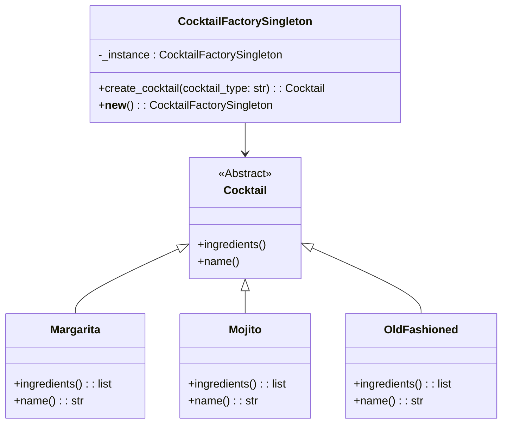

# Singleton Design Pattern

## Vor- und Nachteile

| Vorteile | Nachteile |
| --- | --- |
| schnell und einfach umzusetzen | zweckentfremdeter Einsatz kann zu „quasi-globalen“ Variablen führen (Variablen, welche zwar in einer Klasse gekapselt sind, aber wie globale Variablen im Programm behandelt werden und damit den objektorientierten Ansatz untergraben) |
| eine Möglichkeit, globale Variablen zu vermeiden | bei Systemen mit parallelen Abläufen (Threads) muss sichergestellt werden, dass auch wirklich nur eine Instanz existiert |
| kann durch Vererbung spezialisiert werden | das Testen eines Singleton ist mitunter schwierig oder sogar unmöglich |
| Objekt wird im Gegensatz zustatischen Klassen nur dann erzeugt, wenn es im Programm auch wirklich benötigt wird | der Zeitpunkt der Freigabe von Ressourcen (z.B. das Schließen einer Log-Datei), welche vom Singleton genutzt worden ist, ist teilweise schwer festzulegen |

## UML-Klassendiagramm



## Code

```python
# Singleton Pattern für die CocktailFactory

class CocktailFactorySingleton:
    _instance = None

    def __new__(cls):
        if cls._instance is None:
            cls._instance = super(CocktailFactorySingleton, cls).__new__(cls)
        return cls._instance

    def create_cocktail(self, cocktail_type):
        if cocktail_type == "Margarita":
            return Margarita()
        elif cocktail_type == "Mojito":
            return Mojito()
        elif cocktail_type == "OldFashioned":
            return OldFashioned()
        else:
            raise ValueError(f"Unknown cocktail type: {cocktail_type}")

# Beispiel der Verwendung des Singleton Patterns
def main():
    factory1 = CocktailFactorySingleton()
    factory2 = CocktailFactorySingleton()

    print(f"Factory1 ID: {id(factory1)}")
    print(f"Factory2 ID: {id(factory2)}")

    # Beides sollten die gleiche Instanz sein
    print("Sind beide Instanzen gleich?", factory1 is factory2)

    cocktails = ['Margarita', 'Mojito', 'OldFashioned']
    
    for cocktail_name in cocktails:
        cocktail = factory1.create_cocktail(cocktail_name)
        print(f"Cocktail: {cocktail.name()}")
        print(f"Ingredients: {', '.join(cocktail.ingredients())}")
        print()

if __name__ == "__main__":
    main()
```