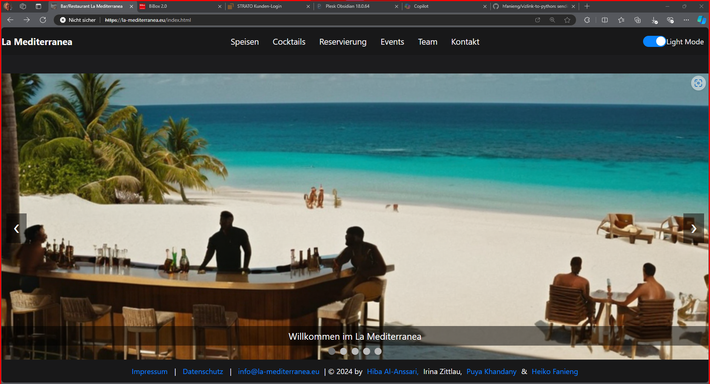

# Testfälle La Mediterranea

| Testfall | Testinhalt | Testergnis |
| --- | --- | --- |
| 1 | Teste die Erreichbarkeit der Website | Die Website ist erreichbar |
| 2 | Testen den Darkmode-Slider | Der Darkmode-Slider funktioniert |
| | Testen des Darkmode-Layouts | Das Darkmode-Layout wird angezeigt |
| | Testen des Lightmode-Layouts | __Das Lightmode-Layout ist fehlerhaft__ |
| 3 | Teste die Anzeige der Speisen-Seite | Die Speisenseite wird angezeigt |
| 4 | Teste die Anzeige der Cocktails-Seite | Die Seite wird angezeigt |
| 5 | Teste den Links-Pfeil der Diashow | Der Pfeil funktioniert |
|  | Teste den Rechtss-Pfeil der Diashow | Der Pfeil funktioniert |
| 6 | Teste Punktauswahl der Diashow | Die Punktauswahl funktioniert |

---
