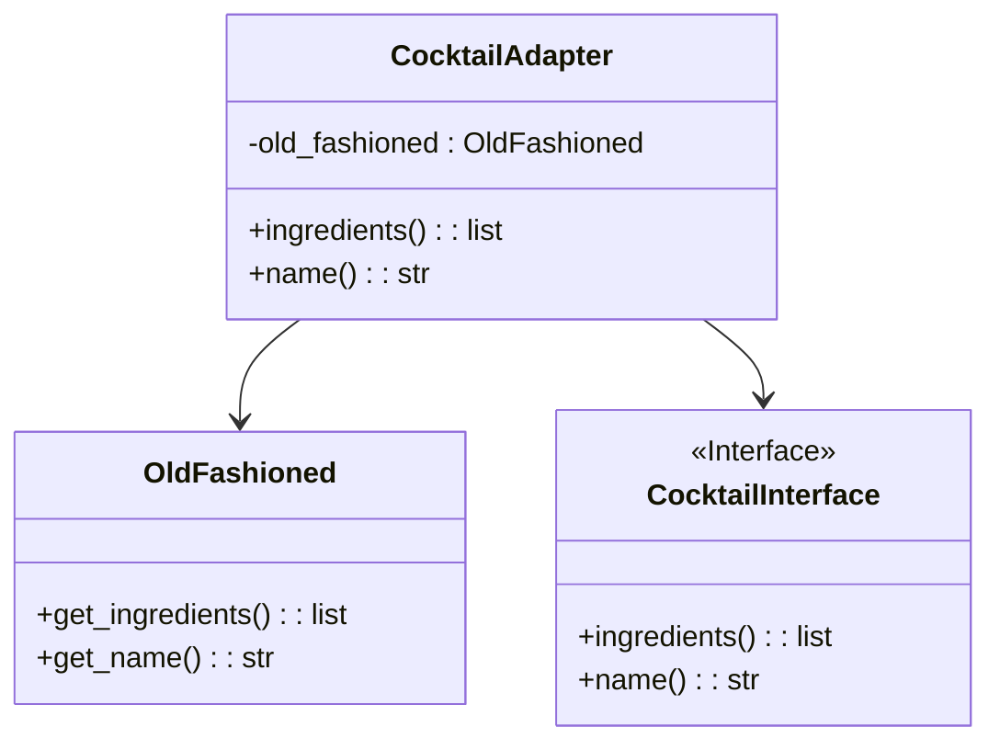
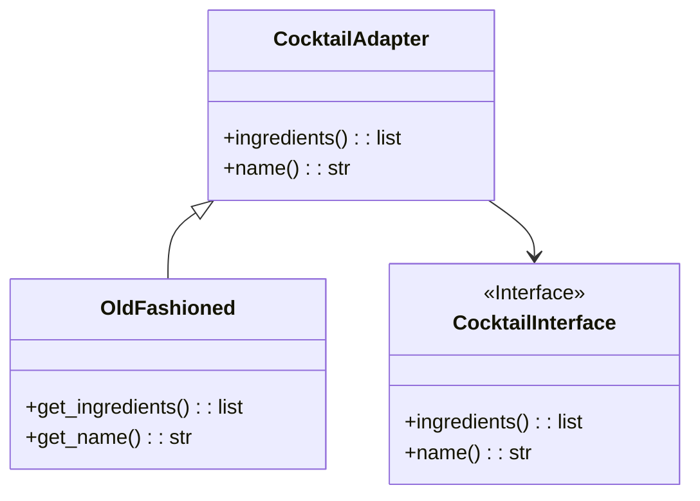

# Adapter Pattern

---

## Umsetzung mittels Delegation (Objektadapter)

### UML-Klassendiagramm (Objektadapter)

__Beim Objektadapter wird die Zielklasse durch Delegation an die Schnittstelle angepasst.__



---

### Code (Objektadapter)

```python
# Vorhandene Cocktail-Klassen
class OldFashioned:
    def get_ingredients(self):
        return ['Bourbon', 'Sugar', 'Bitters', 'Orange Peel']

    def get_name(self):
        return "Old Fashioned"

# Zielschnittstelle, die wir anpassen möchten
class CocktailInterface:
    def ingredients(self):
        pass

    def name(self):
        pass

# Adapter mit Delegation (Objektadapter)
class CocktailAdapter(CocktailInterface):
    def __init__(self, old_fashioned):
        self.old_fashioned = old_fashioned

    def ingredients(self):
        return self.old_fashioned.get_ingredients()

    def name(self):
        return self.old_fashioned.get_name()

# Beispiel der Verwendung
def main():
    old_fashioned = OldFashioned()
    adapter = CocktailAdapter(old_fashioned)

    print(f"Cocktail: {adapter.name()}")
    print(f"Ingredients: {', '.join(adapter.ingredients())}")

if __name__ == "__main__":
    main()
```

---

## Umsetzung mittels Vererbung (Klassenadapter)

### UML-Klassendiagramm (Klassenadapter)

__Beim Klassenadapter wird die Zielklasse direkt durch Vererbung an die Schnittstelle angepasst.__



---

### Code (Klassenadapter)

```python
# Vorhandene Cocktail-Klasse
class OldFashioned:
    def get_ingredients(self):
        return ['Bourbon', 'Sugar', 'Bitters', 'Orange Peel']

    def get_name(self):
        return "Old Fashioned"

# Zielschnittstelle, die wir anpassen möchten
class CocktailInterface:
    def ingredients(self):
        pass

    def name(self):
        pass

# Adapter mit Vererbung (Klassenadapter)
class CocktailAdapter(OldFashioned, CocktailInterface):
    def ingredients(self):
        return self.get_ingredients()

    def name(self):
        return self.get_name()

# Beispiel der Verwendung
def main():
    adapter = CocktailAdapter()

    print(f"Cocktail: {adapter.name()}")
    print(f"Ingredients: {', '.join(adapter.ingredients())}")

if __name__ == "__main__":
    main()
```

---

## Vor- und Nachteile

| Vorteile | Nachteile |
| --- | --- |
| Ermöglicht die Anpassung von Schnittstellen, ohne die zugrunde liegende Implementierung zu ändern | Kann zu einer erhöhten Komplexität führen, insbesondere bei Klassenadaptern |
| Erlaubt die Wiederverwendung bestehender Klassen, ohne sie zu ändern | Kann zu einer erhöhten Kopplung zwischen Adapter und Adaptee führen |
| Erlaubt die Anpassung mehrerer Klassen an eine Schnittstelle | Kann zu einer erhöhten Abhängigkeit von der zugrunde liegenden Implementierung führen |

---
