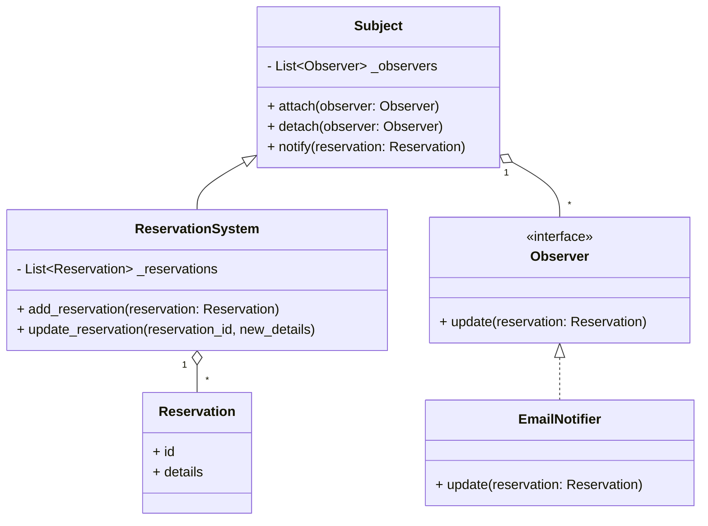
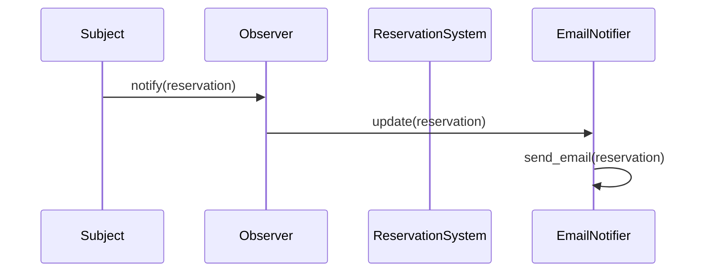

# Observer Pattern

The observer pattern is a software design pattern in which an object, called the subject, maintains a list of its dependents, called observers, and notifies them of state changes, usually by calling one of their methods. It is mainly used to implement distributed event handling systems.

## Problem

Problem Die Erzeugung und die Verwaltung von Informationen soll von der Informationsverarbeitung und -darstellung getrennt werden. Trotzdem sollen die Informationen bei Änderung in allen Teilen des Programms immer aktuell sein. Dazu müssen die entsprechenden Programmteile miteinander kommunizieren, d. h., bei Änderungen müssen alle davon betroffenen Programmteile über die Änderungen informiert werden. Als Beispiel sei das MVC-Pattern (siehe auch Kapitel 1.2.2) angeführt. Beispiel sei das MVC-Pattern (siehe auch Kapitel 1.2.2) angeführt. Bei Änderung der Daten im „Model“ muss die „View“ darüber informiert werden. Diese holt sich dann die aktuellen Daten vom Model.

---
Problem The generation and management of information should be separated from the processing and presentation of information. Nevertheless, the information should always be up-to-date in all parts of the program when changes are made. To achieve this, the corresponding program parts must communicate with each other, i.e. all affected program parts must be informed of changes. An example of this is the MVC pattern (see also section 1.2.2). The MVC pattern (see also section 1.2.2) is given as an example. If the data in the “Model” is changed, the “View” must be informed. This then retrieves the current data from the model.

## Lösung

Lösung Das Observer Pattern zählt zu den Verhaltensmustern. Hierbei bietet der Erzeuger der Information (Subjekt) Methoden an, mit deren Hilfe sich Beobachter an- und abmelden können. Findet eine Veränderung statt, „informiert“ das Subjekt alle angemeldeten Beobachter über die Veränderung. Danach werden die Daten bei den Beobachtern aktualisiert. Hier gibt es drei verschiedene Möglichkeiten der Umsetzung:

__Push Notification:__ Bei Änderungen im Subjekt werden alle Beobachter benachrichtigt. Die Beobachter müssen sich nach dem Eintreffen der Nachricht die Änderungen selbst vom beobachten Subjekt holen.
__Push-Update Notification:__ Bei Änderungen im Subjekt werden alle Beobachter benachrichtigt. Zusätzlich leitet das beobachtete Subjekt alle Änderungen an die Beobachter weiter.
__Pull Notification:__ Die Beobachter werden nicht benachrichtigt, sondern fragen selbstständig den Zustand des beobachten Subjekts ab.

---
Solution The observer pattern is one of the behavioral patterns. Here, the producer of the information (subject) offers methods that observers can use to log in and out. If a change takes place, the subject “informs” all registered observers of the change. The data is then updated for the observers. There are three different implementation options here:

__Push Notification:__ All observers are notified of changes in the subject. After the message arrives, the observers must retrieve the changes from the observed subject themselves.
__Push-Update Notification:__ All observers are notified of changes in the subject. In addition, the observed subject forwards all changes to the observers.
__Pull Notification:__ The observers are not notified but independently query the status of the observed subject.

---


## Abschlussprüfung Winter 2021/22

__Sie sollen vier der folgenden fünf Aufgaben in diesem Projekt erledigen:__

1. Zustandsdiagramm und Anwendungsfalldiagramm für Controller und Lichtsteuerung erstellen (25 Punkte)
2. 00P-Methoden für die Auswertung von Temperaturmessungen implementieren (25 Punkte)
3. UML-Modellierung für ein Smartphone-Dashboard zur Anzeige von Tankfüllständen anfertigen (25 Punkte)
4. ER-Modell zur Speicherung von Sensordaten anlegen (25 Punkte)
5. SQL-Abfragen für eine Zeiterfassungsdatenbank formulieren (25 Punkte)

## Idee für das Projekt

Eine Benachrichtigung (Push) vom System an Manger wenn Änderungen vom Kunden an den Reservierungen stattfinden.

---

---



---


---



---

```python
from abc import ABC, abstractmethod

# Observable (Subject)
class Customer(ABC):
    def __init__(self):
        self._observers = []

    def add_observer(self, observer):
        self._observers.append(observer)

    def remove_observer(self, observer):
        self._observers.remove(observer)

    def notify_observers(self):
        for observer in self._observers:
            observer.update(self)

class User(Customer):
    def __init__(self, name, status="inactive"):
        super().__init__()
        self._name = name
        self._status = status

    @property
    def status(self):
        return self._status

    @status.setter
    def status(self, new_status):
        self._status = new_status
        self.notify_observers()

    def __str__(self):
        return f"User: {self._name}, Status: {self._status}"

# Observer (Staff)
class Staff(ABC):
    @abstractmethod
    def update(self, user):
        pass

class SupportStaff(Staff):
    def update(self, user):
        print(f"Support Staff notified about status change: {user}")

class SalesStaff(Staff):
    def update(self, user):
        print(f"Sales Staff notified about status change: {user}")

# Test the observer pattern
if __name__ == "__main__":
    # Create a user
    user1 = User("John Doe")

    # Create staff members
    support_staff = SupportStaff()
    sales_staff = SalesStaff()

    # Add staff members as observers
    user1.add_observer(support_staff)
    user1.add_observer(sales_staff)

    # Change user status
    print("Updating user status to 'active'...")
    user1.status = "active"

    print("Updating user status to 'inactive'...")
    user1.status = "inactive"
```

---

```plaintext
+-------------------+
|      Customer     | <<abstract class>>
+-------------------+
| - _observers: list|
+-------------------+
| + add_observer()  |
| + remove_observer()|
| + notify_observers()|
+-------------------+
          ^
          |
+-------------------+
|      User         |
+-------------------+
| - _name: str      |
| - _status: str    |
+-------------------+
| + status: property|
| + __str__()       |
+-------------------+
          |
          |
+--------------------+                +-------------------+
|      Staff         | <<abstract class>>  | + update()        |
+--------------------+                +-------------------+
+--------------------+                +-------------------+
|   SupportStaff     |                |    SalesStaff     |
+--------------------+                +-------------------+
| + update()         |                | + update()        |
+--------------------+                +-------------------+
```

---
