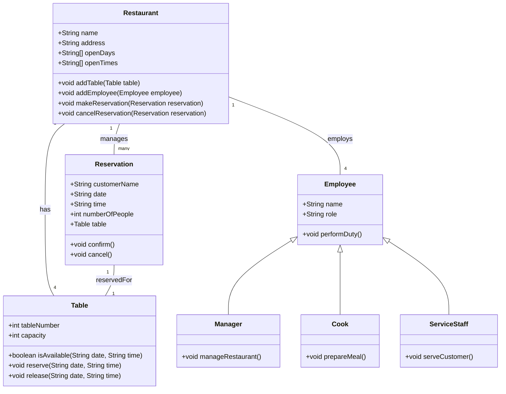

# Specify which statements are correct

## Task 1

1. Tkinter is included in Python's standard library. - Correct
2. Qt can be used in Python via the "PyQt" toolkit. - Correct
3. Python Foundation Classes (PFC) is a binding of .Net to Python. - Incorrect
4. To check events, the "mainloop()" method must be called from the window. - Correct
5. The name for input fields in Tkinter is "Entry". - Correct
6. A method can be assigned to a button via the command parameter. - Correct
7. A widget can be placed on the window using the "place(...)" method. - Correct

> - [x] Heiko + Irina/Puya with ChatGPT

---

## Task 2

Develop a program with a graphical interface where the user can enter a data size in bytes, and the program will convert it into GB and GiB, displaying the results. The program should handle all input and calculation errors and display them.

> - [x] Irina/Puya and ChatGPT

---

```python
import tkinter as tk
from tkinter import messagebox
from tkinter import ttk

def convert_bytes():
    try:
        # Input in bytes
        byte_value = float(entry.get())
        selected_unit = unit_combobox.get()

        # Conversion to bytes based on the selected unit
        if selected_unit == "GB":
            byte_value *= 10 ** 9  # 1 GB = 10^9 Bytes
        elif selected_unit == "GiB":
            byte_value *= 2 ** 30   # 1 GiB = 2^30 Bytes
        # Further units can be added here

        # Calculation of the values
        gb_value = byte_value / (10 ** 9)  # 1 GB = 10^9 Bytes
        gib_value = byte_value / (2 ** 30)  # 1 GiB = 2^30 Bytes

        # Output of the results
        result_var.set(f"{gb_value:.6f} GB\n{gib_value:.6f} GiB")

    except ValueError:
        messagebox.showerror("Input Error", "Please enter a valid number!")

# Main window
root = tk.Tk()
root.title("Data Size Converter")

# Input field
label = tk.Label(root, text="Enter a data size:")
label.pack(pady=10)

entry = tk.Entry(root)
entry.pack(pady=5)

# Combobox for the unit
unit_label = tk.Label(root, text="Select the unit:")
unit_label.pack(pady=5)

unit_combobox = ttk.Combobox(root, values=["GB", "GiB"])
unit_combobox.set("GB")  # Set default value
unit_combobox.pack(pady=5)

# Convert button
convert_button = tk.Button(root, text="Convert", command=convert_bytes)
convert_button.pack(pady=10)

# Result field
result_var = tk.StringVar()
result_label = tk.Label(root, textvariable=result_var)
result_label.pack(pady=10)

# Main loop
root.mainloop()
```

---

## Task 3

Extend the solution from Task 2 so that the user can select a unit using a combobox. Learn more about the ttk.Combobox beforehand.

> - [ ] Irina and Puya with ChatGPT ?!?
> - [ ] 11.09.2024 @ 09:00

---

```python
# ...
```

---

## Task 4

Complete Tasks 14 and 15 from Learning Scenario 5 in the workbook and implement your project in Python.

---

### 13 Plan and implement a class structure, and apply it in a console program

Plan and implement Python classes within a client project and try them out in a console program.

Book: jIKU IT-SoLutions is tasked with developing a program for a savings bank association. Based on the project specification, two classes (see class diagram) have already been designed during planning.

__We:__ The base is __La Mediterranea__ - there is already a class diagram for this.



> - [x] Class diagram by Heiko

__Console program needs to be completed!__

> - [ ] Puya ???
> - [ ] ??.??.2024 @ ??:?? Uhr

---

### 14 Design and implement a graphical user interface (GUI)

Design and implement a graphical user interface to replace the console application for the task. The rest of the program will be reused. First, brainstorm as a team about the layout and arrangement of elements, keeping UX design in mind.

Sketch or Mockup:

- [ ] Irina
- [ ] 04.10.2024 @ 09:00

Example from our project:


When clicking on the date field, a calendar opens where the date can be selected:


WebUI example:

- [ ] Hiba
- [ ] 31.10.2024 @ 09:00
  
Tkinter example:

- [ ] Irina & Heiko
- [ ] 31.10.2024 @ 09:00

---

### 15 Implement your project task in Python

Work on your program in several sprints as a team. In each sprint, follow these steps:

1. Plan the next sprint in a sprint meeting. The Product Owner __(us)__ presents the development team __(us)__ with the unfinished requirements from the Product Backlog, and a sprint goal is defined. Decide which backlog items will be implemented in the sprint.
2. Break down the backlog items into individual or smaller tasks. These are recorded in the Sprint Backlog and visualized on your task board. Also, define when each task is considered complete (Definition of Done).
Hint: Always plan for black-box tests and the necessary test data __(see also Year 2 textbook, Learning Field 8)__.
3. Implement the program based on the Sprint Backlog, with each team member selecting and working on their tasks independently.
4. Conduct a 15-minute daily scrum meeting to discuss the progress and record it in the sprint burndown chart. The Scrum Master is responsible for ensuring that the Daily Scrum is conducted and for handling any issues that arise.
5. Conduct a sprint review meeting shortly before the sprint ends.
6. After the sprint, reflect on your work in a retrospective meeting.

---