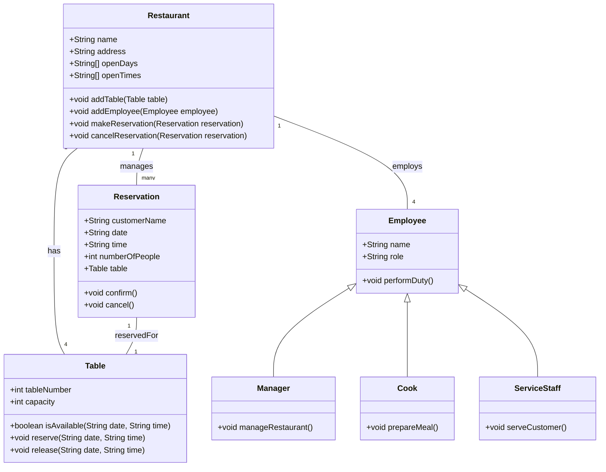

# Geben Sie an, welche Aussagen richtig sind

## Aufgabe 1

> - [x] Hiba, Irina, Puya und Heiko

1. Tkinter ist in der Standardbibliothek von Python enthalten. - Richtig
2. Qt kann durch das Toolkit "PyQt" in Python verwendet werden. - Richtig
3. Python Foundation Classes (PFC) ist eine Anbindungvon .Net an Python. - Falsch
4. Um Ereignisse abzufragen, muss von dem Fenster die Methode "mainloop()" aufgerufen werden. - Richtig
5. Der Name für Eingabefelder ist in Tkinter "Entry". - Richtig
6. Über den Parameter command kann einem Button eine Methode zugewiesen werden. - Richtig
7. Durch die Methode "place(...)" kann ein Widget auf dem Fenster platziert werden. - Richtig

---

## Aufgabe 2

Entwickeln Sie ein Programm mit einer grafischen Oberfläche, in dem der Nutzer eine Datenmenge in Byte eingeben kann und welches danach diese Datenmenge in GB und GiB umrechnet und ausgibt Das Programm soll dabei alle Eingabe- und Rechenfehler abfangen und azeigen.

> - [x] Irina & Puya

---

```python
import tkinter as tk
from tkinter import messagebox

class DataConverter:
    def __init__(self):
        self.root = tk.Tk()
        self.root.title("Data Size Converter")

        # Create input field for data size in bytes
        self.size_label = tk.Label(self.root, text="Enter data size (bytes):")
        self.size_label.grid(row=0, column=0, padx=10, pady=10)
        
        self.size_entry = tk.Entry(self.root, width=30)
        self.size_entry.grid(row=0, column=1, padx=10, pady=10)

        # Create buttons to convert and reset
        self.convert_button = tk.Button(self.root, text="Convert", command=self.convert_size)
        self.convert_button.grid(row=1, column=1, padx=10, pady=10)

        self.reset_button = tk.Button(self.root, text="Reset", command=self.reset_form)
        self.reset_button.grid(row=2, column=1, padx=10, pady=10)

        # Create labels to display the results
        self.result_label_gib = tk.Label(self.root, text="")
        self.result_label_gib.grid(row=3, column=0, columnspan=2, padx=10, pady=10)
        
        self.result_label_gb = tk.Label(self.root, text="")
        self.result_label_gb.grid(row=4, column=0, columnspan=2, padx=10, pady=10)

    def convert_size(self):
        try:
            size_in_bytes = int(self.size_entry.get())
            
            if size_in_bytes < 0:
                messagebox.showerror("Error", "Data size cannot be negative.")
                return

            gib = size_in_bytes / (1024 ** 3)
            gb = size_in_bytes / (1024 ** 3 * 8)

            self.result_label_gib.config(text=f"GiB: {gib:.2f}")
            self.result_label_gb.config(text=f"GB: {gb:.2f}")

        except ValueError:
            messagebox.showerror("Error", "Invalid input. Please enter a valid data size in bytes.")

    def reset_form(self):
        self.size_entry.delete(0, tk.END)
        self.result_label_gib.config(text="")
        self.result_label_gb.config(text="")

    def run(self):
        self.root.mainloop()

if __name__ == "__main__":
    converter = DataConverter()
    converter.run()
```

---

## Aufgabe 3

Erweitern Sie die Lösung aus Aufgabe 2 so, dass der Nutzer mithilfe einer Combobox eine Einheit auswählen kann. Informieren Sie sich dazu im Vorfeld über die ttk.Combobox.

> - [x] Irina und Heiko
> - [x] 10.09.2024 @ 19:09 Uhr

---

```python
import tkinter as tk
from tkinter import ttk, messagebox

class DataConverter:
    def __init__(self):
        self.root = tk.Tk()
        self.root.title("Data Size Converter")

        # Create input field for data size in bytes
        self.size_label = tk.Label(self.root, text="Enter data size (bytes):")
        self.size_label.grid(row=0, column=0, padx=10, pady=10)
        
        self.size_entry = tk.Entry(self.root, width=30)
        self.size_entry.grid(row=0, column=1, padx=10, pady=10)

        # Create combobox to select units
        self.unit_label = tk.Label(self.root, text="Select unit:")
        self.unit_label.grid(row=1, column=0, padx=10, pady=10)
        
        self.units = ["Bytes", "KiB", "MiB", "GiB", "TB"]
        self.unit_var = tk.StringVar()
        self.unit_var.set(self.units[0])
        self.unit_combobox = ttk.Combobox(self.root, textvariable=self.unit_var)
        self.unit_combobox['values'] = self.units
        self.unit_combobox.grid(row=1, column=1, padx=10, pady=10)

        # Create buttons to convert and reset
        self.convert_button = tk.Button(self.root, text="Convert", command=self.convert_size)
        self.convert_button.grid(row=2, column=1, padx=10, pady=10)

        self.reset_button = tk.Button(self.root, text="Reset", command=self.reset_form)
        self.reset_button.grid(row=3, column=1, padx=10, pady=10)

        # Create labels to display the results
        self.result_label_gib = tk.Label(self.root, text="")
        self.result_label_gib.grid(row=4, column=0, columnspan=2, padx=10, pady=10)
        
        self.result_label_gb = tk.Label(self.root, text="")
        self.result_label_gb.grid(row=5, column=0, columnspan=2, padx=10, pady=10)

    def convert_size(self):
        try:
            size_in_bytes = int(self.size_entry.get())
            
            if size_in_bytes < 0:
                messagebox.showerror("Error", "Data size cannot be negative.")
                return

            unit = self.unit_var.get()
            conversion_factors = {
                "Bytes": 1,
                "KiB": 1024,
                "MiB": 1024 ** 2,
                "GiB": 1024 ** 3,
                "TB": 1024 ** 4
            }
            factor = conversion_factors[unit]
            
            size_in_unit = size_in_bytes / factor
            
            if unit == "Bytes":
                self.result_label_gib.config(text="")
                self.result_label_gb.config(text="")
                self.result_label_gib.config(text=f"GiB: {size_in_unit:.2f}")
                self.result_label_gb.config(text="")
            elif unit in ["KiB", "MiB"]:
                if size_in_bytes < 1024 ** 3:
                    self.result_label_gib.config(text="")
                    self.result_label_gb.config(text="")
                    self.result_label_gb.config(text=f"GB: {size_in_unit:.2f}")
                    self.result_label_gib.config(text="")
                else:
                    self.result_label_gb.config(text="")
                    self.result_label_gib.config(text="")
                    gib = size_in_bytes / (1024 ** 3)
                    self.result_label_gib.config(text=f"GiB: {gib:.2f}")
            elif unit == "TB":
                if size_in_bytes < 1024 ** 3:
                    self.result_label_gb.config(text="")
                    self.result_label_gib.config(text="")
                    self.result_label_gb.config(text=f"GB: {size_in_unit * 1024:.2f}")
                    self.result_label_gib.config(text="")
                else:
                    gib = size_in_bytes / (1024 ** 3)
                    self.result_label_gb.config(text="")
                    self.result_label_gib.config(text="")
                    self.result_label_gib.config(text=f"GiB: {gib:.2f}")
                    
        except ValueError:
            messagebox.showerror("Error", "Invalid input. Please enter a valid data size in bytes.")

    def reset_form(self):
        self.size_entry.delete(0, tk.END)
        self.unit_var.set(self.units[0])
        self.result_label_gib.config(text="")
        self.result_label_gb.config(text="")

    def run(self):
        self.root.mainloop()

if __name__ == "__main__":
    converter = DataConverter()
    converter.run()
```

---

## Aufgabe 4

Bearbeiten Sie die Aufgaben 14 und 15 der Lernsituation 5 im Arbeitsbuch und implementieren Sie in diesem Zusammenhang u.a. Ihr Projekt in Python.

---

### 13 Planen und Implementieren einer Klassenstruktur, Umsetzung in einem Konsolenprogramm

Planen und implementieren Sie im Rahmen eines Kundenauftrags Klassen in Python und probieren Sie diese in einem Konsolenprogramm aus.

Buch: Die jIKU IT-SoLutions soll für einen Sparkassenverbund ein Programm entwickeln. Auf der GrundLage des Pflichtenheftes wurden in der Planung schon zwei Klassen (siehe Klassendiagramm) entworfen.

__Wir:__ Basis ist __La Meditteranea__ - hierzu gibt es bereits ein Klassendiagramm.



> - [x] Klassendiagramm von Heiko

__Konsolenprogramm muss vervollständigt werden!__

> - [ ] Puya
> - [ ] 31.10.2024 @ 19:09 Uhr

---

### 14 Entwurf und Implementierung einer grafischen Benutzerschnittstelle (GUI)

Entwerfen und Implementieren Sie für die Aufgabe eine grafische Benutzerschnittstelle,welche die Konsolenanwendung ersetzt. Der Rest des Programms wird übernommen.Machen Sie sich zunächst in Teamarbeit Gedanken über die Oberfläche und die Anordnung der Elemente. Beachten Sie dabei auch das UX-Design.

Sketch oder Mockup:

- [ ] Irina
- [ ] 04.10.2024 @ 09:00 Uhr

Beispiel aus unserem Projekt:


Nachdem Klick auf das Feld Datum öffnet sich ein Kalender, in dem das Datum ausgewählt werden kann:


WebUI-Beispiel (HTML & CSS):

- [ ] Hiba
- [ ] 31.10.2024 @ 19:09 Uhr

WebUI-Beispiel (PHP):

- [ ] Heiko
- [ ] 31.10.2024 @ 19:09 Uhr

Tkinter-Beispiel:

- [ ] Irina & Heiko
- [ ] 31.10.2024 @ 19:09 Uhr

---

### 15 Implementieren Sie Ihre Projektaufgabe in Python

- [ ] Hiba, Irina, Puya & Heiko
- [ ] 30.12.2024 @ 19:09 Uhr

Implementieren Sie und Ihr Projektteam in mehreren Sprints Ihr Programm. Arbeiten Sie dazu in jedem Sprint
folgende Schritte ab:

1. Planen Sie den nächsten Sprint im Rahmen eines Sprint-Meetings. Dabei stellt der ProductOwner __(wir)__ dem Entwicklungsteam __(wir)__ die unerledigten Anforderungen aus dem Product Backlog vor und es wird ein Sprintziel definiert. Dazu Legen Sie fest, welche Anforderungen (Backlog-Items) in dem Sprint umgesetzt werden sollen.
2. Besprechen Sie nun, wie die einzelnen BackLog-Items aus dem Product Backlog in Einzel- oder Teilaufgaben zerlegt werden können. Die einzelnen Aufgabe nwerden dann im sogenannten Sprint Backlog festgehalten und an Ihrem Task-Board visuaLisiert. Außerdem legen Sie für jede Aufgabe fest, wann diese als abgearbeitet gilt (Definition of Done).  
Hinweis: Planen Sie auch immer gleich entsprechende Blackbox-Tests und die dafür erforderlichen Testdaten __(siehe auch Jahrgangsband 2, Lernfeld 8)__.  
3. Auf Basis des Sprint BackLogs implementieren Sie das Programm, wobei jedes Teammitglied seine Aufgaben selbstständig auswählt und bearbeitet.
4. Führen Sie einmal pro Tag ein 15-minütiges Meeting (Daily Scrum) durch. Dabei werden u.a. die Veränderungen der letzten 24 Stunden besprochen und der Arbeitsfortschritt selbst im Sprint-Burndown-Chart festgehalten. Der Scrum Master Ihres Teams ist dafür verantwortlich, dass das Daily Scrum durchgeführt wird. Außerdem dokumentiert und kümmert er sich umauftretende Schwierigkeiten.
5. Führen Sie kurz vor dem Ende des Sprints ein Sprint-Review-Meeting durch.
6. Nach dem Sprint reflektieren Sie Ihre Arbeit in einem Retrospective-Meeting.

---
