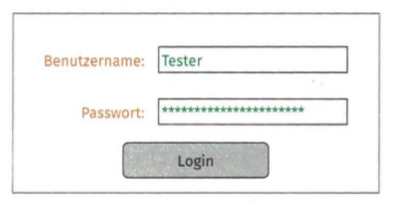

# **Testfall 1: Erfolgreicher Login**

- **Markierung im Bild**: Benutzername-Feld, Passwort-Feld, Login-Button.
- **Was wird getestet?**
  - **Funktionales Kriterium**: Überprüfung, ob sich ein Benutzer mit gültigen Anmeldedaten erfolgreich einloggen kann.
  - **Grafisches Kriterium**: Sicherstellen, dass alle Eingabefelder und Buttons korrekt angezeigt werden und der Login-Button aktiv ist, wenn alle Felder ausgefüllt sind.

---

# **Testfall 2: Fehlgeschlagener Login mit falschem Passwort**

- **Markierung im Bild**: Passwort-Feld, Fehlermeldung.
- **Was wird getestet?**
  - **Funktionales Kriterium**: Überprüfung, ob bei Eingabe eines falschen Passworts eine angemessene Fehlermeldung angezeigt wird und der Login verhindert wird.
  - **Grafisches Kriterium**: Prüfung, ob die Fehlermeldung korrekt positioniert ist und einheitlich formatiert wird (z.B. rote Schrift unter dem Passwort-Feld).

---

# **Testfall 3: Login mit leeren Eingabefeldern**

- **Markierung im Bild**: Benutzername-Feld, Passwort-Feld.
- **Was wird getestet?**
  - **Funktionales Kriterium**: Überprüfung, ob der Login verhindert wird, wenn Benutzername und/oder Passwort nicht eingegeben wurden, und ob entsprechende Validierungsmeldungen erscheinen.
  - **Grafisches Kriterium**: Sicherstellen, dass Platzhaltertexte in den Eingabefeldern angezeigt werden und Validierungsmeldungen korrekt dargestellt sind.