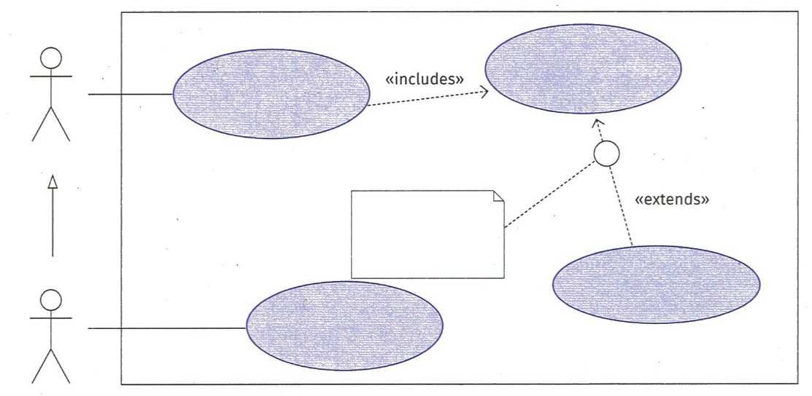
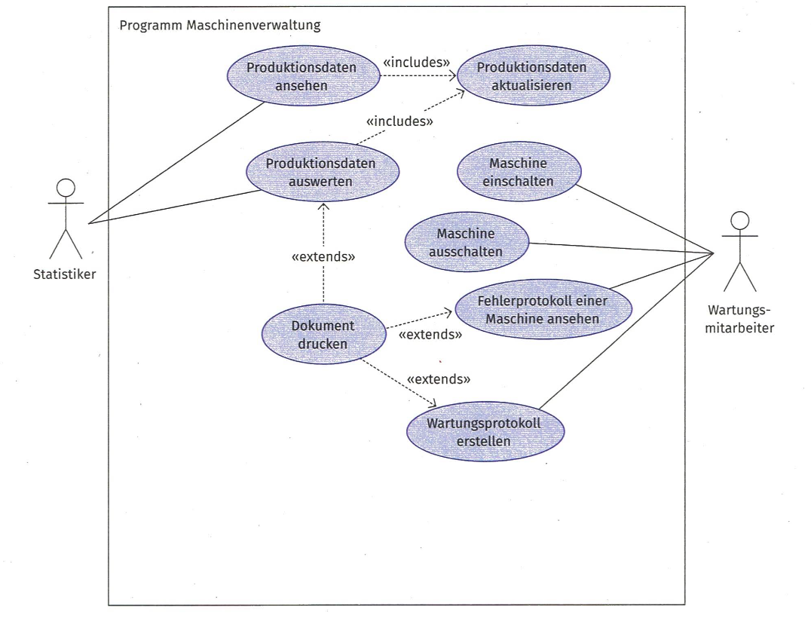
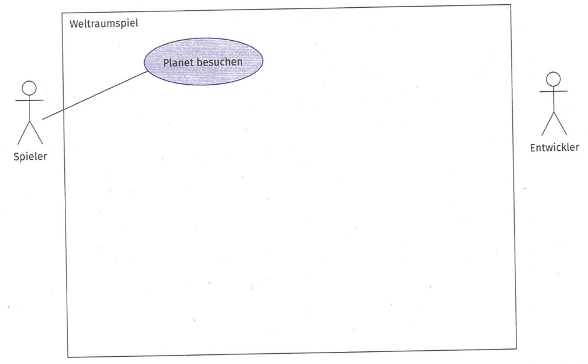
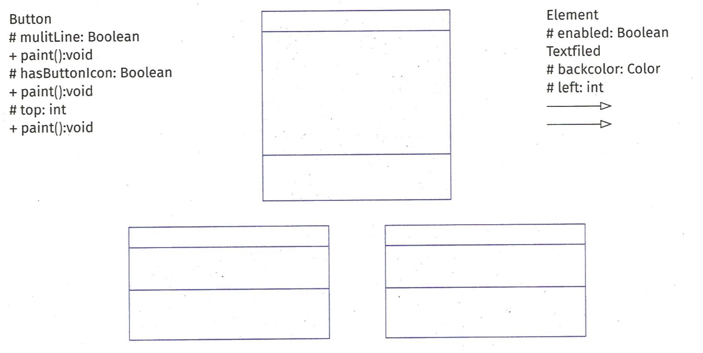
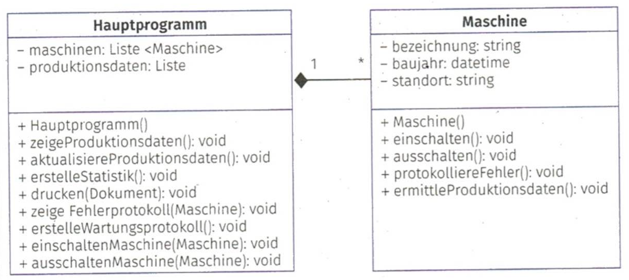

# Lernfelder 6-9, Kapitel 3.3 bis zum Kompetenzcheck, Arbeitsbuch S.111, Aufgabe 2 und Aufgabe 3 bis S.114

## Aufgabe 2

### 2.1 Überprüfen des Wissens über objektorientierte Programmierkonzepte

> Erläutern von Klassen und Objekte anhand eines Beispiels aus dem Projekt "La Mediterranea"

* UML Klassendiagramm

|Klasse|Cocktail|
| --- | --- |
|Attribute|+name string|
||+preis: float|
||+staerke: integer|
||+volumen: float|
|Methoden|+ __init__ (name, preis,starke, volumen):|
||+ __str__: string|
||+ __gt__ (preis, staerke): other,bool|

---

### 2.2 Erläuterung des Unterschides zwischen public und private

#### public

Auf öffentliche (public) Komponenten darf uneingeschränkt zugegriffen werden. Public wird in einem Klassendiagramm mit einem __+ (Plus)__ gekennzeichnet. Im Python Code erkennt man es daran, das dem Attribut/der Methode __KEIN__ Unterstrich vorangestellt ist:

```python
Class Public:
   def public_methode(self):
   return self.public_attribut
```

#### protected

Auf geschützte (protected) Komponenten kann nur innerhalb der eigenen Klasse und aus Klassen, die von dieser Klasse abgeleitet wurden, zugegriffen werden. Protected wird in einem Klassendiagramm mit einer __# (Raute)__ gekennzeichnet. Im Python Code erkennt man es daran, das dem Attribut/der Methode EIN Unterstrich vorangestellt ist:

```python
Class Protected:
   def _protected_methode(self):
   return self._protected_attribut
```

#### private

Ein Zugriff auf private Komponenten ist nur innerhalb der Klasse erlaubt. Private wird in einem Klassendiagramm mit einem - (Minus) gekennzeichnet. Im Python Code erkennt man es daran, das dem Attribut/der Methode __ZWEI__ Unterstriche vorangestellt sind:

```python
Class Private:
    def __private_Methode(self:)
    return.self.__private_attribut
```

## 2.3 Erläuterung des Unterschiedes zwischen Einfach- und Mehrfachvererbung anhand einer Skizze

||Merkmal|
|---|---|
|Einfachvererbung|Bei der Einfachvererbung hat eine abgeleitete eine Basisklasse, von  der sie erbt|
|Mehrfachvererbung|Bei  der Mehrfachvererbung hat eine abgeleitete Klasse *mindestens zwei*  Basisklassen, von denen sie erbt|

> siehe auch Aufgabe 3.4 zur Vererbung

### 2.4 Erläuterung des Überladens am Beispiel und Erweiterung des Klassendiagramms um eine weitere Methode anhand der Beispieldaten aus dem Projekt "La Mediterranea"

* UML Klassendiagramm

||Button|
||---|
|Attribut|- with: int|
||- height: int|
||- colour: Color|
||-|
||+ Buttton ()|
||+ Button(int, int, Color)|
||+ paint ()|

---

|RoundButton|
|---|
|-|
|+ RoundButtton ()|
|+ paint ()|

> Eine eckige Schaltfläche wird durch Überladung in eine runde Schaltfläche umgewandelt

## Aufgabe 3

### 3.1 Anwendung des Wissens über objektorientierte Programmparadigmen

> UML-Klassendiagramm

||Reiter|Film|Rechteck|
|---|---|---|---|
|Attribut|-name: string|-titel:string|-a: double|
||-geburtsdatum: string|-ercheinungsjahr: integer|- b: double|
||-gewicht: float||-länge: double|
|Methode|+ aufsteigen: (void)|+ starten(): void|+berechneUmfang: (void)|
||+ reiten: (void)|+ anhalten: (void)||
||+ absteigen: (void)|+zurückspulen: (void)|+berechneFlächeninhalt: (void)|

### 3.2 Wählen Sie selbständig zwei Klassen und ordnen Sie diesen jeweils drei sinnvolle Eigenschaften und Methoden zu. Tragen Sie Ihr Ergebnis mit entsprechenden Zugriffsmodifiern in das Klassendiagramm ein

> UML Klassendiagramm

||Cocktail|Speise|
|---|---|---|
|Attribut|-name: string|-name:string|
||-zutat: string|-zutat:string|
||-volumen: float|-preis:float|
|Methode|+mischen: (void)|+Einkaufen: (void)|
||+shaken: (void)|+Gemüseschneiden: (void)|
||+abseihen: (void)|+Grillen: (void)|

### 3.3 Recherchieren Sie im Internet zu den Problemen, welche bei der Mehrfachvererbung auftreten können. Diskutieren sie im Projektteam die Ergbenisse

1. __Komplexität und Undurchsichtigkeit:__ Mehrfachvererbung kann das Design unnötig kompliziert und undurchsichtig machen.
2. __Das Diamond-Problem:__ Dieses Problem entsteht, wenn eine Klasse auf zwei verschiedenen Vererbungspfaden von derselben Basisklasse erbt. Wenn man die Vererbungsbeziehungen zwischen den Klassen als Diagramm zeichnet, ergibt sich die Form einer Raute (englisch: diamond), nach der das Problem benannt ist.
3. __Namenskonflikte:__ Bei Mehrfachvererbung können Namenskonflikte auftreten. Die Programmiersprache Eiffel bietet Konstrukte zur transparenten Auflösung dieser Namenskonflikte.
4. __Replikation von Membern:__ In C++ kann das Konzept der virtuellen Basisklasse verwendet werden, um eine Replikation der Member der Basisklasse in der abgeleiteten Klasse zu vermeiden.

Wegen dieser Probleme unterstützen einige objektorientierte Programmiersprachen keine Mehrfachvererbung. Stattdessen bieten sie Alternativkonzepte an, wie zum Beispiel die Konstruktion von Zwillingsklassen oder die Verwendung von Interfaces

### 3.4. Finden Sie im Projektteam mindestens eine sinnvolle Eigenschaft und Methode pro Klasse, welche nur für die entsprechende Klasse und daraus abgeleitete Klasse gilt

> UML-Klassendiagramm

||Uhr|
|---|---|
|Attribut|-zifferblatt: string|
||-lcd_display: string|
||-pendel: string|
||-mechanik: string|
||-element: string|
||-sand: string|
||-puls: integer|
||-material: string|
||-zahnraeder: string|
|Methode|+zifferblatt_wechseln: (void)|
||+ticken: (void)|
||+strömen: (void)|
||+rieseln: (void)|
||+ziffernwechsel: (void)|
||+schwingen: (void)|
||+messen: (void)|
||+aufzaehlen: (void)|
||+materialfluss: (void)|

---

||Digitaluhr|Räderuhr|Elementaruhr|
|---|---|---|---|
|Attribut|-lcd-display: string|-zahnraeder: string|-material: string|
|Methode|+ ziffernwechsel: (void)|+aufzaehlen: (void)|+materialfluss: (void)|

---

||Smartwatch|Pendeluhr|Sanduhr|
|---|---|---|---|
|Attribut|-puls: integer|-pendel: string|-sand: string|
|Methode|+messen: (void)|+schwingen: (void)|+rieseln: (void)|

## Fahrzeuge (Einfachvererbung)

> UML-Klassendiagramm

||Fahrzeug|
|---|---|
|Attribut|-bezeichnung: string|
||-geschwindigkeit: integer|
|Methode|-def __str__(self): (void)|
||-def __gt__(self, other):|

||PKW|
|---|---|
|Attribut|+insassen: integer|
|Methode|+def __str__(self): (void)|
||+def einsteigen(self, anzahl):|
||+def aussteigen(self, anzahl):|

---

## Beach-Bar und Restaurant "La Mediterranea" (Einfachvererbung)

> UML-Klassendiagramm

||Restaurant|
|---|---|
|attribute|-closing_days:string|
||opening_days:string|
|method|+reserve():(void)|
||+isopen():void|

||Bar|
|---|---|
|attribute|-name:string|
|method|+reserve():(void)|
||+isopen():void|

        # base class
        class Restaurant:
                def __init__(self, name):
                self.name = name

                def is_open(self):
                print(f"{self.name} ist geöffnet.")

        # extended class
        class Beachbar(Restaurant):
                def __init__(self, name, amount_tables):
                super().__init__(name)
                self.amount_tables = amount_tables

                def reserve(self):
                print(f"Ein Tisch in {self.name} wurde reserviert.")

## Date and time (multiple inheritance)

>UML class diagramm

||Date|
|---|---|
|attribute|-day:string|
||-month:string|
||-year:string|
|method|-def __str__(self): (void)|

||Time|
|---|---|
|attribute|-hour:string|
||-minute:string|
||-second:string|
|method|-def __str__(self): (void)|

||DateTime|
|---|---|
|attribute|-date (from class Date)|
||-time (from class Time)|
|method|- def __init__(self, d, mo, y, h, mi, s): (void)|
||-def __str__(self): (void)|

## Aufgabe 4 Überprüfung es Wissens über UML Diagragmme

1. Oberbegriff (Mehrzahl) für UML-Diagramme, welche den statischen Zustand eines Systems beschreiben

2. Durch dieses Diagramm werden die Klassen eines Programms und deren Beziehungen untereinander be-schrieben.

3. Durch dieses Diagramm werden die einzelnen Zustände eines Systems und deren Übergänge beschrieben.

4. Oberbegriff (Mehrzahl) für UML-Diagramme, welche die Aktivitäten und Abläufe in einem beschreiben.

5. Dieses Diagramm stellt u.a. dar, wie Akteure mit dem System interagieren.

6. In diesem Diagrammtyp wird vor allem die zeitliche Interaktion zwischen verschiedenen Objekten betrachtet.

7. Dieses Diagramm stellt die Abhängigkeiten und die Organisation von Funktionseinheiten einer Software dar. Es wird damit die nächsthöhere Ebene nach den Klassen beschrieben.

8. Dieses Diagramm dient der Beschreibung des Verhaltens einer Klasse oder einer Komponente. Es kann sowohl zur Darstellung von Algorithmen und als auch von Prozessabläufen verwendet werden.

## Aufgabe 5 Entwickeln und Erweitern des Anwendungsfalldiagramms

### 1 JIKU IT-Solutions soll ein Programm für einen Geldautomaten entwickeln, welcher sowohl das Abheben als auch das Einzahlen von Geld ermöglicht. Dazu liegt bereits ein Entwurf für ein UML-Aktivitätsdiagramm vor. Ordnen Sie die folgenden Begriffe in das UML-Aktivitätsdiagramm ein

* A Kunde
* B Karte sperren
* C Geld auf eigenem Konto einzahlen
* D Kunde bei der Bank
* E dreimal falsche PIN eingegeben
* F Geld abheben
* G Geldautomat
* H authentifizieren



---

### 2 Es wurde im Rahmen eines Kundenauftrags das Anwendungsfalldiagramm erstellt


Dieser erste Entwurf soll nun durch Anwendungsfälle, welche in weiteren Kundengesprächen gewonnen wurden, erweitert werden.
Anwendungsfälle:

* Die Wartungsmitarbeiter sollen die Sensordaten von Maschinen einsehen können.

* Die Programmierer der Firma sollen für die Maschinen ein neues Programm entwickeln können. Die Funktionsweise des Programms kann vorher simuliert werden. Wenn das Programm fertiggestellt wurde, kann es an die Maschine übertragen werden. Die Bedingung dafür ist aber, dass es vorher mindestens einmal simuliert wurde.

* Das Programm kann auch wieder ausgedruckt werden.

Ergänzen Sie das vorliegende Anwendungsfalldiagramm um die genannten Angaben.

### 3 Ihre Entwicklungsabteilung soll an der Entwicklung eines neuen Weltraumspiels mitarbeiten

Für das Spiel wird folgendes Szenario beschrieben:

Es sollen Planeten und Raumschiffe für das Programm erstellt werden. Jeder Spieler kann dann die erstellten Planeten besuchen. Dazu muss er in jedem Fall mit einem Raumschiff dahin fliegen. Dieses kann er nur mit einem eigenen Raumschiff tun. Besitzt er noch kein Raumschiff, kann er eines im Spiel erwerben. Das Erwerben eines Raumschiffes erweitert den Anwendungsfall des Erstellens eines Raumschiffes.  

Entwickeln Sie für dieses Szenario ein entsprechendes Anwendungsfalldiagramm und stellen Sie Ihr Ergebnis im Anschluss der Klasse vor.


### 4 Erweitern Sie in Gruppenarbeit das Anwendungsfalldiagramm zum Weltraumspiel aus der Teilaufgabe 3 um weitere Anwendungsfälle. Schreiben Sie dazu ein Szenario und präsentieren Sie Ihr Ergebnis

Notizen

---

## 6 Entwickeln von Anwendungsdiagrammen für das Projekt

Entwickeln Sie und Ihr Scrum-Team im Rahmen Ihres Projektes ein oder mehrere Anwendungsfalldiagramme. Nutzen Sie dazu Ihre bisherigen Aufzeichnungen aus dem Product Backlog und der User Story.

Diskutieren Sie:

* welche Akteure Ihr Programm benutzen sollen und welche Rollen diese besitzen
* was die Akteure mithilfe Ihres Programms erledigen sollen und welche Dinge das Programm dazu automatisch erledigen soll.

## 7 Entwickeln und Erweitern von Klassendiagrammen

### 1 Es sollen verschiedene Klassen für Oberflächenelemente entwickelt werden. Vervollständigen Sie dazu das gegebene Klassendiagramm. Fügen Sie die gegebenen Begriffe und Beziehungen richtig ein

|Begriff und Beziehung|
|---|
|Button|
|#mulitLine: Boolean|
|+paint():void|
|# hasButtonIcon: Boolean|
|+ paint():void|
|#top: int|
|+ paint():void|

|Begriff und Beziehung|
|---|
|Element|
|# enabled: Boolean|
|Textfield|
|# backcolor: Color|
|# left: int|



### 2 Es wurde im Rahmen eines Kundenauftrags von JIKU IT-Solutions das folgende Klassendiagramm erstelit

Dieser erste Entwurf soll nun durch weitere Klassen erweitert werden. Es gibt zwei Arten von Maschinen:

* CNC-Maschinen zur Fertigung, mit unterschiedlicher Steuerungsart, z. B. Punkt- oder Streckensteuerung, welche mit einer Programmiersprache rogrammiert werden.

* Industrieroboter zur Montage, welche sich durch ihre Kinematik (seriell, parallel) unterscheiden. Hier kommen Programmiersprachen wie KRL, Karel oder V+ zum Einsatz.

Optionaler Bestandteil der Maschinen ist jeweils ein austauschbares Werkzeugschnellwechselsystem. Dieses ermöglicht einen programmgesteuerten Werkzeugwechsel, z.B. beim Schweißen, Schneiden, Fügen, Palettieren, Kleben usw. Je nach Einsatzgebiet sind die Werkzeugwechsler mit Medienkupplungen (Wasser, Hydraulik, Luft) und Elektro-Signalsteckern (LWL, Daten-Bus) ausrüstbar.  

Erweitern Sie das Klassendiagramm und nehmen Sie notwendige Anpassungen der Zugriffsmodifier vor.



### 3 Die Programmierabteilung von JIKU IT-Solutions hat den Auftrag erhalten, ein objektorientiertes Programm für die Verwaltung von Sportwettkämpfen zu entwickeln

In ersten Gesprächen sind u.a. folgende Punkte herausgearbeitet worden:

* Es wird zwischen nationalen und internationalen Wettkämpfen unterschieden.
* Ein Wettkampf kann aus beliebig verschiedenen Disziplinen bestehen.
* Mit einer Anmeldung werden Sportler zum Teil dieses Wettkampfes.
* Eine Obergrenze für Anmeldungen gibt es nicht und ist von Wettkampf zu Wettkampf verschieden.

Entwickeln Sie ein UML-Klassendiagramm, welche die genannten Fakten abbildet. Auf die Angabe von Eigenschaften und Methoden wird erst einmal verzichtet.

### 4 Entwickeln Sie für die Teilaufgabe 3 der Aufgabe 5 (S. 117) in Gruppenarbeit ein Klassendiagramm, z. B. für Planeten und Raumschiffe

Ordnen Sie den Klassen sinnvolle Eigenschaften und Methoden und entspre-
chende Zugriffsmodifier und Datentypen zu. Setzen Sie die einzelnen Klassen in Beziehung zueinander und bestimmen Sie die Multiplizität. Stellen Sie im Anschluss Ihr Ergebnis der Klasse vor.

## 8 Beschreiben Sie die Klassen in Ihrem Projekt mithilfe des UML-Klassendiagramms

Entwickeln Sie und Ihr Scrum-Team im Rahmen Ihres Projektes ein oder mehrere Klassendiagramme. Nutzen Sie dazu Ihre bisherigen Aufzeichnungen aus dem Product Backlog und der User Story Diskutieren Sie:

* welche Klassen Sie entwickeln und welche Eigenschaften und Methoden diese besitzen sollen
* wie Sie die Klassen optimal in Beziehung setzen (z. B. Aggregation oder Komposition) und welche Multiplizität diese gegebenenfalls haben.

## 9 Entwickeln und Erweitern von Aktivitätsdiagrammen

### 1 Es soll der Prozess der Facharbeiterausbildung im IT-Bereich mithilfe eines Aktivitätsdiagramms dargestellt werden. Fügen Sie dazu die Buchstaben der entsprechenden Aktivitäten und Bedingungen in das abgebildete Aktivitätsdiagramm ein

A Ausbildung starten
B Ausbildung beenden
C Lehrgänge besuchen
D nicht bestanden
E Schule besuchen
F Prüfung ablegen
G Facharbeiterzeugnis erhalten
H Versuche ≥ 3
I zu Hause lernen
J bestanden
K Versuche < 3
L Ausbildung nicht erfolgreich absolviert
M In Ausbildungsfirma arbeiten

