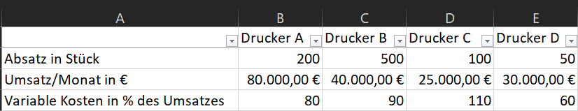

# Seite 461 Aufgabe 4

__Die monatlichen fixen Kosten betragen insgesamt 20.000,00 € und lassen sich proportional entsprechend dem Absatz verteilen.
Berechnen Sie:__

a) die variablen und fixen Kosten je Druckerart

b) die Deckungsbeiträge je Druckerart gesamt und pro Stück

c) das Betriebsergebnis je Druckerart und insgesamt

d) Nehmen Sie zu der Überlegung Stellung, Drucker C oder D aus dem Sortiment zu streichen

