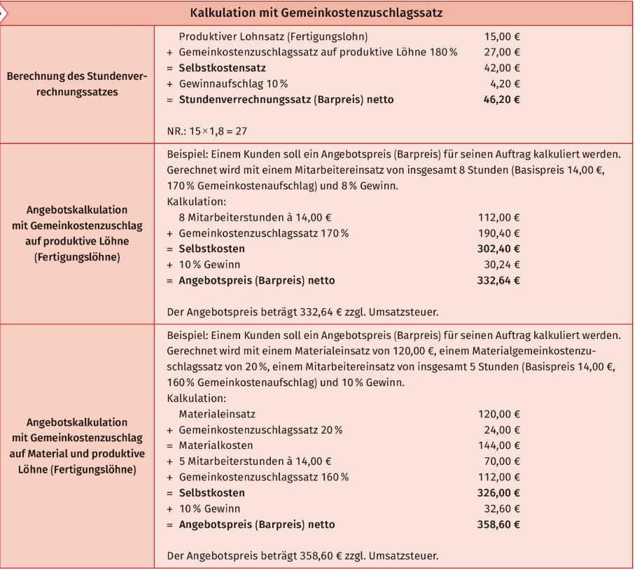

# Seite 455 Aufgabe 3 a) bis f) Angebotspreise entsprechend der Angaben

---

## a)

Fertigungslöhne : 15 Stunden
Durchschnittlicher Stundensatz Fertigungslöhne: 16,00 €

### Fertigungslöhne

- 15*16 __=240€__

Gemeinkostenzuschlagssatz auf produktive Löhne (Fertigungslöhne): 210 %

### Gemeinkosten

- 240*210=50.400
- 50.400/100 __=504 €__

### Selbstkosten

- 504,00 € + 240,00 € = __744,00 €__

Gewinnaufschlag: 12 %

### Nettoangebotspreis

- 744,00 * 12 / 100 = 89,28 €
- 744,00 + 89,28 __=833,28 €__

---

## b) Angebotskalkulation

Fertigungslöhne : 240 Stunden
Durchschnittlicher Stundensatz Fertigungslöhne: 12,00 €
Gemeinkostenzuschlagssatz auf produktive Löhne (Fertigungslöhne): 160 %
Gewinnaufschlag: 7 %

|Berechnung|Wert|
|:---|---:|
|240 Mitarbeiterstunden a 12,00 €|2.880,00 €|
|+ Gemeinkostenzuschlag 160%|4.608,00 €|
|__= Selbstkosten__|__7.488,00 €__|
|+ 7 % Gewinn|524,16 €|
|__= Angebotspreis (Barpreis) netto__|__8.012,16 €__|

---

## c) Angebotskalkulation

Fertigungslöhne : 85 Stunden
Durchschnittlicher Stundensatz Fertigungslöhne: 14,50 €
Gemeinkostenzuschlagssatz auf produktive Löhne (Fertigungslöhne): 175 %
Gewinnaufschlag: 8,5 %

|Berechnung|Wert|
|:---|---:|
|85 Mitarbeiterstunden a 14,50 €|1.232,50 €|
|+ Gemeinkostenzuschlag 175%|2.175,88 €|
|__= Selbstkosten__|__3.389,38 €__|
|+ 8,5 % Gewinn|288,10 €|
|__= Angebotspreis (Barpreis) netto__|__3.677,47 €__|

---

## d) Angebotskalkulation

Materialeinsatz: 500,00 €
Fertigungslöhne : 20 Stunden
Durchschnittlicher Stundensatz Fertigungslöhne: 14,00 €
Materialgemeinkostenzuschlagssatz: 20 %
Gemeinkostenzuschlagssatz auf produktive Löhne (Fertigungslöhne): 165 %
Gewinnaufschlag: 9 %

|Berechnung|Wert|
|:---|---:|
|Materialeinsatz|500,00 €|
|+Materialgemeinkostenzuschlag|100,00 €|
|=Materialkosten|600€,00|
|+20 Mitarbeiterstunden a 14,00 €|280,00 €|
|+ Gemeinkostenzuschlag 165%|462,00 €|
|__= Selbstkosten__|__1.342,00 €__|
|+9 % Gewinn|120,78 €|
|__= Angebotspreis (Barpreis) netto__|__1.1462,78 €__|

---

## d) Angebotskalkulation-Lösungsweg

1. **Materialeinsatz**: 500,00 €
2. **Fertigungslöhne**: 
   \[
   \text{Fertigungslöhne} = \text{Stunden} \times \text{Stundensatz}
   \]
   \[
   20 \, \text{Stunden} \times 14,00 \, \text{€/Stunde} = 280,00 \, \text{€}
   \]
3. **Materialgemeinkosten**: 
   \[
   \text{Materialgemeinkosten} = \text{Materialeinsatz} \times \text{Materialgemeinkostenzuschlagssatz}
   \]
   \[
   500,00 \, \text{€} \times 0,20 = 100,00 \, \text{€}
   \]
4. **Gemeinkosten auf Fertigungslöhne**: 
   \[
   \text{Gemeinkosten auf Fertigungslöhne} = \text{Fertigungslöhne} \times \text{Gemeinkostenzuschlagssatz}
   \]
   \[
   280,00 \, \text{€} \times 1,65 = 462,00 \, \text{€}
   \]
5. **Selbstkosten**: 
   \[
   \text{Selbstkosten} = \text{Materialeinsatz} + \text{Fertigungslöhne} + \text{Materialgemeinkosten} + \text{Gemeinkosten auf Fertigungslöhne}
   \]
   \[
   500,00 \, \text{€} + 280,00 \, \text{€} + 100,00 \, \text{€} + 462,00 \, \text{€} = 1.342,00 \, \text{€}
   \]
6. **Gewinnaufschlag**: 
   \[
   \text{Gewinnaufschlag} = \text{Selbstkosten} \times \text{Gewinnaufschlagssatz}
   \]
   \[
   1.342,00 \, \text{€} \times 0,09 = 120,78 \, \text{€}
   \]
7. **Angebotspreis**: 
   \[
   \text{Angebotspreis} = \text{Selbstkosten} + \text{Gewinnaufschlag}
   \]
   \[
   1.342,00 \, \text{€} + 120,78 \, \text{€} = 1.462,78 \, \text{€}
   \]

Der Angebotspreis beträgt also **1.462,78 €**.

---

## e) Angebotskalkulation

Materialeinsatz: 4.000,00 €
Fertigungslöhne : 120 Stunden
Durchschnittlicher Stundensatz Fertigungslöhne: 14,50 €
Materialgemeinkostenzuschlagssatz: 20 %
Gemeinkostenzuschlagssatz auf produktive Löhne (Fertigungslöhne): 165 %
Gewinnaufschlag: 8 %

|Berechnung|Wert|
|:---|---:|
|Materialeinsatz|4.000,00 €|
|+Materialgemeinkostenzuschlag|800,00 €|
|=Materialkosten|4.800,00 €|
|+120 Mitarbeiterstunden a 14,50 €|1.740,00 €|
|+ Gemeinkostenzuschlag 165%|2.871,00 €|
|__= Selbstkosten__|__9.411,00 €__|
|+ 8 % Gewinn|752,88 €|
|__= Angebotspreis (Barpreis) netto__|__10.163,88 €__|

---

## f) Angebotskalkulation

Materialeinsatz: 15.000,00 €
Fertigungslöhne : 150 Stunden
Durchschnittlicher Stundensatz Fertigungslöhne: 13,50 €
Materialgemeinkostenzuschlagssatz: 15 %
Gemeinkostenzuschlagssatz auf produktive Löhne (Fertigungslöhne): 185 %
Gewinnaufschlag: 11 %

|Berechnung|Wert|
|:---|---:|
|Materialeinsatz|15.000,00 €|
|+Materialgemeinkostenzuschlag|2.250,00 €|
|=Materialkosten|17.250,00 €|
|+150 Mitarbeiterstunden a 13,50 €|2.025,00 €|
|+Gemeinkostenzuschlag 185%|3.746,25 €|
|__= Selbstkosten__|__23.021,25 €__|
|+11 % Gewinn|2.532,34 €|
|__= Angebotspreis (Barpreis) netto__|__25.553,59 €__|

---

