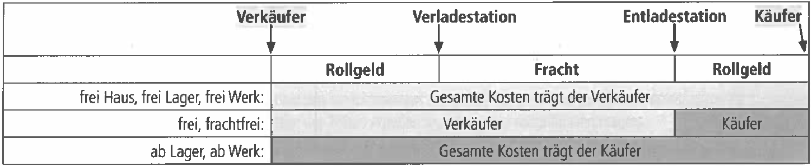
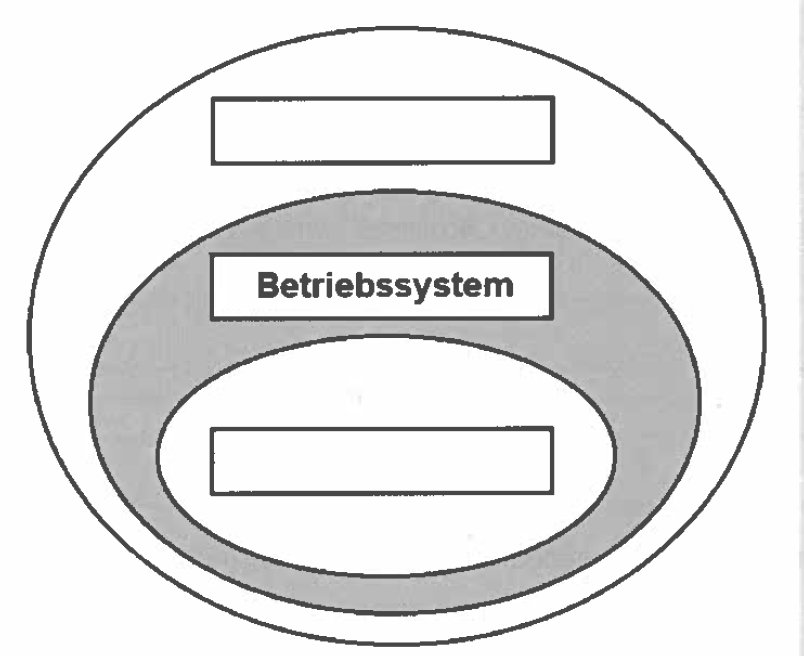
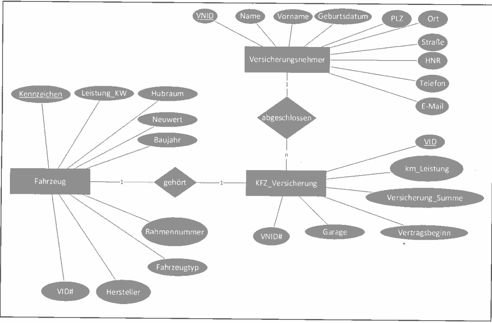

## Teil 1 der Abschlussprüfung Fachinformatiker:in Anwendungsentwicklung

[Aufgaben](2023_spring_ap1_questions_compressed.pdf) | [Lösung](2023_spring_ap1_solution.pdf) | [Belegsatz](2023_spring_ap1_beleg.pdf)

## Situation

| |
| :--- |
|Sie arbeiten in der SecuRita AG, einem Unternehmen des Finanzsektors. Hier steht eine Neustrukturierung der Arbeitsplätze unter Beachtung von Datensicherheit und Datenschutz an. Dabei sollen Sie die folgenden Aufgaben erledigen:|
| [1. Nutzwertanalyse, Vergleich Endgeräte](#1-aufgabe-nutzwertanalyse-vergleich-endgeräte) |
| [2. Bezugspreisermittlung mit Gegenüberstellung von Kauf und Leasing](#2-aufgabe-bezugspreisermittlung-mit-gegenüberstellung-von-kauf-und-leasing) |
| [3. Datenschutz und Datensicherheit](#3-aufgabe-datenschutz-und-it-sicherheit) |
| [4. Einsatz von Kl bei der Schadensabwicklung, Lasten- und Pflichtenheft, UML, SELECT](#4-aufgabe-einsatz-von-kl-bei-der-schadensabwicklung-lasten--und-pflichtenheft-uml-select) |

---

## 1. Aufgabe: Nutzwertanalyse, Vergleich Endgeräte

>26 Punkte

### 1a

>4 Punkte

Nennen Sie pro Modell je einen Vor- und einen Nachteil

||Vorteil|Nachteil|
|---|---|---|
|Notebook|...........................................|...........................................|
|All-in-One-PC|||
|Thin Client|||
|Desktop-PC|||

---

#### 1b Nutzwertanalyse

>16 Punkte

Analysieren Sie die zur Verfügung stehen Modelle und ergänzen Sie die Nutzwertanalyse in den Zellen mit den fehlenden Punkten (weiße Felder). Jeder Punktwert kann nur einmal vergeben werden. (1-4 Punkte möglich, 1: am schlechtesten, 4: am besten)  

Berechnen Sie anschließend für jedes Modell die Summe der gewichteten Punkte.

|Nr.|Kriterien|Gewichtung|Notebook||All-in-One-PC||Thin Client||Desktop-PC||
|---|---|---|---|---|---|---|---|---|---|---|
||||Punkte|__gP__|Punkte|__gP__|Punkte|__gP__|Punkte|__gP__|
|1|Platzbedarf|15%|2|0,3|3|0,45|||||
|2|Ergonomie|20%|2|0,4|||4|0,8|||
|3|Performance|10%|3|0,3|||2|0,2|||
|4|Verfügbarkeit|20%|4|0,8|2|0,4|1|0,2|3|0,6|
|5|Koststen für Wartbarkeit und Erweiterbarkeit|15%|2|0,3|||4||||
|6|Preis|20%|||||||||
||Auswertung|100|||||||||

gP = gewichtete Punkte

---

#### 1c Entscheidung

>4 Punkte

Entscheiden Sie sich für eines der Modelle unter Berücksichtigung der geplanten Modernisierung der Arbeitsumgebung.  
Begründen Sie Ihre Entscheidung.

...

---

#### 1d Kriterium für Nutzwertanalyse

>2 Punkte

Geben Sie ein weiteres sinnvoles Kriterium für die Nutzwertanalyse an. Begründen Sie Ihren Vorschlag.

...

---

### 2. Aufgabe Bezugspreisermittlung mit Gegenüberstellung von Kauf und Leasing

>25 Punkte

Für die Mitarbeiter solen 3.500 neue Notebooks bezogen werden. Von den Standard-Lieferanten wurden folgende drei Angebote eingeholt:

||Notebooks-günstiger.de|SMART Notebooks|Tech-ware|
|---|---|---|---|
|Listen-EK-Preis/Stk.|886,31 €|901,25 €|1.071,00 €|
|Lieferantenrabatt|0 %|0 %|20 %|
|Lieferantenskonto|0 %|0 %|2 %|
|Lieferbedingungen|frachtfrei|frei Haus|ab Werk|

Für ale Angebote gelten die folgenden Lieferkosten durch die Spedition Lieferschnel GmbH:

- Rollgeld zur Verladestation: 45 EUR pro 10 Stück
- Fracht: 100 EUR pro 10 Stück
- Rollgeld ab Entladestation: 5 EUR pro 10 Stück

---

#### 2aa Bezugspreisermittlung

>10 Punkte

Ermiteln Sie den Bezugspreis der einzelnen Anbieter pro Notebook durch Ergänzung der leeren Felder in der folgenden Tabelle:

||Notebooks-günstiger.de|SMART Notebooks|Tech-ware|
|---|---|---|---|
|Listen-EK-Preis/Stk. Brutto|886,31 €|901,25 €|1.071,00 €|
|Lieferantenrabatt|0,00 €|0,00 €||
|=Zieleinkaufspreis|886,31 €|901,25 €||
|Lieferantenskonto|0,00 €|0,00€||
|=Bareinkaufspreis|886,31 €|901,25 €||
|Bezugskosten||||
|=Bezugspreis||||

---

#### 2ab Vergleich

>3 Punkte

Es wurde ein Lieferant mit einem höheren Bezugspreis gewählt. Nennen Sie drei mögliche Gründe.

1. ...
2. ...
3. ...

---

### 2b Leasing

Sie erhalten ein weiteres Angebot. Die Best-IT-Service GmbH bietet die 3.500 Notebooks zu einem Gesamtpreis von 300.000,00 EUR an, alternativ einen Leasingvertrag über fünf Jahre mit einer monatlichen Leasingrate von 6.000,00 EUR mit Kaufoption.

---

#### 2ba Grundprinzip, Eigentums- und Besitzverhältnisse

>4 Punkte

Beschreiben Sei das Grundprinzip von Leasing und erklären Sei dabei die Eigentums- und Besitzverhältnisse

...

---

##### 2bb Vergleich Kauf und Leasing

>3 Punkte

Vergleichen Sei den Kaufpreis mit den Gesamtkosten des Leasings.
Ermitteln Sie den Differenzbetrag

...

---

#### 2bc Vorteile Leasing

>3 Punkte

Nennen Sie __drei Vorteile__, die für einen Leasingvertrag sprechen.

1. ...
2. ...
3. ...

---

#### 2bd Kaufoption

>2 Punkte

Erläutern Sie den Begriff __Kaufoption__.

...

---

## 3. Aufgabe Datenschutz und IT-Sicherheit

>24 Punkte

### 3a Schichtenmodell

>4 Punkte

Sie informieren sich darüber, wie Sie bei den PCs in Ihrem Betrieb auf der Ebene der Betriebssysteme die Sicherheit verbessern könnten. Zur Einordnung der Funktionsebenen eines PCs wird häufig ein Schichten- oder ein Schalenmodel verwendet.

Benennen Sie im nebenstehenden Modell eine Schicht oberhalb und eine Schicht unterhalb des Betriebssystems.

Beschreiben Sie mithilfe der folgenden Tabelle jeweils eine Funktion Ihrer oben benannten Schichten.

|Schicht|Funktion|
|---|---|
|||
|||

---

### 3b Systemhärtung

Bei Ihren Recherchen zur Sicherheit rund um das Betriebssystem treffen Sie auf eine Information des Bundesamts für Sicherheit in der Informationstechnik (BSI). Beim Lesen des Textes ergeben sich die unten aufgeführten Fragen.

>„Ein Großteil der erfolgreichen Angriffe auf IT-Systeme mit Microsoft Windows 10 lässt sich bereits mit den im Betriebssys- tem vorhandenen Bordmitteln erkennen oder verhindern. Um die nötige Konfiguration des Betriebssystems zu erleichtern, hat das Bundesamt für Sicherheit in der Informationstechnik (BSD im Rahmen der „Studie zu Systemaufbau, Protokollie- rung, Härtung und Sicherheitsfunktionen in Windows 10" (SiSyPHuS Win 10) Hand/ungsempfehlungen zurAbsicherung der Windows-Systeme in deutscher und englischer Sprache veröffentlicht. Ein Fokus bei der Erstellung lag auf der einfachen Umsetzung und praktischen Anwendung. Daher stellt das BSI die empfohlenen Konfigurationseinstellungen als direkt in Windows importierbare Gruppenrichtlinienobjekte (GP9) zum Download bereit — ein Service, der schnell und sicher ist. " Quelle: <https://www.bsi.bund.de/DE/Service-Navi/Presse/Pressemitteilungen/Presse2021/210503_SiSyPHuS.html> veröffentlicht am 03. Mai 2021

#### 3ba Aufgaben des BSI

Nennen Sie zwei allgemeine Aufgaben des BSI

>2 Punkte

...

---

#### 3bb Härtung

Erklären Sie den Begriff der „Härtung" eines Betriebssystems

>2 Punkte

...

---

#### 3bc Beispiel für Härtung

Nennen Sie zwei Beispiele für eine Härtung eines Betriebssystems

>2 Punkte

...

---

##### 3bd  Systemwerkzeuge zur Erhöhung der IT-Sicherheit

>2 Punkte

Nennen Sie zwei Svstemwerkzeuae („Bordmittel") eines Betriebssystems, mit denen die IT-Sicherheit erhöht werden kann

...

>2 Punkte

...

---

#### 3be Gruppenrichtlinien

>4 Punkte

Beschreiben Sie, wozu Gruppenrichtlinien auf einem Arbeitsplatzrechner eingesetzt werden können

...

---

#### 3c Protokollierung und Logging

Das BSI gibt weiterhin auch Empfehlungen zur Konfiguration der Protokollierung von Aktivitäten an den einzelnen Rechnern.

##### 3ca

>4 Punkte

Beschreiben Sie, inwiefern eine Protokollierung (Logging) zur Erhöhung der IT-Sicherheit beitragen kann.

...

---

##### 3 cb Besondere Anforderungen

>4 Punkte

Beschreiben Sie die besonderen Anforderungen an den Datenschutz, die bei der Protokollierung beachtet werden müssen.

...

---

## 4. Aufgabe Einsatz von Kl bei der Schadensabwicklung, Lasten- und Pflichtenheft, UML, SELECT

>25 Punkte

### 4a Einsatz von KI bei der Schadensabwicklung

>4 Punkte

Die SecuRita AG möchte zukünftig die Möglichkeit bieten, Schadensfälle schnell und einfach online zu regulieren. Zum Einsatz soll ein Chatbot kommen, der über künstliche Intelligenz verfügt. Dazu soll in einem ersten Schritt eine Übersicht über die Vorteile und Nachteile eines Chatbot unter wirtschaftlichen und sozia- len Aspekten erstellt werden. Geben Sie in jedem Feld ein zutreffendes Argument an.

||Vorteile|Nachteile|
|---|---|---|
|wirtschaftliche Aspekte|||
|soziale Aspekte|||

---

### 4b Lasten- und Pflichtenheft

Die SecuRita AG hat sich für den Einsatz des Chatbots entschieden. Dazu soll in einem ersten Schritt ein Lastenheft erstellt werden.

### 4ba Unterschiede

>4 Punkte

Beschreiben Sie zwei Unterschiede zwischen einem Lastenheft und einem Pflichtenheft

1. ...
2. ...

---

#### 4bb Inhalte Lastenheft

>2 Punkte

Sie wirken an der Erstellung des Lastenheftes mit. Nennen Sie zwei weitere Inhalte, die neben der Ausgangssituation in ein Lastenheft gehören.

|Inhalt Lastenheft|
|---|
|- Ausgangssituation|
|- ...|
|- ...|

---

#### 4c UML Klassendiagramm

>8 Punkte

Im nächsten Schritt wird ein Entwurf eines UML-Klassendiagramms für die Schadensregulierung erstellt. Für die Versicherungsfälle KFZ und Immobilie sollen eigene Klassen entworfen werden.

Die Klasse KFZ hat die Eigenschaften:

- Hersteller
- Typschlüssel
- Neupreis
- Baujahr
- Laufleistung
- Schadenshöhe

und Methoden:

- restwertBerechnen()
- auszahlen()
  
Die Klasse immobilie hat die Eigenschaften:

- Neupreis
- Baujahr
- Wohnfläche
- Lagebewertung
- Schadenshöhe
  
und Methoden:

- restwertBerechnen()
- getLagebewertung()
- auszahien()

__Aufgabe:__ Erstellen Sle eine sinnvolle Klassenhierarchie mit einer gemeinsamen Oberklasse „VersicherungsobÉkt"
__Hinweis:__ Die Restwertberechnung erfolgt beim KFZ und bei der Immobilie unterschiedlich. Zusätzliche Methoden, Konstruktoren und Zugriffsmodifikatoren sind nicht erforderlich.

---

#### 4d SELECT-Abfragen | *entfällt durch AO 2025* 😥

Bei der Schadenregulierung im KFZ-Bereich werden die notwendigen Informationen in einer relationalen Datenbank gespeichert. Wichtig dabei ist die Zuordnung der Versicherungsnehmer zu den jeweiligen KFZ-Daten. So werden zum Beispiel unter dem Attribut Fahrzeugtyp, die Fahrzeuge nach SUV, Limousine, Geländewagen oder Cabriolet unterschieden. Das Attribut „Garage" wird mit dem Datentyp BOOLEAN abgespeichert. Ein Teilauszug aus dieser Datenbank sehen Sie in dem untenstehenden Entity-Relationship-Modell.

__PK__ bezeichnet ein Primärschlüsselattribut, Primärschlüsselattribute werden unterstrichen.

__FK__ bezeichnet ein Fremdschlüsselattribut, Fremdschlüsselattribute werden durch ein nachgestelltes Hash-Zeichen (#) kenntlich gemacht.

#### 4da SELECT-Abfrage | *entfällt durch AO 2025* 😥

> 3 Punkte

Sie erhalten von der Versicherungszentrale den Auftrag, die durchschnittliche Versicherungssumme über alle KFZ-Versiche rungsverträge zu ermitteln. Erstellen Sie dazu eine geeignete SQL-Abfrage.

...

---

##### 4db SELECT-Abfrage | *entfällt durch AO 2025* 😥

>4 Punkte

Sie erhalten von der Versicherungszentrale den Auftrag, die Versicherungsnummern (VID) zu ermitteln, welche im Mai 2022 abgeschlossen wurden und eine maximale Versicherungssumme von über 100.000,00 EUR beinhalten. Alle Fahrzeuge, die in einer Garage abgestellt werden, sollen in dieser Abfrage nicht angezeigt werden. Erstellen Sie dazu eine geeignete SQL-Abfrage.

...

---
