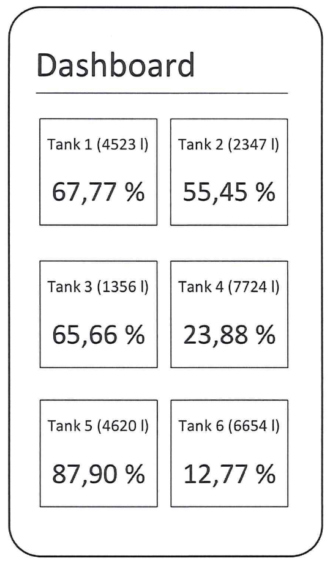
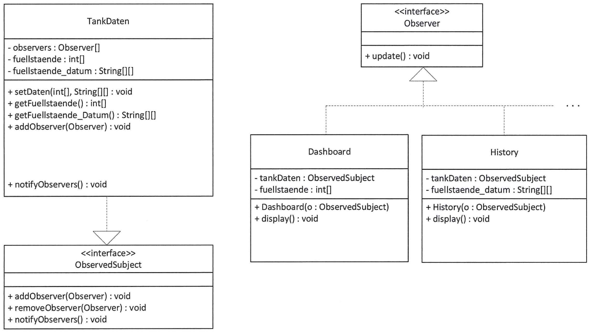
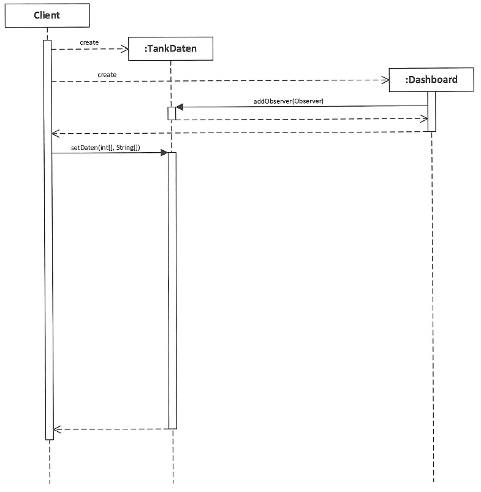

## Situationsbeschreibung

>Die Handlungsschritte 1 bis 5 beziehen sich auf die folgende Ausgangssituation:
Die WärL Chemie GmbH expandiert und plant in diesem Zusammenhang ein neues Gebäude. Für dieses Projekt übernimmt die
IT-Abteilung der WärL Chemie GmbH selbst die Realisierung der Gebäudesteuerung und Wartungsarbeiten.
Sie sollen vier der folgenden fünf Aufgaben in diesem Projekt erledigen:

## Aufgabenstellung

1. [Zustandsdiagramm und Anwendungsfalldiagramm für Controller und Lichtsteuerung erstellen](#1-aufgabe-zustandsdiagramm-und-anwendungsfalldiagramm)
2. [OOP-Methoden (Pseudocode) für die Auswertung von Temperaturmessungen implementieren](#2-aufgabe-oop-methoden-für-die-auswertung-von-temperaturmessungen)
3. UML-Modellierung für ein Smartphone-Dashboard zur Anzeige von Tankfüllständen anfertigen
4. ER-Modell zur Speicherung von Sensordaten anlegen
5. SQL-Abfragen für eine Zeiterfassungsdatenbank formulieren

---

## 1. Aufgabe: Zustandsdiagramm und Anwendungsfalldiagramm

>25 Punkte

### 1a Zustandsdiagramm

>15 Punkte

Für jeden Flur der Gebäude der WärL Chemie GmbH soll eine automatisierte Lichtsteuerung eingerichtet werden.

Der Controller zur Lichtsteuerung kann sich in einem der Zustände „wartend""',auto", „manuel" oder „zeitgesteuert" befinden.

- Der Controller befindet sich initial im Zustand „wartend" bei ausgeschaltetem Licht.
- Wenn Sensoren Personen im Flur erkennen, wechselt der Controller in den Zustand „auto" und das Licht wird mit dem
Eintritt in diesen Zustand eingeschaltet.
- Wenn keine Personen mehr im Flur erkannt werden und sich der Controller im Zustand „auto" befindet, findet ein Wechsel
in den Zustand „zeitgesteuert" statt.
- Falls innerhalb einer festgelegten Zeitspanne erneut Personen erkannt werden, erfolgt ein Wechsel vom Zustand „zeitge-
steuert" in den Zustand „auto"
- Falls innerhalb der Zeitspanne keine Personen den Flur betreten, erfolgt ein Wechsel in den Zustand „wartend" und das
Licht wird bei Eintritt in diesen Zustand ausgeschaltet.
- Da beim Übergang vom Zustand „wartend" in den Zustand „auto" das Licht etwas verzögert eingeschaltet wird, kann eine
Person (im Zustand „auto") das Licht manuell einschalten, solange es noch aus ist. Dann erfolgt ein Zustandswechsel in den
Zustand „manuell" und das Licht wird mit Eintritt in diesen Zustand eingeschaltet.
- Im Zustand „manuell" kann das Licht von einer Person ausgeschaltet werden. Der Controller wechselt dabei in den Zustand
„Wartend"
". Falls von den Sensoren keine Personen mehr erfasst werden, erfolgt ein Übergang vom Zustand „manuell" in
den Zustand „zeitgesteuert"
Erstellen Sie für die beschriebene Situation ein Zustandsdiagramm für den Controller der Lichtsteuerung.

---

### 1b Anwendungsfalldiagramm

>10 Punkte

Im Rahmen der neuen Aufgaben für das Gebäudemanagement fallen für die Mitarbeiter folgende Tätigkeiten an:

- Für Wartungsmitarbeiter fallen entsprechende Wartungen und Kalibrierungen für die Sensoren an. Für die Wartung ist ein
Login erforderlich, falls dieser noch nicht erfolgt ist.
- Administratoren können Sensordaten auswerten. Dazu müssen in jedem Fal Sensordaten gelesen werden. Falls dies noch
nicht erfolgt ist, ist für die Auswertung der Daten ein Login erforderlich.
- Jeder Mitarbeiter kann die Sensordaten auslesen.
Erstellen Sie für die beschriebene Situation ein Anwendungsfalldiagramm.

---

## 2. Aufgabe: OOP-Methoden für die Auswertung von Temperaturmessungen

>25 Punkte

In einem Gebäudeteil gibt es Sensoren, die Temperaturwerte in unregelmäßigen Zeitabständen messen. Zur Auswertung der Messwerte sollen u. a. zwei Methoden implementiert werden. Folgende Klassen sind bereits vorhanden:

| Value |
|:---|
| - sensor_id:Integer |
| -value: Double |
| - time: Long |
|---|
| + Konstruktor(sensor_id: Integer, value: Double, time: Long) |
| + getld() : Integer |
| + getValue() : Double |
| + getTime(): Long |

---

| TempList | |
| :--- | :--- |
| +setValue(value: Value) | Speichert ein Value-Objekt chronologisch in einer Liste. Die Objekte werden für jeden Sensor getrennt gespeichert. |
| + getValue(sensor_id, pos: Integer) : Value | Liefert für den Sensor mit der übergebenen Sensor-ld das Value-Objekt an der Position pos. |
| +getSize(sensor_id: Integer): Integer | Liefert die Anzahl der gespeicherten Value-Objekte für den Sensor mit der übergebenen Sensor-ld. |

### 2a Methoden

>5 Punkte

Sobald an einem Sensor eine neue Messung vorliegt, wird automatisch die Methode  
*onNewValue(sensor_id: Integer, value: Double, time: Long)*  
aufgerufen.

Die Methode onNewValue soll mit folgender Funktionalität implementiert werden:

- Erstellen eines Value-Objektes mit den übergebenen Parametern (siehe Klassendiagramm für Value)
- Speichern des Value-Objektes mit der Methode setValue des Objektes tempList (das Objekt vom Typ TempList ist bereits vorhanden und kann verwendet werden, siehe Klassendiagramm TempList).

Implementieren Sie die Methode onNewValue in Pseudocode.

```plaintext
onNewValue (sensor_id: Integer, value: Double, timestamp: Long)
```

...

---

### 2b Methoden

>20 Punkte

Um Temperaturdaten dieses Gebäudes statistisch auswerten zu können, soll eine Methode  
*maxPeriod(sensor_id: Integer, mindestwert: Double): Integer*  
implementiert werden, die aus allen in tempList gespeicherten Temperaturwerten die höchste Anzahl von hintereinander gespeicherten Werten des Sensors ermittelt, welche den vorgegebenen Mindestwert einhalten.

Beispiel:
Es liegen die Temperaturwerte 20, 22, 23, 21, 19, 18, 20, **22, 23, 23, 24, 22,** 21 vor.

Die höchste Anzahl von hintereinanderliegenden Werten, welche den Mindestwert 22 einhalten, ist fünf.

Implementieren Sie die Methode maxPeriod in Pseudocode.

```plaintext
maxPeriod (sensor id: Integer, mindestwert: Double) : Integer
```

---

## 3. Aufgabe: UML-Modellierung für ein Smartphone-Dashboard

>25 Punkte

Eine Smartphone-Anwendung mit unterschiedlichen Anzeigemöglichkeiten für Tankfüllstände soll entwickelt werden.



In einer ersten Implementierung sol eine „Dashboard"-Anzeige, welche die Fülstände aler Tanks anzeigt und später eine
„History"-Anzeige, die den zeitlichen Verlauf des Füllstands eines Tanks darstellt, erstellt werden.

---

### 3a Klasse Tank

>11 Punkte

Zunächst soll eine Klasse Tank für Tankobjekte modelliert werden.

#### 3aa Klassenvariablen

>7 Punkte

Die Klasse Tank soll Folgendes beinhalten:

- Die nur klassenintern sichtbaren Instanzvariablen bezeichner, fuellstand, fassungsvermoegen
- Einen öffentlichen Konstruktor zur Initialisierung der Instanzvariablen.
- Beispielhaft für den fuellstand je eine öffentliche Set- und Get-Methode.

Hinweis: Geben Sie jeweils sinnvolle Datentypen an.

Erstellen Sie das UML-Klassendiagramm für die Klasse Tank.

| Tank |
|:---|
| ............................................................................. |
| --- |
| ............................................................................. |

---

#### 3ab Methoden

>4 Punkte

Implementieren Sie in Pseudocode die Set- und Get-Methode für die Instanzvariable *fuellstand* der Klasse *Tank*.

---

### 3b Klasse Dashboard

Die Füllstände der Tanks werden stündlich aktualisiert. Ale Anzeigen sollen entsprechend angepasst werden. Ein noch unvollständiger Entwurf nach dem Observer-Muster zur Umsetzung dieser Anforderung liegt bereits vor.



---

#### 3ba Impelmentierung und Beziehung

>4 Punkte

Ergänzen Sie im obigen Klassendiagramm in den Klassen *TankDaten*, *Dashboard* und *History* die jeweils fehlende Implementierung und die Beziehung zwischen der Klasse *Tankdaten* und dem Interface *Observer*.

---

#### 3bb Beziehung

>2 Punkte

Erläutern Sie die Art der Beziehung zwischen den Klassen *Tankdaten* und *ObservedSubject*.

---

### 3c UML-Sequenzdiagramm und Pseudocode

#### 3ca Sequenzdiagramm

>6 Punkte

Ergänzen Sie das folgende UML-Sequenzdiagramm.

- Der Client erzeugt ein *TankDaten*- und ein *Dashboard*-Objekt.
- Im Konstruktor des *Dashboard*-Objekts wird die Methode *addObserver* aufgerufen.
- Der Client ruft die Methode *setDaten* auf.
- In der Methode *setDaten* wird *notifyObservers* gestartet.
- Die Methode *notifyObservers* führt *update* aus.
- Die Methode *update* holt sich über den Aufruf der Methode *getFuellstaende* das Array mit den aktuellen Füllständen
der Tanks und startet die Methode *display* zur Anzeige der Daten.
- Der Kontrollfluss geht von *display* über *update*, *notifyObservers* und *setData* zurück zum Client.

Hinweis: Die ersten drei Spiegelstriche sind bereits umgesetzt.

---



---

#### 3cb Pseudocode

>2 Punkte

Die Methode *notifyObservers* benachrichtigt über den Aufruf von *update* alle registrierten Observer.
Implementieren Sie notifyObservers in Pseudocode.

---

## 4. Aufgabe: ER-Modell zur Speicherung von Sensordaten

>25 Punkte

---

## 5. Aufgabe: SQL-Abfragen für eine Zeiterfassungsdatenbank

>25 Punkte

---
