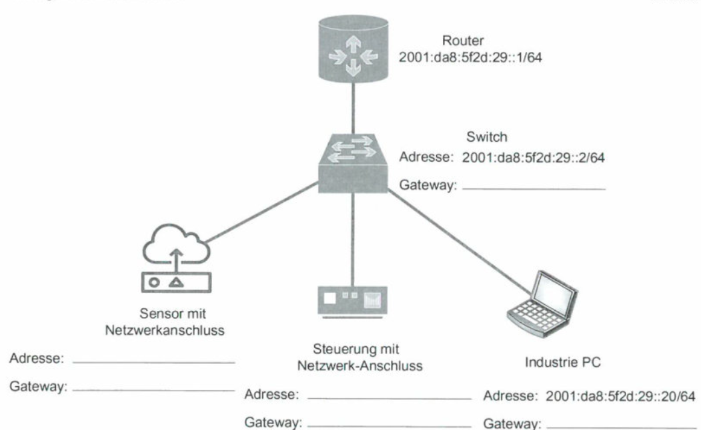
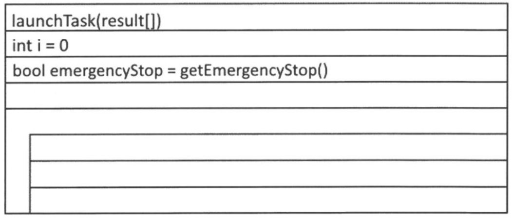
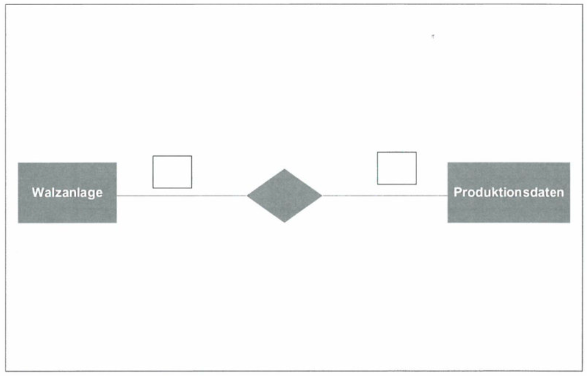

## Teil 1 der Abschlussprüfung Fachinformatiker:in Anwendungsentwicklung

[Aufgaben](Herbst_2022_Teil1-Prufung_compressed.pdf) | [Lösung](Herbst_2022_Teil1-Prufung_LTAO2020.pdf) | [Belegsatz](Herbst_2022_Teil1-Prufung_Belegsatz.pdf)

## Situation

>Ihr Ausbildungsbetrieb, die Package AG, produziert und handelt mit Verpackungsmaterial. Um dem Marktpotenzial aufgrund
der enorm gestiegenen Nachfrage gerecht zu werden, hat die Geschäftsleitung Investitionen zur Steigerung der Produktionska-
pazitäten beschlossen. Dies sol vor alem durch eine Erhöhung des Automatisierungsgrads erreicht werden, die weitreichende
Auswirkungen auf die künftige Gestaltung und Ausstattung der Arbeitsplätze in der Produktion haben wird. Für diese Aufgabe
wurde daher eine eigene Arbeitsgruppe gebildet. | Sie wurden in diese Arbeitsgruppe aufgenommen.

---

## 1. Aufgabe

>23 Punkte

### 1a Marktsituation

Die Marktsituation der Package AG ist aktuell noch gekennzeichnet durch wenige Anbieter aber viele Nachfrager.

#### 1aa Marktform

>1 Punkt

Nennen Sie die aktuell vorliegende Marktform

...

---

#### 1ab Neue Marktform

>1 Punkt

Es ist jedoch festzustellen, dass immer mehr Anbieter auf den Markt drängen.
Nennen Sie die neue Marktform, mit der die Package AG zukünftig rechnen sollte?

...

---

### 1b Pojektschritte

>6 Punkte

Um bei dem komplexen Vorhaben den Überblick zu behalten, legt die Arbeitsgruppe Projektschritte (z. B. Projektinitiierung) fest.
Beschreiben Sie in nachvollziehbaren Stichpunkten zu jedem Projektschritt einen inhaltlichen Aspekt, der durchzuführen ist.

| Projektschritte, z. B | Inhaltlicher Aspekt, z. B. |
| :--- | :--- |
| 1. Projektinitiierung | Identifikation eines Problembereiches |
| 2. Beschreibung des Istzustands | ... |
| 3. Definition des Sollkonzepts | ... |
| 4. Planung | ... |
| 5. Umsetzung | ... |
| 6. Überprüfung der Zielerreichung | ... |
| 7. Ausblick | ... |

---

### 1c Stakeholder

>3 Punkte

„Stakeholder" beeinflussen die Machbarkeit von Projekten.

Beschreiben Sie drei Gruppen von Stakeholdern mit deren Einfluss auf das Projekt.

1. ...
2. ...
3. ...

---

### 1d Projektberater

>5 Punkte

In der Projektgruppe wird die Einbindung eines externen Projektberaters diskutiert.

Welche Vorteile und Nachteile sind damit verbunden? Nennen Sie insgesamt fünf Vor- und/oder Nachteile, z. B. zwei Vorteile
und drei Nachteile.

- Vorteile: ...

- Nachteile: ...

---

### 1e Effektiver Stundensatz

>5 Punkte

Alternativ zu internen Fachkräften kann aus dem Büro des Projektberaters vergleichbares Personal zu einem effektiven
Stundensatz von 85 EUR beauftragt werden.

Berechnen Sie den effektiven Stundensatz der internen Fachkräfte mit nachfolgenden Angaben:

- 260 Arbeitstage pro Jahr
- 7,8 Std. pro Tag
- 30 Urlaubstage pro Jahr
- 5 Krankheitstage pro Jahr
- 5 Feiertage pro Jahr
- Jahreskosten eines Arbeitnehmers 140.000 EUR

---

### 1f Dienstvertrag vs. Werkvertrag

>2 Punkte

Es stellt sich die Frage, ob mit dem Projektberater ein Dienstvertrag oder Werkvertrag abgeschlossen werden sol.
Geben Sie eine begründete Empfehlung.

...

---

## 2. Aufgabe

>25 Punkte

Die Package AG plant die Anschaffung einer kleinen Fertigungslinie für Karton, welche mit einer Arbeitsbreite von **508 mm** und
einer Produktionsgeschwindigkeit von **30,48 m/min** Karton auf Rollen produziert. Die Anlage sol zwölf Stunden pro Tag produktiv sein.

Karton wird zum Teil aus Altpapier hergestelt, Unreinheiten wirken sich auf die Qualität des Kartons aus. Zur Qualitätssicherung
wird die erzeugte Kartonbahn fortlaufend durch eine Kamera gescannt. Die entstandenen Bilder werden ausgewertet und anschließend gespeichert. Bei erkannten Verfärbungen der Oberfläche oder Einschlüssen im Karton werden die aktuellen Rollen als mindere Qualität eingestuft.

- Erfasste Scanfläche: **50,80 cm** breit x **30,48 cm** lang
- Auflösung: 400 dpi x 400 dpi
- Farbtiefe: 16 Bit
- 1 Inch: 2,54 cm

### 2a Speicherbedarf

>2 Punkte

Ermitteln Sie zunächst die Zahl der Scans/Aufnahmen pro Tag. Der Rechenweg ist anzugeben.

...

---

### 2b Speicherbedarf

Die Daten der Scans werden einen Tag für Auswertungen zur Qualitätskontrolle gespeichert.

#### 2ba Datenvolumen in MiB

>4 Punkte

Ermitteln Sie das zu speichernde Datenvolumen in MiB pro Scan.
Der Rechenweg ist anzugeben.

...

---

#### 2bb Datenvolumen in TiB

>2 Punkte

Ermitteln Sie anschließend das gesamte zu speichernde Datenvolumen pro Tag in TiB.
Runden Sie das Ergebnis auf volle TiB auf.
Der Rechenweg ist anzugeben.

Hinweis: Sollten Sie die Aufgabe a) oder die Teilaufgabe ba) nicht gelöst haben, gehen Sie von **100.000 Scans/Aufnahmen** pro Tag und **70 MiB** Datenvolumen pro Scan aus.

...

---

### 2c Speicherbedarf

In Abstimmung mit der IT-Leitung beschließen Sie, ein redundantes Speichersystem einzurichten. Dazu sind folgende Kompo-
nenten verfügbar:

- 2 Festplatten (je 3 TB Speicherkapazität)
- 7 Festplatten (je 2 TB Speicherkapazität)
- PCI RAID-Hostadapter

#### 2ca RAID 5-Konfiguration | *entfällt durch AO 2025*

>4 Punkte

Mit alen vorhandenen Festplaten sol eine fehlertolerante RAID 5-Konfiguration erstellt werden, welche die größtmögliche Nettospeicherkapazität biete.

Berechnen Sie die maximale Nettospeicherkapazität in TB. Der Rechenweg ist anzugeben.

- RAID-Level: ...
- Nettospeicherkapazität: ...
- Rechenweg: ...

---

#### 2cb JBOD-Konfiguration

>2 Punkte

Für einen Vergleich sol auch die Speicherkapazität berechnet werden, wen man die gegebenen Festplatten als JBOD
(Zusammenfassung aler Festplatten zu einem logischen Volume) nutzt.

Ermitteln Sie die erreichbare Speicherkapazität in TB. Der Rechenweg ist anzugeben.

- Speicherkapazität in TiB: ...
- Rechenweg: ...

---

### 2cc JBOD vs. RAID 0

>4 Punkte

Beschreiben Sie zwei Vorteile, die ein Laufwerksverbund als JBOD gegenüber einem RAID 0 bietet.

1. ...
2. ...

---

### 2d NAS vs. SAN | *entfällt durch AO 2025*

>3 Punkte

Die im Netzwerk der Hauptverwaltung eingesetzten NAS-Speichersysteme sollen durch ein SAN (Storage Area Network) abgelöst werden.

Nennen Sie drei Vorteile, die den Einsatz begründen

1. ...
2. ...
3. ...

---

### 2e Kennzeichnung QR-Code vs. RFID-Chips

Für die Kennzeichnung der produzierten Kartonrollen durch einen maschinenlesbaren Aufkleber schlägt die Geschäftsleitung die Verwendung von Barcode, QR-Code oder RFID-Chips vor.

Stelen Sie jeweils einen Vor- und Nachteil der Kennzeichnung mit QR-Code bzw. RFID-Chips in folgender Tabelle gegenüber.

>4 Punkte

| Kennzeichnung | Vorteil | Nachteil |
| :--- | :--- | :--- |
| Barcoode | Einfach zu erstellen | Kann bei Verschmutzung oder Sichtbehinderung nicht gelesen werden |
|  | Kostengünstig | Relativ umfangreiche Zeichenfolge für Barcode |
| QR-Code | ... | ... |
| RFID-Chips | ... | ... |

---

## 3. Aufgabe

>28 Punkte

### 3a IPv6-Adressierung

>2 Punkte

Zur fachgerechten Kommunikation zwischen den Einzelkomponenten in der Automatisierung wird über den Einsatz von IPv6 als
Ersatz für IPv4 nachgedacht.

Nennen Sie zwei technologische Vorteile der IPv6-Adressierung gegenüber IPv4, die für den Einsatz im Bereich loT relevant sein
können.

1. ...
2. ...

---

### 3b

>4 Punkte

In einer abgeschlossenen Testumgebung sol die Kommunikation zwischen einigen Netzwerkkomponenten über IPv6 geprüft werden. Dabei sol eine globale Adresse ähnlich derjenigen aus einem anderen Teilnetz des Betriebs 201: `da8:5f2d:28::/64` verwendet werden. Hier handelt es sich bereits um eine verkürzte Schreibweise. Sie besteht aus einem 48-Bit langem Standortpräfix und einer 16-Bit Teilnetz-ID.

Identifizieren Sie in der gegebenen Adresse die beiden genannten Komponenten und geben Sie die beiden Teile der Adresse in
ihrer ungekürzten Form im hexadezimalen Format an.

1. Ungekürztes Standortpräfix: ...
2. Ungekürzte Teilnetz-ID: ...

---

### 3c

>2 Punkte

Geben Sie an, wie viele Teilnetze mit der gegebenen IPv6-Adresse gebildet werden können.

...

---

### 3d Adressierung

>6 Punkte

Vergeben Sie für die abgebildete loT-Testumgebung nutzbare IPv6-Adressen auf der Grundlage der gegebenen globalen
Adresse für ale Geräte. Vermischen Sie dabei aus Gründen der Übersichtlichkeit nicht die Adressen der Endgeräte mit denen
der Netzwerkgeräte. Richten Sie die IP-Adressierung so ein, dass ale Geräte später auch aus einem anderen Teilnetz über den
Router gewartet werden können.

| | Router | Switch      | Server mit Netzwerkanschluss | Steuerung mit Netzwerkanschluss | Industrie PC |
| :--- | :--- | :--- | :--- | :--- | :--- |
| Adresse | 2001: da8:5/2d:29:: 1/64 | 2001:da8:5f2d:29::2/64 | ... | ... | 2001:da8:5f2d:29::20/64 |
| Gateway | ... | ... | ... | ... | ... |

---

### 3e Erreichbarkeit

>2 Punkte

Auf dem loT-Gerät 1 sol nun die Erreichbarkeit des Loopback-Interfaces und des Standard-Gateways auf einer Kommandozeile
geprüft werden.

Geben Sie die erforderlichen Befehle an.

...  
...

---

### 3f Netzwerkkonfiguration

>2 Punkte

Nach der Eingabe des Befehls ip addr zur Anzeige der Netzwerkkonfiguration erscheint u. a. die Ausgabe `fe80::62eb:69ff:fed2:d2a6/64`

Geben Sie den Grund dafür an, dass eine IPv6-Adresse angezeigt wird, die Sie nicht konfiguriert hatten und benennen Sie
dabei die Adressart.

...

---

### 3g Angebotsvergleich

>10 Punkte

Die Geschäftsführung möchte im Umfeld der Maschinenautomatisierung die Mitarbeiter mit weiteren mobilen und robusten
Geräten ausstatten. Der Bedarf beträgt im ersten Schritt 30 Stück.

Folgende drei unverbindliche Angebote liegen vor:

| | Noteplus AG, Mainz | Notebook-Clever.de, Berlin | Frankfurt PC-Genie KG |
|:--- | :--- | :--- | :--- |
| Bareinkaufspreis pro Stück | 1.000 EUR | 1.100 EUR | 1.300 EUR |
| Lieferbedingungen/-kosten pro Stück | Ab Werk: 15 EUR | Frachtfrei: 10 EUR | Frei Haus |
| Bezugspreis pro Stück | | | |
| Lieferzeit | 5 Wochen | 3 Wochen | 1 Woche |
| Qualität | Gut | Durchschnitt | Sehr gut |
| Kundenrückmeldungen auf der Homepage der Lieferanten | Öfter bei Lieferungen kleine Mängel | Lieferung ohne Beanstandung | Sehr gutes Kulanzverhalten |

Berechnen Sie zuerst den Bezugspreis pro Stück. Bewerten Sie anschließend die Anbieter und Angebote mit einer Skala von 1 (schwach) bis 3 (sehr gut).

Führen Sie mithilfe der vorliegenden Daten einen gewichteten Angebotsvergleich durch und entscheiden Sie sich für den geeigneten Lieferanten.

---

| Kriterien | Gewichtung  Noteplus AG, Mainz | | Notebook-Clever.de, Berlin | | Frankfurt PC-Genie KG | |
| :--- | :--- | :--- | :--- | :--- | :--- | :--- |
| Bezugspreis | 11 |  |  |  |  |  |
| Lieferzeit | 8 |  |  |  |  |  |
| Qualität | 9 | |  |  |  |  |
| Erfahrung | 5 |  |  |  |  |  |

---

## 4. Aufgabe

>24 Punkte

### 4a SQL-Abfrage | *entfällt durch AO 2025* 😥

Sie erhalten den Auftrag, Produktionsdaten an die Steuerung der Walzanlage zu übergeben. Die Produktionsdaten werden in
einer SQL-Datenbank gespeichert. Ale Datentypen sind Ganzzahlen. Die Breite, Länge und Dicke der Wellpappe wird in der
Datenbank in Millimeter gespeichert.

Die Tabelle ProductionData hat den folgenden Aufbau:

| ProductionData |
| :--- |
| OrderID (PK) |
| Width |
| Length |
| Thickness |
| Quantity |

### 4a SQL-Abfrage

Geben Sie den SQL-Befehl an, der die Breite, die Länge, die Dicke und die Anzahl der OrderID 736298 ausgibt. Die OrderID
soll nicht in der Ergebnismenge enthalten sein.

#### 4aa SQL-Befehl

>3 Punkte

Geben Sie den SQL-Befehl an, der die Breite, die Länge, die Dicke und die Anzahl der OrderID 736298 ausgibt. Die OrderID
soll nicht in der Ergebnismenge enthalten sein.

...

---

### 4ab SQL-Befehl

>4 Punkte

Wie viele Produktionsaufträge für Welpappen mit einer Dicke von 2 mm wurden bisher in der Datenbank gespeichert.
Geben Sie dazu den entsprechenden SQL-Befehl an.

...

---

### 4ac SQL-Befehl

>4 Punkte

Geben Sie die Gesamtanzahl gefertigter Welpappen aus der Datenbank an, die mit einer Dicke von 2 m, einer Breite von 200 m und einer Länge von 30 m gefertigt worden sind.

Geben Sie dazu den entsprechenden SQL-Befehl an.

...

---

## 4b Struktogramm | *entfällt durch AO 2025* 😀

>7 Punkte

Die abgefragten Produktionsdaten werden über eine entsprechende API an die Steuerung der Walzanlage übergeben. Die
Auftragsdaten werden im Array result[] mit dem Index 0 bis 3 gespeichert. Sie sollen jetzt an die Steuerung der Walzanlage
durch eine von Ihnen zu erstellende Funktion übergeben werden. Gehen Sie von einem Array result[] aus, bei dem im Index 0
die Breite, im Index 1 die Länge, im Index 2 die Dicke und im Index 3 die Anzahl der zu produzierenden Wellpappen stehen.

Erstellen Sie die Funktion **„launchTask(result[])"**

Zur Kommunikation mit der Steuerung der Walzanlage stehen Ihnen die folgenden API-Funktionen zur Verfügung:

**setRollerDim(int, int, int)** - Übergeben wird Breite, Länge und Dicke der Wellpappe.

**rollerStart()** - Startet einen Auftrag von einem Stück. Es wird eine Wellpappe mit den gesetzten Parametern erzeugt.

Die Walzanlage verfügt über einen Notausschalter. Sie darf nur laufen, wenn der Notaus nicht ausgelöst ist.

Der Status des Notausschalters kann mit der Funktion **bool getEmergencyStop()** abgefragt werden, der „true" liefert wenn
der Notaus ausgelöst ist und „false" wenn der Notaus nicht ausgelöst ist.

Ergänzen Sie das gegebene Struktogramm durch die entsprechenden Befehle zur Produktion der geforderten Anzahl von Wel-
pappen (siehe Index 3) in den angegebenen Maßen (siehe Index 0, 1 und 2).

---

---

## 4d

>6 Punkte

Für die Produktion von Wellpappen ist die vorhandene Datenbank zu erweitern. Die Firma hat sich für ein SQL-fähiges relationales Datenbanksystem entschieden, in der die nachfolgenden Bedingungen berücksichtigt werden sollen. Die Speicherung der Datenbank wird auf dem Hostrechner „Steuerungs-PC" realisiert. In einer ersten Unterredung werden die zu speichernden Informationen definiert.

In dieser Datenbank solen nur die Zusammenhänge zwischen den Walzanlagen, den Produktionsdaten abgebildet werden. In der Produktionshalle sind mehrere Walzanlagen vorhanden. Diese jeweiligen Walzanlagen können Wellpappen mit unterschiedlichen Dicken (z. B. kleiner 4 mm, 4-8 mm, 8-12 mm) herstellen. In der Datenbank soll gespeichert werden, welche Walzanlage für welche Dicken (Spezifikation) verwendet werden kann. Außerdem soll das Baujahr, die Bezeichnung und eine eindeutige Maschinennummer gespeichert werden.

Für jede Walzanlage sollen die entsprechenden Produktionsdaten (Breite, Länge, Dicke und Anzahl) mit dem jeweiligen Zeitstempel abgespeichert werden.

Vervollständigen Sie das vorgegebene Entity-Relationship-Modell (kurz: ERM) für diese Datenbank mit alen erforderlichen Attributen und Kardinalitäten.

Hinweis: Die eventuell benötigten Fremdschlüssel müssen nicht in diesem Entwurf eingetragen werden. Die Kardinalität zwischen den beiden Tabellen soll auf die entsprechenden Beziehungslinien eingetragen werden.

---

