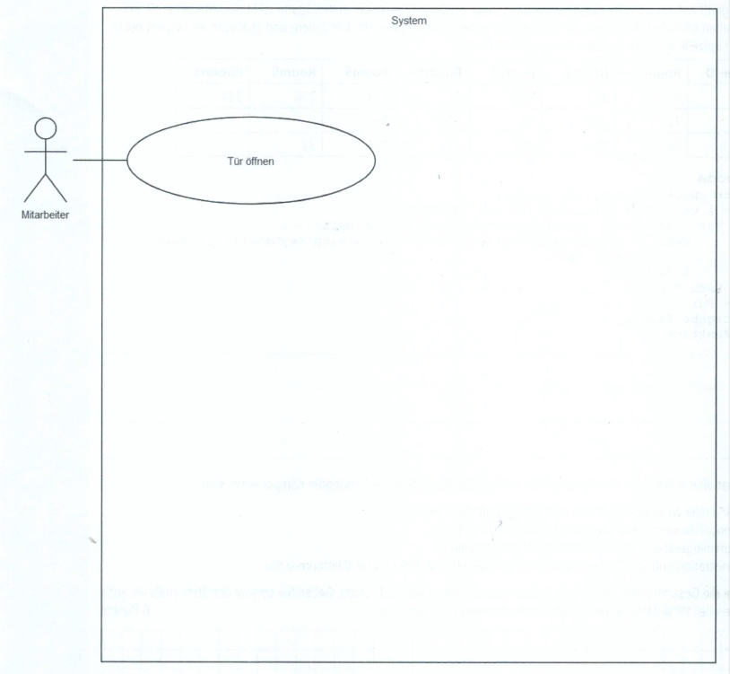
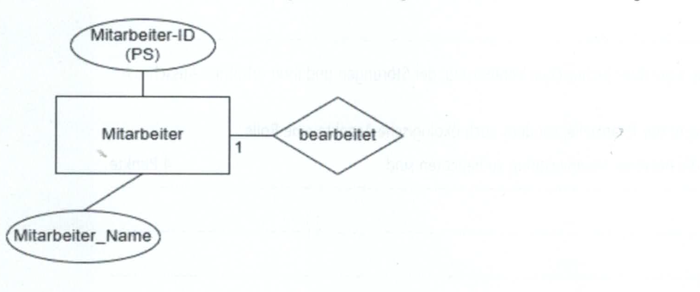

## Teil 1 der Abschlussprüfung Fachinformatiker:in Anwendungsentwicklung

**Einrichten eines IT-gestützten Arbeitsplatzes.**

## Situation

| |
| :--- |
|  Sie sind Auszubildender der Identify OHG, die sich auf die Herstellung von elektronischen Schlüsselsystemen und Ausweisen unter Beachtung höchster Sicherheitsanforderungen spezialisiert hat. |

---

## 1. Aufgabe (26 Punkte)

Zur Vorbereitung der Absicherung eines Besprechungsraums informieren Sie sich u. a. über Maßnahmen aus dem BSI IT-Grund-schutz-Kompendium und wirken an der Umsetzung mit.

---

### 1a Zugangs- und Zugriffskontrolle

>3 Punkte

Zur Absicherung des Besprechungsraums soll u. a. eine automatische Zutrittskontrolle an der Eingangstür eingerichtet werden.
Nennen Sie **drei** technische Möglichkeiten, um eine automatische Zutrittskontrolle zu gewährleisten.

1. ...
2. ...
3. ...

---

### 1b Sicherheitsrisiken

>3 Punkte

Beschreiben Sie die Sicherheitsrisiken der folgenden Situationen:

| Situation | Sicherheitsrisiko |
| :--- | :--- |
| Geöffnete Fenster und Türen nach Verlassen des Besprechungsraums | **Beispiel:** Informationen in Papierform oder IT-Geräte können durch Diebstahl in falsche Hände geraten. |
| Nutzung durch externe Personen | |
| Lose verlegte Kabel | |
| Nutzung von BYOD-Geräten (Bring Your Own Device) | |

---

### 1c Maßnahmen zur Absicherung

>6 Punkte

Ein PC soll für die Durchführung von Präsentationen mit einem Anzeigegerät verbunden werden. Der BSI-Grundschutz empfiehlt, den Präsentationsrechner in dem Besprechungsraum sicher zu konfigurieren.
Begründen Sie die folgenden vorgeschlagenen Maßnahmen.

Nutzung einer Minimalkonfiguration mit festgelegter Anwendungssoftware:

**Begründung:** ...

Anschluss an ein vom LAN der Institution getrenntes Datennetz:

**Begründung:** ...

---

### 1d Netzwerkkonfiguration

>3 Punkte

Sie erhalten vom Netzwerkadministrator der Identify OHG die folgenden Vorgaben für die Netzwerkkonfiguration des Präsenta-
tionsrechners. Die Adressvergabe soll statisch erfolgen, um eine spätere Fernwartung zu vereinfachen.

Netzwerk: 192.168.20.0/24
DHCP-Range: 192.168.20.20 - 192.168.20.254
Router: 192.168.20.1

---

#### 1da Vorkonfiguration

> 2 Punkte

Bei der Analyse des PCs wird Ihnen jedoch die IP-Adresse 169.254.122.115 angezeigt.

Begründen Sie diese „Vorkonfiguration":

**Begründung:** ...

---

#### 1db Konfiguration

>2 Punkte

Markieren Sie bzw. passen Sie die Konfiguration entsprechend der Vorgaben des Administrators in der folgenden Eingabemaske an.

**Eingabemaske:**

---

#### 1dc Konfiguration

>5 Punkte

Entsprechend der BSI-Empfehlungen ist das IP-Netz des Präsentationsrechners vom Firmennetz getrennt. Im Besprechungsraum befindet sich eine unbeschriftete Netzwerk-Doppeldose. Hier wird auf der einen Seite das Firmennetz, auf der anderen Seite das Netz für den Präsentationsrechner zur Verfügung gestellt. Ihre Aufgabe besteht nun darin, die richtige RJ-45-Buchse (links oder rechts) der Netzwerkdose zu ermitteln und zu beschriften. Ihnen steht dazu ein Patchkabel und der Präsentationsrechner mit seiner Kommandozeile zur Verfügung. Beschreiben Sie Ihre Vorgehensweise stichpunktartig.

1. ...
2. ...
3. ...
4. ...

---

#### 1dd  Aktivitäten bei Installationen und Konfigurationen kennen und beurteilen

>4 Punkte

Für die Einrichtung weiterer Maßnahmen der IT-Sicherheit im Netzwerk benötigt Ihr Administrator die MAC-Adresse des Präsentationsrechners.

Geben Sie einen möglichen Konsolenbefehl an, um die Adresse zu ermitteln und nennen Sie ein Beispiel für eine MAC-Adresse in strukturierter hexadezimaler Darstellung.

**Konsolenbefehl:** ...

**MAC-Adresse:** ...

---

## 2. Aufgabe

>25 Punkte

Die Identify OHG benötigt eine neue Software für ihre Schließsysteme. Sie arbeiten in der Abteilung Softwareentwicklung bei der
Planung der neuen Software mit. Dabei erstellen Sie auch eine Kostenübersicht für einen Kunden.

### 2a Fremdvergabe

>2 Punkte

In der Softwareentwicklungsabteilung des Unternehmens gibt es derzeit einen personellen Engpass. Die Identify OHG denkt über eine Fremdvergabe nach.

Nennen Sie zwei Argumente, die gegen eine Fremdvergabe sprechen.

1. ...
2. ...

---

### 2b Progammiersprache

>3 Punkte

Es wird beschlossen, die Software selbst zu entwickeln. Die Entwicklungsabteilung fragt, in welcher Programmiersprache die
Software entwickelt werden soll.

Nennen Sie ein allgemeingültiges Kriterium, welches für die Auswahl der Programmiersprache von Bedeutung ist und geben Sie
dazu eine kurze Begründung an.

**Kriterium:** ...

**Begründung:** ...

---

### 2c Compiler und Interpreter

>3 Punkte

Zur Auswahl der Programmiersprachen stehen Compiler- und Interpreter-Sprachen.

Erläutern Sie den wesentlichen Unterschied zwischen den beiden Übersetzungsarten.

**Compiler:** ...

**Interpreter:** ...

---

### 2d UML-Anwendungsfall-Diagramm

>5 Punkte

Sie werden beauftragt, für die Schlüsselsystemsoftware ein UML-Anwendungsfaldiagramm (Use-Case) zu erstellen. Die folgenden Anforderungen liegen vor:

- Der Mitarbeiter kann Türen öffnen und Türen zuschließen. Dabei findet immer eine Berechtigungsprüfung statt.
- Der Administrator kann alles, was ein Mitarbeiter kann. Zusätzlich kann er die Türschlösser programmieren. Dabei findet
immer eine Berechtigungsprüfung statt.

Ergänzen Sie das gegebene UML-Anwendungsfalldiagramm.

---



---

### 2e Array in Pseudocode

>6 Punkte

Ihr Kollege hat gerade die Methode bool checkAuthority (int id, int roomNr) erstelt. Diese übergibt eine Mitarbeiter-ID und eine Raumnummer, um abzufragen, ob für diesen Raum eine Zutritsberechtigung besteht. Ermitteln und begründen Sie den Rückgabewert, der bei Aufruf der Funktion mit id = 3 und romNr = 236 geliefert wird.

Hinweis:
Die Funktion greift auf ein globales zweidimensionales Array keyData [][] zu. In der ersten Spalte steht die Mitarbeiter-ID. Die
folgenden Spalten enthalten die Räume, für die eine Zutrittsberechtigung besteht. Der Zeilen- und Spaltenindex beginnt bei O.
Es gibt **keine Kopfzeile** im Array, sie dient nur zur Erläuterung.

| Mitarbeiter-ID | Room1 | Room 2 | Room 3 | Room 4 | Room 5 | Room 6 | Roomxx |
| :--- | :--- | :--- | :--- | :--- | :--- | :--- | :--- |
| 1 | 223 | 312 | 154 | 47 | 124 | 236 | 241 |
| 2 | 103 | 401 | 14 | 236 | 56 | | |
| 3 | 20 | 312 | 235 | 17 | 124 | 32 | |

---

```txt
Funktion checkAuthority (id, roomNr)
   Für i von 0 bis (AnzahlZeilen von keyData) - 1
      Für j von 1 bis (AnzahlBelegteSpalten von keyData) - 1
         Wenn id gleich keyData[i][0] und roomNr gleich keyData[i][j] dann
            Rückgabe True
         Ende Wenn
      Ende Für
   Ende Für
      Rückgabe False
Ende Funktion
```

---

### 2f Berechnen von Gesamtkosten, Netto- und Bruttopreis

>6 Punkte

Eine Schule hat eine Anfrage zur Ausstattung ihres Schließsystems gestelt. Die benötigten Komponenten sind:

- 65 Schließzylinder zu einem Stückpreis von 512,00 EUR (Nettopreis).
- 80 Transponder zu einem Stückpreis von 39,00 EUR (Nettopreis).
- Ein Programmiergerät zum Preis von 2.300,00 EUR (Nettopreis).
- Eine Administrationssoftware, die eine jährliche Lizenzgebühr von 349,00 EUR (Nettopreis) hat.

Berechnen Sie die Gesamtkosten für die Schule über einen Zeitraum von fünf Jahren. Geben Sie sowohl den Nettopreis als auch den Bruttopreis bei 19% Mehrwertsteuer an. Der Rechenweg ist anzugeben.

...

## 3. Aufgabe (24 Punkte)

Die Identify OHG möchte Computer kaufen und Sie begleiten den Beschafungsprozess. Ferner soll der Arbeitsspeicher bestehender Laptops erweitert werden.

### 3a Ratendarlehen für PCs

>7 Punkte

Ein Angebot für die zehn Computer beläuft sich auf 12.000 EUR.

Die Identify OHG entschließt sich zum Kauf der Computer auf Kredit und erhält von der Kleinstadt-Bank ein Angebot für ein Ratendarlehen.

- Nominalzins: 6 % jährlich
- Laufzeit: 36 Monate
- Tilgung: jeweils in gleichen Beträgen zum Jahresende

Ermitteln Sie für den genannten Darlehensbetrag die jährlichen Zahlungen und die fäligen Gesamtzinsen sowie die Zahlungen insgesamt.

| Zeitraum | Restschuld EUR | Zinsen EUR | Tilgung | Zahlungen 12 Monate EUR |
| :--- | :--- | :--- | :--- | :--- |
| 01.04.2025 - 31.03.2026 | | | | |
| 01.04.2026 - 31.03.2027 | | | | |
| 01.04.2027 - 31.03.2028 | | | | |
| Summe | | | 12.000 | |

---

### 3b RAM-Kompatibilität und Empfehlung

>4 Punkte

Der Abteilungsleiter der Entwicklungsabteilung der Identify OHG möchte, dass in Zukunft alle entwickelten Anwendungen auf der firmeninternen Cloud ausgerollt werden. Darum müssen alle Anwendungen auch mit entsprechenden Tols entwickelt und getestet werden. Aus den Hardwareanforderungen eines dieser Tools geht hervor, das die Laptops der Entwickler folgende Bedingungen erfüllen müssen:

- Windows 11
- 32 GB RAM

Der aktuelle Laptop der Entwickler verfügt über die folgenden Eckdaten:

- Prozessor: Intel® Coret™ i5-1335U Prozessor der 13. Generation
- Betriebssystem: Windows 11 Professional (64 Bit)
- Grafik: Integrierte Intel® UHD-Grafik
- Arbeitsspeicher: 16 GB DDR4-3200MHz
- Massenspeicher: 1 TB HDD
- WLAN: Intel® Wi-Fi 6 AX201 2x2 AX und Bluetooth® 5.1

---

Der Abteilungsleiter der Entwicklungsabteilung hat sich dazu entschieden, das die vorhandenen Laptops um den benötigten Arbeitsspeicher erweitert werden. Der Laptop verfügt über einen weiteren Slot für einen weiteren Arbeitsspeicher-Riegel. Von dem Hardware-Dienstleister der Identify OHG bekommen Sie folgende drei Arbeitsspeicher angeboten:

**Arbeitsspeicher 1 - 82,20 EUR:**

- 16 GB DDR5-6000MHz

**Arbeitsspeicher 2 - 75,70 EUR:**

- 16 GB DDR4-5600MHz

**Arbeitsspeicher 3 - 31,80 EUR:**

- 16 GB DDR4-3200MHz

---

#### ba RAM-Kompatibilät

>3 Punkte

Erklären Sie die Kompatibilität für jeden der drei Arbeitsspeicher mit dem vorhandenen Laptop.

**Arbeitsspeicher 1:**

- ...

**Arbeitsspeicher 2:**

- ...

**Arbeitsspeicher 3:**

- ...

---

#### 3bb RAM Empfehlung und Begründung

>2 Punkte

Begründen Sie, welchen Arbeitsspeicher Sie dem Abteilungsleiter zur Anschaffung empfehlen.

...

---

#### 3bc SSD-Vorteile

>3 Punkte

Sie schlagen dem Abteilungsleiter vor, die HDD im Laptop mit einer SD zu ersetzen.
Nennen Sie drei Vorteile einer SSD gegenüber einer HDD.

1. ...
2. ...
3. ...

---

### 3 Phishing

>3 Punkte

Bei der Korrespondenz mit dem Hardwarelieferanten werden häufig E-Mails ausgetauscht. Sie warnen die Anwender darum vor Phishingmails.

#### 3ca Gefahren durch Phishingmails

>2 Punkt

Beschreiben Sie eine Gefahr durch Phishingmails.

...

---

#### 3cb Anzeichen zur Erkennung von Phisingmails

>3 Punkte

Nennen Sie drei Anzeichen, an denen der User erkennen kann, dass es sich um eine Phishingmail handelt.

1. ...
2. ...
3. ...

---

#### 3cc Schutzmaßnahmen

>2 Punkte

Nennen Sie zwei Maßnahmen, die Sie **dem Unternehmen** zum Schutz vor Phishingmails empfehlen.

1. ...
2. ...

---

#### 3cd Maßnahmen beim Empfangen von Mails

>2 Punkte

Nennen Sie zwei Maßnahmen, die das Unternehmen **den Mitarbeitern** beim Empfang von Mails vorgibt, um sich vor Phishingmail zu schützen.

1. ...
2. ...

---

## 4. Aufgabe (26 Punkte)

### 4a Lasten- und Pflichtenheft

>6 Punkte

Ale Vorgänge des Produktionsprozesses müssen dokumentiert werden. Als Grundlage wird ein Datenmodell erstellt.

Bei La Mediterranea ist auch bei **internen Aufträgen** ein Lasten- und Pflichtenheft üblich. Erklären Sie jeweils den Zweck von Lasten- und Pflichtenheft und führen Sie jeweils ein konkretes Beispiel für den Inhalt an. Tragen Sie Ihr Ergebnis in nachfolgende Tabelle ein.

| | Lastenheft | Pflichtenheft |
| :--- | :--- | :--- |
| Zweck | | |
| Beispiel für möglichen Inhalt | | |

[https://bibox2.westermann.de/book/5409/page/220](url)

[https://github.com/devsfiae/teil-1-gap/tree/main/2024-herbst](url)

---

### 4b Datenmodell

>6 Punkte

Erweitere das unten angegebene Datenmodell redundanzfrei um die vorliegenden Angaben. Gib Sie auch die Kardinalitäten an

Angaben zur Datenbank:

- Die Bearbeitung eines **Auftrages** darf immer nur von einem einzigen **Mitarbeiter** erfolgen.
- Neben seinem Namen ist auch der Vorname zu erfassen.
- Jeder Issue hat einen Beginn und ein Ende der Bearbeitung.
- In jeder Entitätsmenge sol eine eindeutige Identifizierung durch einen Primärschlüssel möglich sein

---



---

### 4c Leasing und Vorteile

>6 Punkte

Da sich die Störungen an einer Maschine häufen, soll eine neue zur Herstellung von Ausweiskarten beschafft werden. Es wer-
den Überlegungen zur Beschaffung über Leasing angestellt.

Beschreiben Sie drei Vorteile der Beschaffung über Leasing.

1. ...
2. ...
3. ...

---

### 4d Leasingdauer und weitere Nutzung

>4 Punkte

Nach Ablauf der Leasingdauer bieten sich bezüglich der weiteren Nutzung der Maschine mehrere Möglichkeiten.
Beschreiben Sie zwei dieser Möglichkeiten.

1. ...
2. ...

---

### 4e Ökologische Aspekte

Ein Kollege informiert Sie, dass die Maschine trotz ihrer technischen Veralterung, der Störungen und ihrer erhöhten Ausschussproduktion weiter genutzt werden kann.

Bei der Beschaffung der Maschine spielen nicht nur finanzielle, sondern auch ökologische Aspekte eine Role.
Beschreiben Sie zwei ökologische Aspekte, die bei einer Neuinvestition zu beachten sind.

1. ...
2. ...

---
import TagsNav from '../../../../../components/TagsNav.astro';

## Tags
<TagsNav tags={frontmatter.tags} />