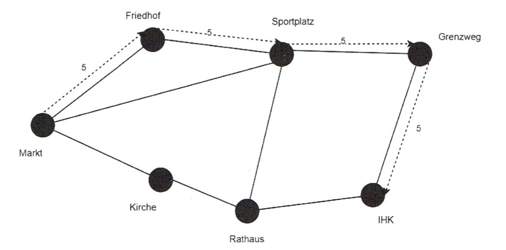
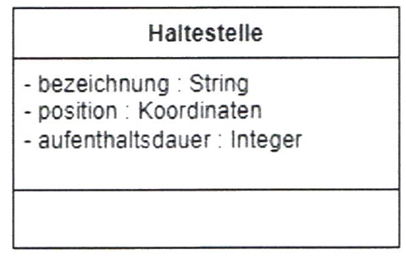
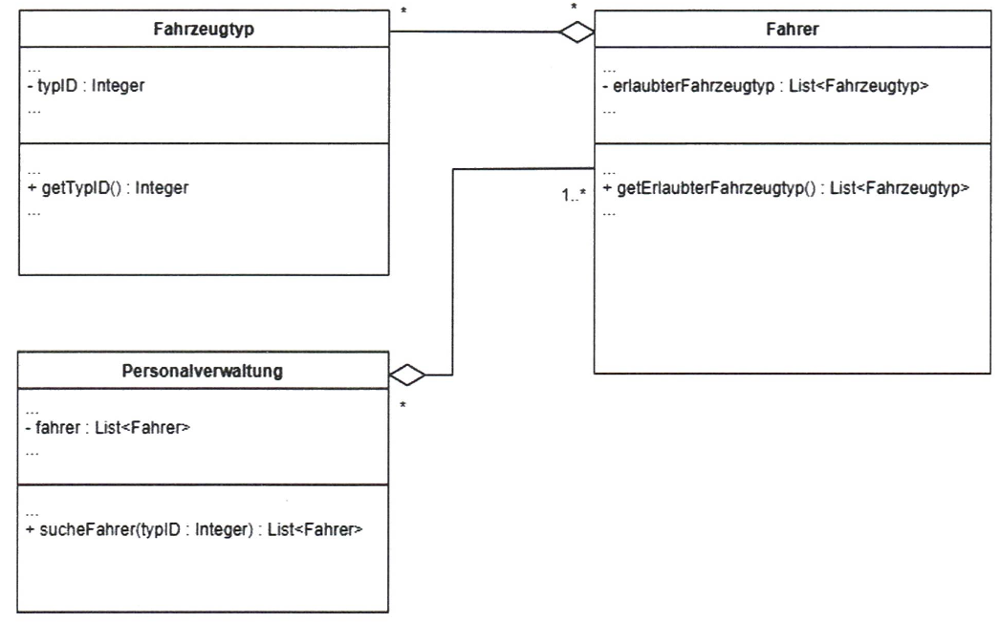

## Teil 2 der Abschlussprüfung Fachinformatiker:in Anwendungsentwicklung

- **Planen eines Softwareproduktes**

## Situation

Die Aufgaben 1 bis 4 beziehen sich auf die folgende Ausgangssituation:

| |
| :--- |
| In Kiel soll das Nahverkehrssystem (KVAG) um eine neue Stadtbahn erweitert werden. In Zusammenhang mit dieser Erweiterung sollen die IT-Systeme der KVAG erweitert und erneuert werden. Dazu werden verschiedene Teilprojekte festgelegt. Diese betreffen unter anderem die Fahrplanauskunft, die Buchungssysteme, die Anzeigen und die Vernetzung. Alle Teilprojekte sollen auch hinsichtlich der Anforderungen von Datenschutz und Datensicherheit untersucht werden. |

## Aufgabe 1

> 24 Punkte

Sie arbeiten im Teilprojekt „Fahrplanauskunft“ mit. Für diese Fahrplanauskunft ist eine App für mobile Endgeräte zu entwickeln.
Der Benutzer dieser App muss sich für die Nutzung der App registrieren. Es soll auch in späteren Versionen möglich sein, Ticketbuchungen und Zahlungen vornehmen zu können.

Bei der Entwicklung der App „Fahrplanauskunft“ haben Sie die Möglichkeit, aus unterschiedlichen Vorgehensmodellen auszuwählen.

### 1a

> 4 Punkte

Beschreiben Sie zwei Kategorien von möglichen Vorgehensmodellen.

1. ...
2. ...

---

### 1b

>4 Punkte

Beschreiben Sie jeweils ein Modell zu den in 1a genannten Kategorien.

1. ...
2. ...

---

### 1c

>12 Punkte

Zur Vorbereitung des Projektes sollen folgende Begriffe erläutert werden.  
Füllen Sie dazu die folgende Tabelle aus:

| Begriff | Erläuterung |
| :--- | :--- |
| Change Request Management | |
| Meilenstein | |
| Stakeholder | |
| Lessons Learned | |

---

### 1d

>4 Punkte

Wenn ein Nutzer der App seine Benutzerdaten speichern möchte, soll eine „Datenschutz-Einwilligung“ verwendet werden.  
Beschreiben Sie zwei Gründe, warum die Verwendung einer „Datenschutzerklärung und deren Einwilligung“ von Bedeutung für den Datenschutz ist.

1. ...
2. ...

---

## Aufgabe 2

>26 Punkte

### 2a

Die KVAG betreibt je nach Anforderung verschiedene Datennetze.

>9 Punkte

Ordnen Sie folgende drei Netzwerkkonzepte ihrem jeweiligen Anwendungsgebiet zu und begründen Sie die gewählte Zuordnung.  

- LAN (Local Area Network)  
- SAN (Storage Area Network)  
- LPWAN (Low Power Wide Area Network)

| Anwendungsgebiet | Netzwerkkonzept | Begründung |
| :--- | :--- | :--- |
| Internet der Dinge (IoT) | | |
| Unternehmensnetzwerk | |  |
| Rechenzentrum | |  |

---

### 2b

Der am häufigsten verwendete Technologiestandard in einem Local Area Network (LAN) ist das paketvermittelnde Ethernet.

#### 2ba

>6 Punkte

Ordnen Sie die Nummern der folgenden Bezeichner den Feldern des Ethernet-Frames zu.  

| Nummer | Bezeichner |
| :--- | :--- |
| 1 | Source Address |
| 2 | Data Payload |
| 3 | Preamble |
| 4 | Frame Check Sequence|
| 5 | Type |
| 6 | Destination Address |


---

#### 2bb

>3 Punkte

In den Feldern „Source Address“ und „Destination Address“ werden die MAC-Adressen (Medium Access Control) des Senders bzw. Empfängers eingetragen. Erläutern Sie den Aufbau einer MAC-Adresse.

...

---

### 2c Pseudocode oder Skript zu IP-Adressen und MAC-Adressen

>8 Punkte

Im Netz `192.168.0.0/24` sollen die IP-Adressen und MAC-Adressen aller Geräte mithilfe eines Skripts ermittelt werden.  

**Hinweise:**

- Die MAC-Adresse kann mit der Funktion `getMacAddress(IP-Address) : MAC-Address` abgerufen werden. Wird keine MAC-Adresse gefunden, wird `NULL` zurückgegeben.
- Das JSON-Array soll beispielhaft folgendes Aussehen haben:

```json
[
  {
    "IP-Adresse": "192.168.0.1",
    "MAC-Adresse": "08:00:27:E2:A8:F0"
  }
]
```

Schreiben Sie ein Skript in Pseudocode oder in einer Ihnen bekannten Skriptsprache, welches die IP-Adressen und die MAC-Adressen aller Geräte im Netz mit der ID 192.168.0.0/24 abfragt und das Ergebnis in ein JSON-Array schreibt.

## Aufgabe 3

>25 Punkte

Die Software für die Fahrplanauskunft und die Einsatzplanung soll überarbeitet werden.

### 3a Klassendiagramm

Für die Fahrplanauskunft soll das Streckennetz neu modelliert werden. Als Beispiel ist ein vereinfachtes Streckennetz dargestellt:



---

In einem Klassendiagramm sollen Haltestellen, Strecken, Linien und Fahrten modelliert werden. Dabei sollen folgende Sachverhalte berücksichtigt werden:

- Eine Haltestelle hat eine Bezeichnung, eine Position und eine Aufenthaltsdauer.  
Die Haltestellen sind im Beispiel durch schwarze Punkte dargestellt.
- Eine Strecke ist eine direkte Verbindung zwischen zwei Haltestellen. Für die Strecke wird eine Fahrtdauer festgelegt.  
Im Beispiel sind die Strecken durch eine schwarze durchgezogene Linie zwischen zwei Haltestellen dargestellt.
- Eine Buslinie ist eine Folge von Strecken. Sie ist durch eine geordnete Liste von Strecken festgelegt.  
Beispiel: Buslinie 5 besteht aus den Strecken Markt–Friedhof, Friedhof–Sportplatz, Sportplatz–Grenzweg und Grenzweg–IHK.
Sie ist durch die gestrichelte Linie mit der Beschriftung 5 dargestellt.
- Eine Fahrt findet auf einer ganzen Buslinie oder auf einem Teil der Buslinie statt. Die Fahrt hat eine Starthaltestelle, eine
Startzeit und eine Endhaltestelle.  
Beispiel: Eine Fahrt auf der Linie 5 beginnt um 10:00 Uhr an der Haltestelle Friedhof und endet an der Haltestelle Grenzweg.

Für jede Klasse sollen die Attribute mit Datentypen angegeben werden. Methoden müssen nicht eingetragen werden. Ferner
sollen die Beziehungen mit Multiplizitäten im Diagramm eingetragen werden.

---

Ergänzen Sie das Klassendiagramm entsprechend den Vorgaben:

Beispiel für die Klasse Haltestelle:



---

### 3b Aggregation und Multiplizität

In der KVAG gibt es mehrere Fahrzeugtypen. Jeder Fahrer darf nur bestimmte Fahrzeugtypen fahren. Eine Liste der erlaubten Fahrzeugtypen ist in der Klasse Fahrer vorhanden. In der Klasse Personalverwaltung gibt es eine Liste aller Fahrer.
Im folgenden Auszug aus einem Klassendiagramm sind die Klassen mit den entsprechenden Attributen dargestellt:



Im Klassendiagramm sind die Beziehungen als Aggregation modelliert.

---

#### 3ba

>2 Punkte

Beschreiben Sie die Bedeutung der Aggregation zwischen den Klassen Personalverwaltung und Fahrer.

...

---

#### 3bb

>3 Punkte

Erläutern Sie die Bedeutung der Multiplizität `1..*` in der Beziehung zwischen den Klassen Personalverwaltung und Fahrer
sowie die Bedeutung der Multiplizität `*` in der Beziehung zwischen den Klassen Fahrer und Fahrzeugtyp.

...

---

#### 3bc

>3 Punkte

Erläutern Sie, ob für die Modellierung der Beziehung zwischen den Klassen Personalverwaltung und Fahrer statt einer Aggregation auch eine Komposition sinnvoll verwendet werden kann.

...

---

## Aufgabe 4

>25 Punkte

Die aktuelle Auslastung der Bahnen soll auf verschiedenen Anzeigen ausgegeben werden.

### 4a

>15 Punkte

Bei der Auslastung werden die Zustände leer, niedrig, normal und hoch unterschieden. Wenn die Fahrt beginnt oder wenn alle Personen wieder ausgestiegen sind (Auslastung = 0 %), befindet sich die Bahn im Zustand leer. Ist eine Bahn leer, dann kann
sie die Fahrt beenden und in den Endzustand gelangen.

Jeweils beim Verlassen einer Haltestelle wird bei dem Ereignis Abfahrt die aktuelle Auslastung überprüft. Folgende Festlegungen
wurden zur Auslastung getroffen:

- Zustand niedrig: bis 30 % Auslastung
- Zustand normal: über 30 % und unter 70 % Auslastung
- Zustand hoch: ab 70 % Auslastung
- Die Zustandsübergänge zwischen den Zuständen leer und normal bzw. hoch sollen zur Vereinfachung nicht berücksichtigt werden.

Erstellen Sie ein UML-Zustandsdiagramm zur Beschreibung der Auslastung.

---

### 4b Entwurfsmuster (Design-Pattern)

Die aktuelle Auslastung soll u. a. in einer App, auf den Anzeigetafeln an den Haltestellen und in der Verwaltungssoftware der
Mitarbeiter angezeigt werden. Ändert sich die Auslastung einer Bahn, so sollen alle Anzeigen aktualisiert werden.

Bei der Entwicklung der Software soll ein Entwurfsmuster (Design-Pattern) verwendet werden.

#### 4ba Entwurfsmuster

>4 Punkte

Beschreiben Sie zwei Vorteile, welche sich durch die Verwendung von Entwurfsmustern ergeben.

1. ...
2. ...

---

#### 4bb Erzeugungs-, Struktur- und Verhaltensmuster

>2 Punkte

Entwurfsmuster können beispielsweise in die Kategorien Erzeugungs-, Struktur- und Verhaltensmuster unterteilt werden. Ein Beispiel für die Kategorie Strukturmuster ist gegeben:

| **Kategorie** | **Beispiel** |
| :--- | :--- |
| Strukturmuster | Facade-Pattern |
| Erzeugungsmuster | |
| Verhaltensmuster | |

---

#### 4bc Auswahl Entwurfsmuster

>4 Punkte

Zur Aktualisierung aller Anzeigen bei einer Änderung des Auslastungszustandes soll ein Entwurfsmuster verwendet werden.
Nennen Sie ein geeignetes Entwurfsmuster und begründen Sie Ihre Entscheidung.

...

---
